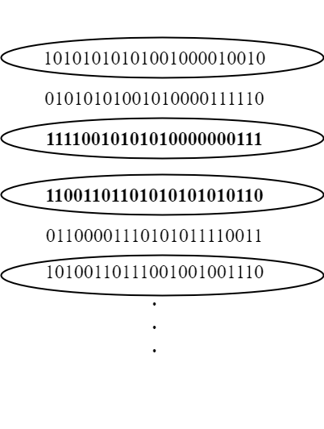
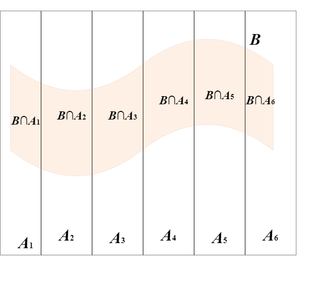
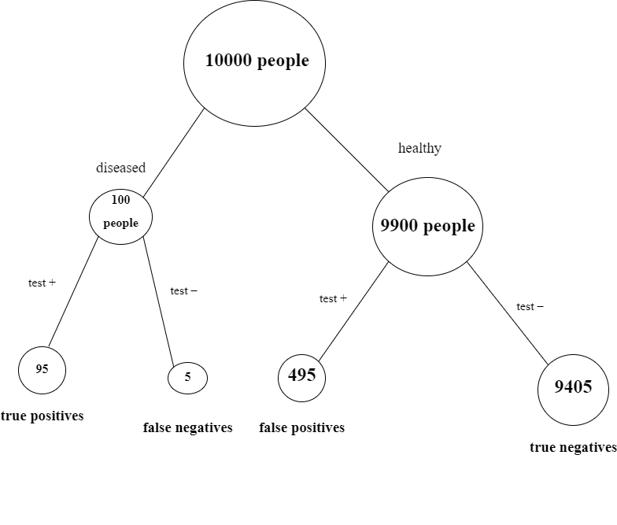
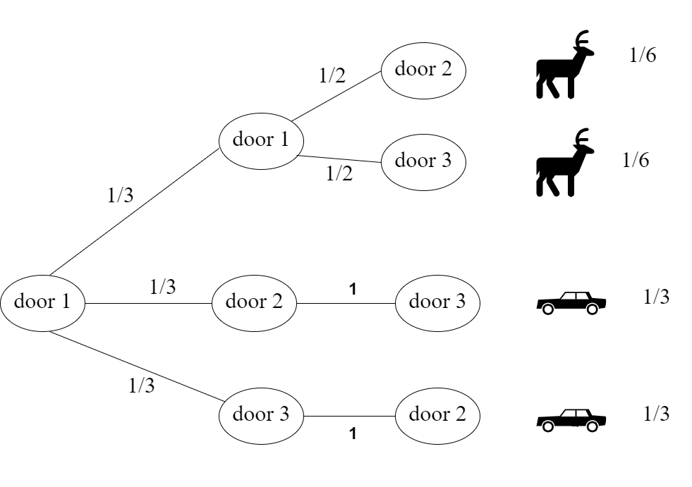
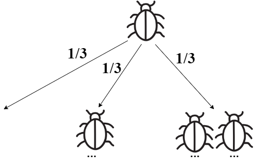
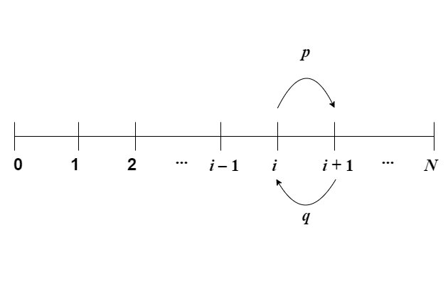
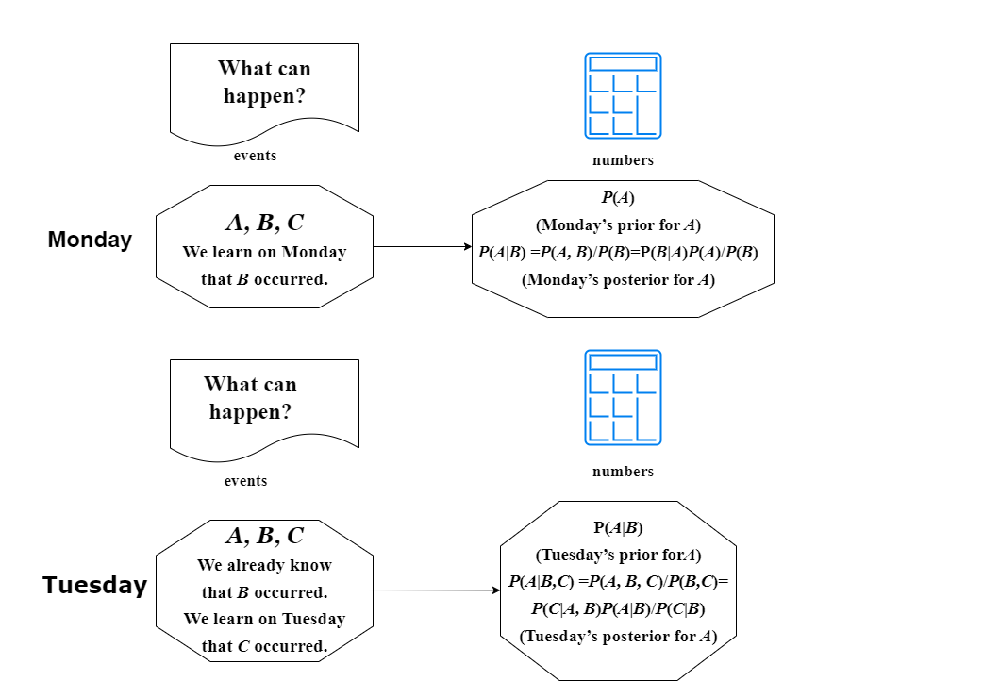

## 条件概率

[2.1条件思维的重要性](#2.1 条件思维的重要性)

[2.2定义和直觉](#2.2 定义和直觉)

[2.3贝叶斯定理和全概率公式](#2.3 贝叶斯定理和全概率公式)

[2.4 条件概率是概率](#2.4 条件概率是概率)

[2.5事件的独立性](#2.5 事件的独立性)

[2.6贝叶斯定理的一致性](#2.6 贝叶斯定理的一致性)

[2.7 作为问题解决工具的条件化](#2.7 作为问题解决工具的条件化)

[2.8 陷阱与悖论](#2.8 陷阱与悖论)

[2.9 回顾](#2.9 回顾)

我们之前引⼊了 概率作为表达我们对事件的信念程度或不确定性的语言。每当我们观察到新的证据（ie，获得数据）时，我们就获取了可能影响我们概率的信息。与现有信念⼀致的新观察结果可能使我们对该信念更加确信，而违反预期的观察可能会使原来的信念受到质疑。条件概率是解决这⼀基本问题的概念：我们应该如何根据我们观察到的新证据更新我们的信念？

###  2.1 条件思维的重要性

条件概率在科学、医学和法律推理中极为关键，因为它展示了我们如何用逻辑和连贯的方式将证据融入对世界的理解。实际上，可以认为所有概率都是有条件的，即每个概率评估都隐含了某些背景知识或假设。

例如，假设某个早晨我们对事件R（即当天是否会下雨）感兴趣。设 $ P(R) $ 为我们在观察天空之前对下雨的概率评估。如果我们随后看到天空中布满乌云，我们对下雨的概率评估应当上升；我们使用 $P(R|C)$ 来表示这一新的概率（读作“在C条件下R的概率”），其中C代表天空中有乌云的事件。当我们从 $ P(R) $ 转变为 $ P(R|C) $ 时，我们称这一过程为在C上进行条件处理。随着一天的推移，我们可能会获得更多关于天气状况的信息，从而不断更新我们的概率评估。如果我们观察到事件 $ B_1, \ldots, B_n $ 发生，那么我们会将我们在这些证据下的新条件概率表示为 $ P(R|B_1, \ldots, B_n) $。如果最终我们观察到确实开始下雨了，我们的条件概率便变为1。

此外，条件化是解决问题的一种极其强大的策略，它通常允许我们通过逐案推理，将复杂的问题分解为易于管理的部分。类似于计算机科学中将大问题分解为小块（甚至字节大小的块）的常见策略，在概率论中，我们通常会将复杂的概率问题简化为一系列更简单的条件概率问题。特别是，我们将讨论一种称为**首步分析**的策略，通常使我们能够得出递归解决方案，以解决实验有多个阶段的问题。

**由于条件概率在我们更新信念以反映证据的手段和解决问题的策略中具有中心重要性，因此我们称条件概率为统计的灵魂。**

###  2.2 定义和直觉

> **Definition 2.2.1**（条件概率）
>
> 如果$A$和$B$是事件，并且 $ P(B) > 0 $，那么给定事件B下的事件A的条件概率，记为 $ P(A|B) $，定义为 $$ P(A|B) = \frac{P(A \cap B)}{P(B)} $$。

这里，$A$是我们想要更新不确定性的事件，$B$$是我们观察到的证据（或我们假定为已知的事件）。我们称 $ P(A) $ 为$A$的先验概率，而 $ P(A|B) $ 为$A$的后验概率（“先验”指在证据发生之前，“后验”指在证据发生之后）。

解释垂直条件条后面出现的事件很重要，作为我们已经观察到的证据或正在条件化的证据：**$ P(A|B) $ 是在证据B的前提下A的概率，而不是某个称为A|B的实体的概率。**如第2.4.1节所讨论的，**没有所谓的$A|B$事件**

**对于任何事件A，$ P(A|A) = P(A \cap A)/P(A) = 1 $**。当我们观察到$A$已经发生时，我们对$A$的更新概率是1。如果不是这种情况，我们将要求对条件概率给出新的定义！

> **example 2.2.2**（两张牌）
>
> 一副标准的扑克牌被公平随机的洗牌后。随机抽取两张牌，一次一张，不放回。设第一张牌是红心的事件为$A$，是第二张牌是红色的事件为$B$。要求找出 $ P(A|B) $ 和 $ P(B|A) $。

> **Solution**：
> 根据概率的朴素定义和乘法规则，得:$$ P(A \cap B) = \frac{13 \cdot 25}{52 \cdot 51} = \frac{25}{204} $$，
> 因为一个有利的结果是由选择13张红心中的任何一张，然后选择剩余的25张红牌中的任何一张决定的。同样，$P(A) = \frac{1}{4}$，因为4种花色的可能性都一样，所以$P(A) = \frac{1}{4}$，而 $$ P(B) = \frac{26 \cdot 51}{52 \cdot 51} = \frac{1}{2} $$
> 因为第二张牌有26种有利的可能性，对于每一种，第一张牌可以是任何其他牌（回想一下第1章中提到的，在乘法规则中不需要按时间顺序）。
>
> 通过**对称性**，可以更简洁地看到 $P(B) = \frac{1}{2}$：在做实验之前的观点来看，**第二张牌有相同的可能性成为牌堆中的任何一张牌。**
>
> 我们现在有了应用条件概率定义所需的所有部分：$$ P(A|B) = \frac{P(A \cap B)}{P(B)} = \frac{25/204}{1/2} = \frac{25}{102} $$，$$ P(B|A) = \frac{P(B \cap A)}{P(A)} = \frac{25/204}{1/4} = \frac{25}{51} $$
>
> 这是一个简单的例子，但已经有几点值得注意。
>
> 1. **谨慎地确定哪些事件放在条件条的哪一边非常重要。**特别是 $ P(A|B) \neq P(B|A) $。下一节将探讨 $ P(A|B) $ 和 $ P(B|A) $ 在一般情况下是如何相关的。混淆这两个量被称为检察官谬误，在第2.8节中进行讨论。如果我们改为将B定义为第二张牌是红心的事件，那么这两个条件概率将会相等。
> 2. $ P(A|B) $ 和  $P(B|A)$**都有意义 （直观上和数学上**）；抽取卡片的时间顺序并不决定我们可以查看哪些条件概率。当我们计算条件概率时，我们考虑的是观察一个事件对另一个事件提供了什么信息，而不是一个事件是否导致了另一个事件。为了进一步直觉，想象有人展开牌，并同时用左手和右手各抽一张牌。根据左手的牌和右手的牌而不是第一张和第二张牌来定义$A$和$B$，并不会以任何重要的方式改变问题的结构。
> 3. 我们也可以看到 $P(B|A) = \frac{25}{51}$，通过直接解释条件概率的含义：如果抽出的第一张牌是红心，那么剩余的牌由25张红牌和26张黑牌组成（所有这些都有相同的可能性被接下来抽出），所以得到红牌的条件概率是 $\frac{25}{25 + 26} = \frac{25}{51}$。以这种方式找到 $ P(A|B) $ 更难：如果我们了解到第二张牌是红色的，我们可能会想“知道这一点很好，但我们真正想知道的是它是否是红心！”条件概率的结果来自本章后面的部分，为我们提供了解决这个问题的方法。

 为了更深入地了解条件概率的含义，这里有两种直观的解释。

> **Intuition 2.2.3**（鹅卵石世界）。考虑一个有限的样本空间，其结果可视化为总质量为1的鹅卵石。由于$A$是一个事件，它是一组鹅卵石，$B$亦然。图2.1(a)展示了一个例子。
>
> $P(A|B)$的鹅卵石世界直觉。从左至右：
>
> * (a) 事件$A$和$B$是样本空间的子集。
>
> * (b) 因为我们知道B发生了，所以去掉了 $ B^c $ 中的结果。
>
> * (c) 在受限的样本空间中，重新标准化，使总质量仍然为1。
>
>   现在假设我们得知$B$发生了。在图2.1(b)中，获得这一信息后，我们去除了 $ B^c $ 中的所有鹅卵石，因为它们与B发生的知识不相容。然后 $ P(A \cap B) $ 是A中剩余鹅卵石的总质量。最后，在图2.1(c)中，我们进行重新标准化，即将所有质量除以一个常数，使剩余鹅卵石的新总质量为1。这是通过除以 $ P(B) $ 实现的，$ P(B) $ 是$B$中鹅卵石的总质量。

与事件$A$相对应的结果的更新质量是条件概率 $ P(A|B) = \frac{P(A \cap B)}{P(B)} $。

通过这种方式，我们的概率根据观察到的证据进行了更新。与证据相矛盾的结果被丢弃，它们的质量在剩余的结果中重新分配，保持剩余结果的相对质量。例如，如果最初卵石2的重量是卵石1的两倍，并且两者都包含在$B$中，那么在对$B$进行条件处理后，卵石2的重量仍然是卵石1的两倍。但是如果卵石2不包含在$B$中，那么在对$B$进行条件处理后，它的质量会更新为0。

> **Intuition 2.2.4**（频率解释）
>
> 回想一下，频率解释的概率是基于大量重复试验的相对频率。想象我们多次重复我们的实验，生成一个长列表的观察结果。然后可以自然地认为给定$B$的$A$的条件概率：它是在$B$发生的试验中$A$发生的次数比例。
>
> 在图2.2中，我们的实验结果可以写成一串0和1；第一个数字是1的事件为$B$，第二个数字是1的事件为$A$。对$B$进行条件处理，我们圈出了$B$发生的所有重复，并且我们查看在$A$也发生的圈出重复中的比例。
>
> 用符号表示，让 $ n_A, n_B, n_{AB} $ 分别是在**大量**$n$次实验重复中$A$, $B$, $A∩B$的发生次数。频率解释是 $$ P(A) \approx \frac{n_A}{n}, P(B) \approx \frac{n_B}{n}, P(A \cap B) \approx \frac{n_{AB}}{n} $$。那么 $ P(A|B) $ 被解释为 $ n_{AB}/n_B $，等于 $ (n_{AB}/n)/(n_B/n) $。这种解释再次转化为 $ P(A|B) = \frac{P(A \cap B)}{P(B)} $。
>
> 
>
> $P(A|B)$的频率直觉。$B$发生的重复被圈出；在这些中，$A$发生的重复被加粗突出。$P(A|B)$是长期相对频率中A发生的重复次数，限于$B$发生的重复子集中。

为了练习应用条件概率的定义，让我们做一些更多的例子。接下来的三个例子都以一个有两个孩子的家庭的相同基本场景开始，但根据具体的假设和我们所依据的确切信息，情况会有所不同。

> **example 2.2.5**（两个孩子）
>
> 马丁·加德纳在1950年代在《科学美国人》的专栏中提出了以下谜题。
>
> 1. 琼斯先生有两个孩子。年长的孩子是一个女孩。两个孩子都是女孩的概率是多少？
>
> 2. 史密斯先生有两个孩子。他们中至少有一个是男孩。两个孩子都是男孩的概率是多少？
>
> 3. 乍一看，这个问题似乎应该是条件概率的一个简单应用，但几十年来一直存在争议，即这个问题的两个部分是否应该有不同的答案，以及这个问题的模糊程度有多大。加德纳分别给出了两部分的答案是$$\frac{1}{2}$$和$\frac{1}{3}$，这可能看起来有些矛盾：我们为何要在意我们得知的是年长孩子的性别，而不仅仅是知道其中一个孩子的性别？

> **重要的是要澄清问题的假设**。为了得到加德纳给出的答案，正在做几个隐含的假设。
>
> * 假设性别是二元的，每个孩子都可以明确地归类为男孩或女孩。事实上，许多人并不完全符合“男性”或“女性”的类别，而是认同为非二元性别。
> * 假设$P$(男孩) = $P$(女孩)，无论是对于年长的孩子还是年幼的孩子。事实上，在大多数国家，出生的男孩比女孩稍微多一些。例如，在美国通常估计每出生100个女孩就有105个男孩出生。
> * 假设两个孩子的性别是独立的，即知道年长孩子的性别不会提供关于年幼孩子性别的信息，反之亦然。如果孩子们是同卵双胞胎，这将是不现实的。

在这些（公认有问题的）简化假设下，我们可以如下解决问题。

> **Solution**：
>
> 根据上面列出的假设，条件概率的定义给出 $$ P(两个女孩|年长的是女孩) = \frac{P(两个女孩, 年长的是女孩)}{P(年长的是女孩)} = \frac{1/4}{1/2} = \frac{1}{2}, $$ $$ P(两个女孩|至少有一个女孩) = \frac{P(两个女孩, 至少有一个女孩)}{P(至少有一个女孩)} = \frac{1/4}{3/4} = \frac{1}{3}. $$
>
> （我们用女孩而不是男孩来解决问题的第二部分，是为了更容易比较问题的两个部分。）两个结果不同可能看起来违反直觉，因为我们没有理由关心年长的孩子是女孩而不是年幼的孩子。的确，由于对称性，
>
> $$ P(两个女孩|年幼的是女孩) = P(两个女孩|年长的是女孩) = \frac{1}{2}. $$
>
> 然而，条件概率 $ P(两个女孩|年长的是女孩) $ 和 $ P(两个女孩|至少有一个女孩) $ 之间没有这样的对称性。说年长的孩子是女孩指定了一个特定的孩子，然后另一个孩子（年幼的孩子）有$50\%$的概率是女孩。而“至少有一个”并不指代特定的孩子。**基于特定孩子是女孩的条件会把样本空间$ \{GG, GB, BG, BB\}$ 中的4个“鹅卵石”中的2个排除掉，比如，GB意味着年长的孩子是女孩，年幼的孩子是男孩。相比之下，基于至少有一个孩子是女孩的条件只会排除掉BB。**

> **example 2.2.6**（随机遇到的孩子是女孩）
>
> 一个家庭有两个孩子。你随机遇到其中一个，发现她是一个女孩。在前一个例子中的假设下，两个孩子都是女孩的条件概率是多少？还要假设你遇到任何一个孩子的可能性都相同，而且你遇到哪个孩子与性别无关。

> **Solution**：
>
> 直观上，答案应该是$\frac{1}{2}$：想象我们遇到的孩子在我们面前，另一个孩子在家。两个都是女孩只是说在家的孩子是女孩，这似乎与我们面前的孩子是女孩的事实无关。但让我们更仔细地检查这一点，使用条件概率的定义。这也是用集合表示法编写事件的好练习。
>
> 设 $G1$、$G2$ 和 $G3$ 分别是年长、年幼和随机遇到的孩子是女孩的事件。根据假设，$ P(G1) = P(G2) = P(G3) = $$\frac{1}{2}$ 。根据朴素定义，或如第2.5节所解释的独立性，$ P(G1 \cap G2) = $$\frac{1}{4}$ 。因此，
>
> $$ P(G1 \cap G2|G3) = \frac{P(G1 \cap G2 \cap G3)}{P(G3)} = \frac{1/4}{1/2} = \frac{1}{4}, $$
>
> 因为 $ G1 \cap G2 \cap G3 = G1 \cap G2 $（如果两个孩子都是女孩，就保证了随机遇到的孩子是女孩）。
>
> 但请记住，为了得到$\frac{1}{2}$的结果，需要关于如何选择随机孩子的假设。用统计学的语言来说，我们说我们收集了一个随机样本；在这里，样本包括两个孩子中的一个。**统计学中最重要的原则之一是，必须仔细思考样本是如何收集的，而不仅仅是盯着原始数据，不理解它们来自何处。**考虑一个简单的极端情况，假设一个压迫性的法律禁止一个男孩离开家，如果他有一个妹妹。那么“随机遇到的孩子是女孩”等同于“至少有一个孩子是女孩”，因此问题简化为例2.2.5的第一部分。

> **example 2.2.7**（在冬天出生的女孩）
>
> 一个家庭有两个孩子。在至少有一个是在冬天出生的女孩的情况下，找到两个孩子都是女孩的概率。除了例2.2.5中的假设外，假设四个季节的可能性相同，且性别与季节无关。（这意味着知道性别不会提供关于季节概率的信息，反之亦然；有关独立性的更多内容，请参见第2.5节。）

> **Solution**：
>
> 根据条件概率的定义，$$ P(两个女孩|至少有一个冬天出生的女孩) = \frac{P(两个女孩, 至少有一个冬天出生的女孩)}{P(至少有一个冬天出生的女孩)} $$。
>
> 由于特定孩子是冬天出生的女孩的概率是]$\frac{1}{8}$，分母等于 $$ P(至少有一个冬天出生的女孩) = 1 - \left(\frac{7}{8}\right)^2 $$。
>
> 为了计算分子，使用“两个女孩，至少有一个冬天出生的女孩”与“两个女孩，至少有一个冬天出生的孩子”是相同事件的事实；然后使用性别和季节独立的假设：$$ P(两个女孩, 至少有一个冬天出生的女孩) = P(两个女孩, 至少有一个冬天出生的孩子)$$ $$ = \left(\frac{1}{4}\right)P(至少有一个冬天出生的孩子) $$ $$ = \left(\frac{1}{4}\right)\left(1 - P(两个都不是冬天出生)\right) $$ $$ = \left(\frac{1}{4}\right)\left(1 - \left(\frac{3}{4}\right)^2\right) $$
>
> 因此 $$ P(两个女孩|至少有一个冬天出生的女孩) = \frac{\left(\frac{1}{4}\right)\left(1 - \left(\frac{3}{4}\right)^2\right)}{1 - \left(\frac{7}{8}\right)^2} = \frac{7/64}{15/64} = \frac{7}{15} $$

乍一看，这个结果似乎荒谬！在例2.2.5中，给出至少有一个是女孩的情况下，两个孩子都是女孩的条件概率是$\frac{1}{3}$；为什么当我们了解到至少有一个是冬天出生的女孩时，结果会有所不同？**关键在于关于出生季节的信息使“至少有一个是女孩”更接近于“特定一个是女孩”。基于越来越具体的信息进行条件化，概率越来越接近$\frac{1}{2}$。**

例如，基于“至少有一个是在3月31日下午8:20出生的女孩”的条件会非常接近于指定一个孩子，而了解关于一个特定孩子的信息并不会告诉我们关于另一个孩子的信息。这些看似无关的信息，如出生季节，在例2.2.5的两个部分之间提供了中间插值。将这个例子推广到与性别无关的任意特征

### 2.3 贝叶斯定理和全概率公式

虽然条件概率的定义很简单只是两个概率的比率，但是它有深远的影响。第一个结果很容易通过将定义中的分母移到等式的另一边获得。

> **Theorem 2.3.1**（两个事件相交的概率）。对于任何具有正概率的事件$A$和$B$，
>
> $$ P(A \cap B) = P(B)P(A|B) = P(A)P(B|A) $$。

这是从 $P(A|B)$ 的定义开始，两边都乘以 $P(B)$，然后取 $P(B|A)$ 的定义，两边都乘以$P(A)$而得出的。乍一看这个定理似乎没什么用：它只是条件概率的定义，写得稍微不同，因为 $P(A|B)$ 是根据 $P(A∩B)$ 定义的，所以用 $P(A|B)$ 来帮助找到 $P(A∩B)$ 是循环论证。但是我们可以这样看，因为通常可以找到条件概率，而不必回到定义，所以在这些情况下定理2.3.1可以帮助我们更容易地找到 $P(A∩B)$,因此这个定理实际上非常有用。

反复应用定理2.3.1，我们可以推广到$n$个事件的交集。

> **Theorem 2.3.2**（n个事件交集的概率）。对于任何事件 $ A_1, ..., A_n $ 且 $ P(A_1, A_2, ..., A_{n-1}) > 0 $，$$ P(A_1, A_2, ..., A_n) = P(A_1)P(A_2|A_1)P(A_3|A_1, A_2)...P(A_n|A_1, ..., A_{n-1}), $$逗号表示交集，例如，$ P(A_3|A_1, A_2) $ 是 $ P(A_3|A_1 \cap A_2) $。

实际上，这是$n!$个定理中的一个，因为我们可以任意排列 $ A_1, ..., A_n $，而不影响左边的结果。通常右边对于某些排序比其他排序更容易计算。例如，

$$ P(A_1, A_2, A_3) = P(A_1)P(A_2|A_1)P(A_3|A_1, A_2) = P(A_2)P(A_3|A_2)P(A_1|A_2, A_3), $$
还有其他4种形式的展开。通常需要练习和思考才能知道使用哪种排序。

我们现在将介绍本章的两个主要定理——贝叶斯定理和全概率公式——这能够使我们在广泛的问题中计算条件概率。贝叶斯定理是一个极其著名且极其有用的结果，它能将 $P(A|B)$ 与 $P(B|A)$ 联系起来。

> **Theorem 2.3.3**（贝叶斯定理）。$$ P(A|B) = \frac{P(B|A)P(A)}{P(B)} $$。

可直接由定理2.3.1得出，而定理2.3.1又由条件概率的定义得来。因为，贝叶斯定理在概率和统计中有重要的含义和应用，**所以经常需要找到条件概率，而通常 $P(B|A)$ 比 $P(A|B)$ （或反之）更容易直接找到。**

另一种写贝叶斯定理的方法是用赔率而不是概率。

> **Definition 2.3.4**（odds）。事件$A$的赔率是$$ \text{odds}(A) = \frac{P(A)}{P(A^c)} $$。

例如，如果$P(A) = \frac{2}{3}$，或者我们说支持A的赔率是2比1。（这有时写作2:1，有时表示为1比2的反对A的赔率；需要小心，因为一些来源没有明确指出他们是指支持事件的赔率还是反对事件的赔率。）当然我们也可以从赔率转换回概率：$$ P(A) = \frac{\text{odds}(A)}{1 + \text{odds}(A)} $$。
通过取贝叶斯定理中的$P(A|B)$表达式并除以$P(A^c|B)$的贝叶斯定理表达式，我们得到贝叶斯定理的赔率形式。

> **Theorem 2.3.5**（贝叶斯定理的赔率形式）。对于任何具有正概率的事件$A$和$B$，条件在$B$下$A$的赔率是 $$ \frac{P(A|B)}{P(A^c|B)} = \frac{P(B|A)}{P(B|A^c)} \cdot \frac{P(A)}{P(A^c)} $$

换句话说，这意味着后验赔率 $ \frac{P(A|B)}{P(A^c|B)} $ 等于先验赔率 $ \frac{P(A)}{P(A^c)} $ 乘以因子 $ \frac{P(B|A)}{P(B|A^c)} $，这在统计学中被称为似然比。有时使用贝叶斯定理的这种形式来得到后验赔率，然后如果需要，我们可以从赔率转换回概率。

**全概率公式（LOTP）将条件概率与非条件概率联系起来。**它经常与贝叶斯定理一起使用，并且对于使用条件概率用来将复杂的概率问题分解为更简单的部分的至关重要。

> **Theorem 2.3.6**（Law of total probability）
>
> 设 $ A_1, \ldots, A_n $ 是样本空间$S$的一个划分（即，$ A_i $ 是不相交的事件且它们的并集是$S$），且所有 $ P(A_i) > 0 $。那么 $$ P(B) = \sum_{i=1}^{n} P(B|A_i)P(A_i) $$。
> 证明。由于 $ A_i $ 形成了$S$的一个划分，我们可以将$B$分解为 $$ B = (B \cap A_1) \cup (B \cap A_2) \cup \cdots \cup (B \cap A_n) $$。
> 这在图2.3中说明，我们将B切成了较小的部分 $ B \cap A_1 $ 到 $ B \cap A_n $。根据概率的第二公理，因为这些部分是不相交的，我们可以将它们的概率相加得到$P(B)$$：$$ P(B) = P(B \cap A_1) + P(B \cap A_2) + \cdots + P(B \cap A_n) $$。
> 现在我们可以应用定理2.3.1到每个 $ $P(B \cap A_i) $：$ P(B) = P(B|A_1)P(A_1) + \cdots + P(B|A_n)P(A_n) $

全概率公式告诉我们，要得到$B$的无条件概率，**我们可以将样本空间分成不相交的切片 $ A_i $，找出B在每个切片中的条件概率，然后取条件概率的加权和，其中权重是概率 $ P(A_i) $**。如何划分样本空间至关重要：一个好的划分会将复杂问题简化为更简单的部分，而一个差的划分只会加剧我们的问题，这也会导致需要我们计算$n$个困难概率而不是只有一个！

接下来的几个例子展示了我们如何结合使用贝叶斯定理和全概率公式，根据观察到的证据来更新我们的信念。

* FIGURE 2.3

  $ A_i $ 划分了样本空间；$ P(B) $ 等于 $ \sum_i P(B \cap A_i) $。

> **example 2.3.7**（随机硬币）
>
> 你有一枚公平的硬币和一枚有偏的硬币，后者正面朝上的概率为$\frac{3}{4}$。你随机挑选一枚硬币，抛掷三次。结果每次都是正面朝上。根据这个信息，你选中的是公平硬币的概率是多少？

> **solution**：
> 设选择的硬币连续三次落正面的事件为$A$，设我们选中公平硬币的事件为$F$。虽然我们感兴趣的是$ P(F|A) $，但是找到$ P(A|F) $和$ P(A|F^c) $更容易，因为我们知道有哪个硬币有帮助；这暗示了使用贝叶斯定理和全概率公式。这样，我们有
> $$ P(F|A) = \frac{P(A|F)P(F)}{P(A)} = \frac{P(A|F)P(F)}{P(A|F)P(F) + P(A|F^c)P(F^c)} = \frac{(1/2)^3 \cdot 1/2}{(1/2)^3 \cdot 1/2 + (3/4)^3 \cdot 1/2} \approx 0.23. $$在抛掷硬币之前，我们认为选中公平硬币和有偏硬币的可能性一样大：$ P(F) = P(F^c) = \frac{1}{2 }$。然而，在观察到三次正面之后，我们选中有偏硬币的可能性比选中公平硬币的可能性更大，所以$ P(F|A) $只有大约0.23。

> **example 2.3.8**（先验与后验）
>
> 在上述例子中的计算中，第一步后说“$ P(A) = 1 $因为我们知道A发生了”是不正确的。确实$ P(A|A) = 1 $，但 $P(A)$ 是$A$的先验概率，$P(F)$ 是$F$的先验概率——这两者都是在我们观察到实验中的任何数据之前的概率。这些不能与基于证据A的后验概率混淆。

> **example 2.3.9**（检测罕见疾病）
>
> 一名叫弗雷德的患者接受了一种名为conditionitis的疾病检测，这种医疗条件影响了$1\%$的人口。测试结果呈阳性，即测试表明弗雷德患有这种疾病。设弗雷德患病的事件为$D$，他测试呈阳性的事件为$T$。

> 假设这个测试是“$95\%$准确的”；测试准确性有不同的衡量标准，但在这个问题中假设为 $P(T|D) = 0.95$ 和$P(T^c|D^c) = 0.95$。$P(T|D)$ 被称为测试的敏感性或真阳性率，$P(T^c|D^c)$ 被称为特异性或真阴性率。
>
> 根据测试结果提供的证据，找出弗雷德患有conditionitis的条件概率。

> **Solution**：
> 应用贝叶斯定理和全概率公式，我们有
> $$ P(D|T) = \frac{P(T|D)P(D)}{P(T)} = \frac{P(T|D)P(D)}{P(T|D)P(D) + P(T|D^c)P(D^c)} = \frac{0.95 \cdot 0.01}{0.95 \cdot 0.01 + 0.05 \cdot 0.99} \approx 0.16. $$
> 所以，尽管测试看起来相当可靠，但弗雷德测试呈阳性，患有conditionitis的概率只有$16\%$！
>
> 但是大多数人发现，即使测试准确性为$$95\%$$，测试呈阳性的情况下患病的条件概率只有$16\%$这一事实令人惊讶（参见Gigerenzer和Hoffrage [13]）。这个令人惊讶的低后验概率的关键是由**测试的证据和我们关于疾病流行程度的先验信息**这两个因素在起作用。
>
> 虽然测试在疾病方面提供了证据，但conditionitis也是一种罕见的状况！条件概率 $ P(D|T) $ 反映了这两个因素之间的平衡，恰当地权衡了**疾病的稀有性与测试结果错误的稀有性**。
>
> 为了有更进一步的直觉理解，考虑一个有10000人的人群，如图2.4所示，其中100人患有conditionitis，9900人没有；这对应$1\%$的疾病发病率。如果我们对人群中的每个人都进行测试，我们预计在100名患病者中，有95人测试呈阳性，5人测试呈阴性。在9900名健康个体中，我们预计有大约 $ (0.95)(9900) \approx 9405 $​ 人测试呈阴性，495人测试呈阳性。
>
> 

> **FIGURE 2.4**
> 在一个有10000人的人群中检测罕见疾病，其中疾病流行率为$1\%$，真阳性率和真阴性率都等于$95\%$。气泡大小不成比例。
>
> 现在让我们聚焦于那些测试呈阳性的个体；也就是说，让我们以阳性测试结果为条件。95个真阳性（即，测试呈阳性且确实患病的个体）远远少于495个假阳性（即，尽管没有患病但测试呈阳性的个体）。所以大多数测试呈阳性的人实际上并没有患病！

> **example 2.3.10**（六指人）
>
> 在一个特定国家发生了一起犯罪。罪犯是该国居住的$n$个男人中的一个（且只有一个）。最初，这些$n$个男人被认为同样可能是罪犯。然后一名目击者报告称，犯罪是由一名右手有六根手指的男人所犯。
>
> 设 无辜者右手有六根手指的概率为$ p_0$ ，犯罪者右手有六根手指的概率为$ p_1 $，并且 $p_0 < p_1$ 。（因为目击者并不是$100\%$可靠的，所以我们可能有 $ p_1 < 1 $。）设 $ a = \frac{p_0}{p_1} $ 和 $ b = \frac{1 - p_1}{1 - p_0} $。
>
> 鲁根住在这个国家。他被发现右手有六根手指。
>
> * (a) 根据这个信息，鲁根是罪犯的概率是多少？
>
> * (b) 现在假设这个国家的所有$n$个男人都检查了他们的手，并且鲁根是唯一一个右手有六根手指的人。根据这个信息，鲁根是罪犯的概率是多少？

> **Solution**：
>
> * (a) 设鲁根有罪的事件为$R$，他右手有六根手指的事件为$M$。根据贝叶斯定理和全概率公式，可得：$$ P(R|M) = \frac{P(M|R)P(R)}{P(M|R)P(R) + P(M|R^c)P(R^c)} = \frac{p_1 \cdot \frac{1}{n}}{p_1 \cdot \frac{1}{n} + p_0 \cdot (1 - \frac{1}{n})} = \frac{1}{1 + a(\frac{1}{n} - 1)} $$。
> * (b) 设除了鲁根外的国家里的男人都没有六根手指的事件为$N$。使用上述符号，$$ P(R|M, N) = \frac{P(M, N|R)P(R)}{P(M, N|R)P(R) + P(M, N|R^c)P(R^c)} $$ $$ = \frac{p_1(1 - p_0)^{n-1} \cdot \frac{1}{n}}{p_1(1 - p_0)^{n-1} \cdot \frac{1}{n} + p_0(1 - p_1)(1 - p_0)^{n-2} \cdot (1 - \frac{1}{n})} $$ $$ = \frac{1}{1 + ab(n - 1)} $$。

### 2.4 条件概率是概率

当我们以事件$E$为条件时，我们更新我们的信念以符合这一知识，有效地将自己置于一个我们知道$E$发生的宇宙中。然而，在我们的新宇宙中，概率的法则仍然像以前一样运作。条件概率满足概率的所有性质！因此，我们已经推导出的关于概率的任何结果，如果我们用条件于$E$的概率替换所有非条件概率，都仍然有效。特别是：

* 条件概率在0和1之间。

- $ P(S|E) = 1, P(\emptyset|E) = 0 $。
- 如果 $ A_1, A_2, \ldots $ 是不相交的，那么 $ P(\bigcup_{j=1}^{\infty} A_j |E) = \sum_{j=1}^{\infty} P(A_j |E) $。
- $ P(A^c|E) = 1 - P(A|E) $。
- 包含-排除：$ P(A \cup B|E) = P(A|E) + P(B|E) - P(A \cap B|E) $。

> **2.4.1** 
>
> 当我们写 $ P(A|E) $ 时，并不是说 $ A|E $ 是一个事件，我们正在计算它的概率；$ A|E $ 不是一个事件。相反，$ P(\cdot|E) $ 是一个赋予了发生E的知识下概率的概率函数，而 $ P(\cdot) $ 是一个在不考虑E是否发生的情况下赋予概率的不同的概率函数。当我们取一个事件A并将其放入 $ P(\cdot) $ 函数时，我们会得到一个数值，$ P(A) $；当我们将其放入 $ P(\cdot|E) $ 函数时，我们会得到另一个数值，$ P(A|E) $，它结合了知道E发生所提供的信息（如果有的话）。

为了从数学上证明条件概率是概率，固定一个事件$E$且 $ P(E) > 0 $，对于任何事件$A$，定义 $ \tilde{P}(A) = P(A|E) $。这个符号有助于强调我们正在固定$E$并将 $ P(\cdot|E) $ 作为我们的新概率函数来处理。我们只需要检查概率的两个公理。首先，$$ \tilde{P}(\emptyset) = P(\emptyset|E) = \frac{P(\emptyset \cap E)}{P(E)} = 0, \tilde{P}(S) = P(S|E) = \frac{P(S \cap E)}{P(E)} = 1 $$
其次，如果 $ A_1, A_2, \ldots $ 是不相交的事件，那么 $$ \tilde{P}(A_1 \cup A_2 \cup \cdots) = \frac{P((A_1 \cap E) \cup (A_2 \cap E) \cup \cdots)}{P(E)} = \sum_{j=1}^{\infty} \frac{P(A_j \cap E)}{P(E)} = \sum_{j=1}^{\infty} \tilde{P}(A_j) $$
所以 $ \tilde{P} $ 满足概率的公理。

反之，所有概率都可以被认为是条件概率：每当我们做出概率陈述时，总有一些背景信息我们在条件化，即使我们没有明确指出。考虑本章开头的下雨例子。基于过去雨天的比例来确定今天下雨的概率 $ P(R) $ 是很自然的。但我们应该看哪些过去的日子呢？如果是11月1日，我们是否只应该计算秋季的雨天，从而以季节为条件？我们应该以确切的月份还是确切的日期为条件吗？我们可以对地点提出相同的问题：我们应该关注在我们确切位置下雨的日子，还是附近下雨就足够了？

为了确定看似无条件的概率 $ P(R) $，我们实际上必须做出决定，关于我们要条件化的哪些背景信息！这些选择需要仔细的思考，不同的人可能会得出不同的先验概率 $ P(R) $（尽管每个人都可以同意根据新证据如何更新）。

由于所有概率都是基于背景信息的条件，我们可以想象总是有一个垂直的条件条，背景知识$K$位于垂直条的右侧。那么无条件概率 $ P(A) $ 只是 $ P(A|K) $ 的简写；背景知识被吸收到字母P中，而不是明确地写出。

> **总结我们的讨论**：
> **条件概率是概率，所有概率都是条件性的。**
> 我们现在陈述贝叶斯定理和全概率公式的条件形式。这些是通过取贝叶斯定理和LOTP的普通形式，并在垂直条的右侧到处添加E得到的。

> **Theorem 2.4.2**（带额外条件的贝叶斯定理）
>
> 只要 $ P(A \cap E) > 0 $ 和 $ P(B \cap E) > 0 $，我们有 $$ P(A|B, E) = \frac{P(B|A, E)P(A|E)}{P(B|E)} $$

> **Theorem 2.4.3**（带额外条件的LOT P）
>
> 设 $ A_1, A_2, \ldots $ 是S的一个划分。只要对所有i，$ P(A_i \cap E) > 0 $，我们有 $$ P(B|E) = \sum_{i=1}^{n} P(B|A_i, E)P(A_i|E) $$

带额外条件的贝叶斯定理和LOTP的形式可以类似于我们验证 $ \tilde{P} $ 满足概率公理的方式来证明，但它们也直接来自于“条件概率是概率”的“元定理”。

> 
>
> **Example 2.4.4**（继续随机硬币例子）
>
> 继续例2.3.7的情境，假设我们现在已经看到我们选择的硬币连续三次落正面。如果我们再抛掷一次硬币，它再次落正面的概率是多少？

> **solution**：
> 像之前一样，设$A$是选择的硬币连续三次落正面的事件，并定义一个新事件$H$，表示选择的硬币在第四次抛掷时落正面。我们感兴趣的是 $ P(H|A) $。如果我们知道我们有公平硬币，这将非常有帮助。使用带额外条件的LOTP给出 $ P(H|A) $ 作为 $ P(H|F, A) $ 和 $ P(H|F^c, A) $ 的加权平均值，在这两个条件概率中我们确实知道我们是否有公平硬币： $$ P(H|A) = P(H|F, A)P(F|A) + P(H|F^c, A)P(F^c|A) $$ $$ \approx \frac{1}{2} \cdot 0.23 + \frac{3}{4} \cdot (1 - 0.23) \approx 0.69 $$
> 后验概率 $ P(F|A) $ 和 $ P(F^c|A) $ 来自我们对例2.3.7的回答。
>
> 解决这个问题的另一种等效方法是定义一个新的概率函数 $ \tilde{P} $，使得对于任何事件$B$，$ \tilde{P}(B) = P(B|A) $。这个新函数赋予了在A发生的知识下更新的概率。然后通过普通的全概率公式，$$ \tilde{P}(H) = \tilde{P}(H|F)\tilde{P}(F) + \tilde{P}(H|F^c)\tilde{P}(F^c) $$
> 这与我们使用带额外条件的LOTP的方式完全相同。这再次说明了条件概率是概率的原则。

> **Example 2.4.5**（一致同意）
>
> Lisa Zyga的文章“为什么过多的证据可能是坏事”中说：
> 根据古代犹太法律，如果一个嫌疑人在审判中被所有法官一致认定有罪，那么嫌疑人将被宣告无罪释放。这种推理听起来反直觉，但当时的立法者注意到，一致同意通常表明司法过程中存在系统性错误。
>
> 有$n$位法官正在审理一起案件。嫌疑人被认为有罪的先验概率为$p$。每位法官投票决定定罪或无罪。以概率$s$发生系统性错误（例如，辩护不力）。如果发生系统性错误，那么法官将一致投票定罪（即，所有$n$位法官都投票定罪）。系统性错误的发生与嫌疑人是否有罪无关。假定系统性错误没有发生且嫌疑人有罪时，每位法官投票定罪的概率为$c$，且是独立地。假定系统性错误没有发生且嫌疑人无罪时，每位法官投票定罪的概率为$w$，同样是独立地。假设 $$ 0 < p < 1, 0 < s < 1, \text{且} 0 < w < \frac{1}{2} < c < 1 $$
>
> * (a) 仅对于这部分，假设恰好$k$位法官中的$n$位投票定罪，其中 $ k < n $。根据这个信息，找出嫌疑人有罪的概率。
> * (b) 现在假设所有$n$位法官都投票定罪。根据这个信息，找出嫌疑人有罪的概率。
> * (c) 作为n的函数，(b)的答案是增函数吗？用简短、直观的话进行解释。

**Solution**：

* (a) 由于 $ k < n $，因此没有发生系统性错误。我们将隐含地以此为条件。设$G$是嫌疑人有罪的事件，$X$是投票定罪的法官数量。使用贝叶斯定理、LOTP和二项式概率质量函数（PMF），$$ P(G|X = k) = \frac{P(X = k|G)P(G)}{P(X = k)} = \frac{p c^k (1 - c)^{n-k}}{p c^k (1 - c)^{n-k} + (1 - p) w^k (1 - w)^{n-k}} $$
* (b) 设U是事件 $ X = n $，$B$是发生系统性错误的事件。那么 $$ P(G|U) = \frac{P(U|G)P(G)}{P(U)} = \frac{pP(U|G)}{pP(U|G) + (1 - p)P(U|G^c)} $$
  通过带额外条件的LOTP，$$ P(U|G) = P(U|G, B)P(B|G) + P(U|G, B^c)P(B^c|G) = s + (1 - s)c^n $$，$$ P(U|G^c) = P(U|G^c, B)P(B|G^c) + P(U|G^c, B^c)P(B^c|G^c) = s + (1 - s)w^n $$
  因此，$$ P(G|U) = \frac{p(s + (1 - s)c^n)}{p(s + (1 - s)c^n) + (1 - p)(s + (1 - s)w^n)} $$
* (c) 不是，因为$n$的大值会导致系统性错误的高概率，如果发生系统性错误，那么法官的投票就不会告诉我们嫌疑人是否有罪。随着$n$趋向于无穷大，
* (b)的答案将回归到先验概率$p$。

我们经常想要**根据多于一个信息片断来条件化**，现在我们有几种方法可以做到这一点。例如，以下是一些寻找 $ P(A|B, C) $ 的方法：
1. 我们可以将$B$和$C$视为单一事件 $ B \cap C $，并使用条件概率的定义得到 $$ P(A|B, C) = \frac{P(A \cap B \cap C)}{P(B \cap C)} $$
如果我们认为$B$和$C$最容易一起考虑，这是一种自然的方法。然后我们可以尝试评估分子和分母的计算难度。例如，我们可以在分子和分母中都使用LOTP，或者我们可以将分子写成 $ P(B, C|A)P(A) $（这将给出贝叶斯定理的一个版本）并使用LOTP来帮助处理分母。

2. 我们可以使用带额外条件$C$的贝叶斯定理得到 $$ P(A|B, C) = \frac{P(B|A, C)P(A|C)}{P(B|C)} $$ 如果我们想把问题中的一切都条件化在$C$上，这是一种自然的方法。

3. 我们可以使用带额外条件$B$的贝叶斯定理得到 $$ P(A|B, C) = \frac{P(C|A, B)P(A|B)}{P(C|B)} $$ 这与之前的方法相同，只是$B$和$C$的角色对调了。我们单独提及这一点，只是为了强调在**不考虑哪个事件应该扮演哪个角色的情况下盲目地套用公式是个坏主意**。这种处理条件化问题的多样化方法既具挑战性又具有强大的力量。

### 2.5 事件的独立性

我们现在已经看到了几个例子，其中一个事件的条件化改变了我们对另一个事件发生概率的看法。事件之间不提供彼此信息的情况称为独立性。

> **Definition 2.5.1**（Independence of two events）
>
> 如果 $$ P(A \cap B) = P(A)P(B) $$ 则事件A和B是独立的。
> 如果 $ P(A) > 0 $ 且 $ P(B) > 0 $，那么这等价于 $$ P(A|B) = P(A) $$ 也等价于 $ P(B|A) = P(B) $
> 换句话说，如果我们可以通过将它们各自的概率相乘来得到两个事件的交集的概率，那么这两个事件是独立的。或者，如果知道B发生不会改变我们对A发生的概率（反之亦然），则事件$A$和事件$B$是独立的。

注意，独立性是一个**对称关系**：**如果$A$独立于$B$，那么$B$独立于$A$。**

> **definition 2.5.2** **独立性与不相交完全不同**。如果$A$和$B$是不相交的，那么 $ P(A \cap B) = 0 $，所以不相交的事件只有在 $ P(A) = 0 $ 或 $ P(B) = 0 $ 的情况下才能是独立的。知道$A$发生告诉我们$B$肯定没有发生，所以$A$显然传达了关于$B$的信息，意味着这两个事件不是独立的（除非$A$或$B$已经有零概率）。

**直观上，如果A不提供关于$B$是否发生的任何信息，那么它也不提供关于 $ B^c $ 是否发生的任何信息**。我们现在证明一个沿着这些线索的实用结果。

> **Proposition 2.5.3**
>
> 如果$A$和$B$是独立的，那么$A$和$B^c$是独立的，$A^c$和$B$是独立的，$A^c$ 和 $ B^c $ 是独立的。
>
> **Proof**：
>
> 设$A$和$B$是独立的。我们首先证明$A$和 $ B^c $ 是独立的。如果 $ P(A) = 0 $，那么A与任何事件（包括 $ B^c $）都是独立的。所以设 $ P(A) \neq 0 $。那么 $$ P(B^c|A) = 1 - P(B|A) = 1 - P(B) = P(B^c) $$
> 所以$A$和 $ B^c $ 是独立的。交换$A$和$B$的角色，我们有 $ A^c $ 和$B$是独立的。使用$A$, $B$独立意味着$A$, $ B^c $ 独立的事实，用 $ A^c $ 代替$A$的角色，我们也有 $ A^c $ 和 $ B^c $ 是独立的。
> 我们也经常需要讨论三个或更多事件的独立性。

> **Definition 2.5.4**（三个事件的独立性）
>
> 如果满足以下所有等式，则说事件$A$、$B$和$C$是独立的：$$ P(A \cap B) = P(A)P(B), $$ $$ P(A \cap C) = P(A)P(C), $$ $$ P(B \cap C) = P(B)P(C), $$ $$ P(A \cap B \cap C) = P(A)P(B)P(C) $$
> 如果满足前三个条件，我们说$A$、$B$和$C$是两两独立的。**两两独立不意味着独立：可能只了解$A$或只了解$B$对预测$C$是否发生没有用处，但了解A和B都发生可能对$C$非常相关。**以下是这种区别的一个简单示例。

> **Example 2.5.5**（两两独立并不意味着独立）
>
> 假设两次公平、独立的硬币抛掷，并设第一次抛掷是正面的事件为$A$，第二次抛掷是正面的事件为$B$，两次抛掷结果相同的事件为$C$。因为 $$ P(A \cap B \cap C) = \frac{1}{4} $$而 $$ P(A)P(B)P(C) = \frac{1}{8} $$ 所以$A$、$B$和$C$是两两独立的，但不是独立的问题在于，仅仅知道关于$A$或仅知道关于$B$对我们了解$C$一无所知，但知道$A$和$B$的情况对我们了解$C$有信息（实际上，在这种情况下，它为我们提供了关于$C$的完美信息）。

另一方面，$ P(A \cap B \cap C) = P(A)P(B)P(C) $ 并不意味着两两独立；这可以通过查看极端情况 $ P(A) = 0 $ 快速看出，当方程变成 0 = 0 时，它对我们关于$B$和$C$的了解没有任何帮助。

我们可以类似地定义任意数量事件的独立性。直观上，这个想法是，知道任何特定子集中发生的事件不会提供有关不在该子集中的事件发生情况的信息。

> **Definition 2.5.6**（多个事件的独立性）
>
> 要使$n$个事件 $A_1, A_2, \ldots, A_n$ 独立，我们要求任意一对满足 $ P(A_i \cap A_j) = P(A_i)P(A_j) $（对于 $ i \neq j $），任意三元组满足 $ P(A_i \cap A_j \cap A_k) = P(A_i)P(A_j)P(A_k) $（对于i, j, k不同），以及对所有四元组、五元组等类似。这很快可能变得难以处理，但稍后我们将讨论其他思考独立性的方式。对于无限多个事件，如果每个有限子集的事件都是独立的，我们说这些事件是独立的。

条件独立类似于独立性地定义。

> **Definition 2.5.7**（条件独立）
>
> 如果 $$ P(A \cap B|E) = P(A|E)P(B|E) $$
> 则说事件A和B在给定E的条件下是条件独立的。

> **2.5.8** 混淆独立性和条件独立性很容易犯下严重的错误。
>
> 1. 两个事件在给定E的条件下可以是条件独立的，但在给定 $ E^c $ 的条件下不是独立的。
>
> 2. 两个事件可以在给定E的条件下是条件独立的，但不是独立的。
>
> 3. 两个事件可以是独立的，但在给定E的条件下不是条件独立的。

特别是，$ P(A, B) = P(A)P(B) $ 并不意味着 $ P(A, B|E) = P(A|E)P(B|E) $；我们不能像在从LOTP转变为带额外条件的LOTP时那样到处插入“给定E”。这是因为LOPT始终成立（它是概率公理的结果），而 $ P(A, B) $ 可能等于 $ P(A)P(B) $，也可能不等于，这取决于A和B是什么。

接下来的几个例子说明了这些区别。在处理条件概率和条件独立性时需要格外小心！

> **Example 2.5.9**（给定E与给定 $ E^c $ 的条件独立）
>
> 假设有两种类型的课程：好课和差课。在好课中，如果你努力学习，你很可能得到$A$。在差课中，教授随机给学生分配成绩，不考虑他们的努力。设课程是好课的事件为$G$，你努力学习的事件为$W$，$A$是你得到$A$的事件。那么$W$和$A$在给定$ G^c $的条件下是条件独立的，但在给定$G$的条件下它们不是条件独立的。

> **example 2.5.10**（条件独立并不意味着独立）
>
> 再次回到例2.3.7的情景，假设我们选择了一枚公平硬币或一枚正面朝上概率为$\frac{3}{4}$的有偏硬币，但我们不知道我们选择了哪一个。我们多次抛掷硬币。在选择了公平硬币的条件下，硬币抛掷是独立的，每次抛掷都有$\frac{1}{2}$的概率是正面。同理，选择了有偏硬币的条件下，抛掷是独立的，每次都有$\frac{3}{4}$的概率是正面。
>
> 然而，硬币抛掷并不是无条件独立的，因为如果我们不知道我们选择了哪枚硬币，那么观察抛掷序列会给我们关于我们手中是公平硬币还是有偏硬币的信息。这反过来有助于我们预测来自同一枚硬币的未来抛掷结果。
>
> 正式地陈述这一点，设$F$是我们选择了公平硬币的事件，$A_1$和$A_2$是第一次和第二次硬币抛掷正面朝上的事件。在$F$的条件下，$A_1$和$A_2$是独立的，但$A_1$和$A_2$不是无条件独立的，因为$A_1$提供了关于$A_2$的信息。

> **Example 2.5.11**（独立性并不意味着条件独立）
>
> 我的朋友爱丽丝和鲍勃是唯二经常给我打电话的人。每天，他们都独立地决定是否当天给我打电话。设$A$是爱丽丝下周五给我打电话的事件，$B$是鲍勃下周五给我打电话的事件。假设$A$和$B$是无条件独立的，且 $ P(A) > 0 $ 且 $ P(B) > 0 $。然而，假设下周五我确切地接到一个电话，$A$和$B$就不再独立：如果电话是爱丽丝打来的，那么就不是鲍勃打来的。换句话说，设$C$是我下周五确切接到一个电话的事件，$ P(B|C) > 0 $ 而 $ P(B|A, C) = 0 $，所以$A$和$B$在给定$C$的条件下不是条件独立的。 

> **Example 2.5.12**（为什么宝宝在哭？)
>
> 一个特定的宝宝只在她饿了或累了时哭泣。设宝宝在哭的事件为$C$，她饿了的事件为$H$，$T$是她累了的事件。设 $ P(C) = c $，$ P(H) = h $，$ P(T) = t $，其中$c$、$h$、$t$都不等于0或1。设$H$和$T$是独立的。
>
> * (a) 用$h$和$t$表示$c$。
> * (b) 找出 $ P(H|C) $，$ P(T|C) $，和 $ P(H \cap T|C) $
> * (c) H和T在给定C的条件下是否是条件独立的？用两种方式解释：使用(b)中的量进行代数解释，并用直观的话进行解释。

> **solution**：
>
> * (a) 由于$H$和$T$是独立的，所以我们有 $$ P(C) = P(H \cup T) = P(H) + P(T) - P(H \cap T) = h + t - ht $$。
> * (b) 通过贝叶斯定理，我们有 $$ P(H|C) = \frac{P(C|H)P(H)}{P(C)} = \frac{h}{c} $$，$$ P(T|C) = \frac{P(C|T)P(T)}{P(C)} = \frac{t}{c} $$，$$ P(H \cap T|C) = \frac{P(C|H \cap T)P(H \cap T)}{P(C)} = \frac{ht}{c} $$。
> * (c) 不，H和T在给定C的条件下不是条件独立的，因为 $$ P(H \cap T|C) = \frac{ht}{c} \neq \frac{h}{c} \cdot \frac{t}{c} = P(H|C)P(T|C) $$。
>   我们也可以从直观上看出为什么它们在给定$C$的条件下不是条件独立的：如果宝宝在哭但不饿，她必定累了。

###  2.6 贝叶斯定理的一致性

贝叶斯定理的一个重要性质是它是一致的：假设我们收到多条信息并希望更新我们的概率以纳入所有信息，无论我们是顺序更新，一次考虑一条证据，还是同时更新，一次使用所有证据，都无关紧要。例如，假设我们正在进行一个为期一周的实验，每天结束时都会产生数据。基于当天的数据，我们可以每天使用贝叶斯定理更新我们的概率。或者我们可以去度假一周，周五下午回来，使用整个星期的数据进行更新。两种方法都会得到相同的结果。

让我们来看看这一原则的一个具体应用

> **example 2.6.1**（继续罕见疾病检测）
>
> 弗雷德在例2.3.9中测试呈阳性后，决定进行第二次检测。新测试与原始测试相互独立（考虑到他的疾病状态），并且具有相同的敏感性和特异性。不幸的是，弗雷德第二次测试又呈阳性。以两种方式找出弗雷德患病的概率，一种是同时考虑两次测试结果，另一种是首先根据第一次测试结果更新概率，然后再根据第二次测试结果再次更新。

> **Solution**：
>
> 设$D$是他患病的事件，T1是第一次测试结果呈阳性，T2是第二次测试结果呈阳性。在例2.3.9中，我们使用贝叶斯定理和全概率公式找到了 $ P(D|T1) $。另一种快速解决方法使用贝叶斯定理的赔率形式：$$ \frac{P(D|T1)}{P(D^c|T1)} = \frac{P(D)}{P(D^c)} \cdot \frac{P(T1|D)}{P(T1|D^c)} = \frac{1}{99} \cdot \frac{0.95}{0.05} \approx 0.19 $$。
>
> 因为 $ \frac{P(D|T1)}{1 - P(D|T1)} = 0.19 $，我们有 $ P(D|T1) = \frac{0.19}{1 + 0.19} \approx 0.16 $，与我们之前的答案一致。在这种情况下，使用贝叶斯定理的赔率形式更快，因为我们不需要计算普通贝叶斯定理分母中的无条件概率 $ P(T1) $。现在，再次使用贝叶斯定理的赔率形式，让我们看看如果弗雷德第二次测试呈阳性会发生什么。
>
> 一步法：同时基于两次测试结果更新，我们有 $$ \frac{P(D|T1 \cap T2)}{P(D^c|T1 \cap T2)} = \frac{P(D)}{P(D^c)} \cdot \frac{P(T1 \cap T2|D)}{P(T1 \cap T2|D^c)} = \frac{1}{99} \cdot \frac{0.95^2}{0.05^2} = \frac{361}{99} \approx 3.646 $$，
>
> 这对应于0.78的概率。
>
> 两步法：在第一次测试后，弗雷德患病的后验赔率为 $$ \frac{P(D|T1)}{P(D^c|T1)} = \frac{1}{99} \cdot \frac{0.95}{0.05} \approx 0.19 $$，

如上所述。这些后验赔率成为新的先验赔率，然后根据第二次测试进行更新 $$ \frac{P(D|T1 \cap T2)}{P(D^c|T1 \cap T2)} = \left( \frac{1}{99} \cdot \frac{0.95}{0.05} \right) \cdot \frac{0.95}{0.05} = \frac{361}{99} \approx 3.646 $$，

与上面的结果相同。

注意，随着第二次阳性测试结果的出现，弗雷德患病的概率从0.16跳升到0.78，使我们对弗雷德实际患有conditionitis的信心大增。这个故事的寓意是，获得第二意见是个好主意！

### **2.7 作为问题解决工具的条件化**

条件化是解决问题的强大工具，因为它让我们可以进行美好的想象：当我们遇到一个问题，如果我们知道事件$E$是否发生，问题会变得更容易，我们可以分别以$E$和 $ E^c $ 为条件，然后使用全概率公式结合它们。

**2.7.1 策略：以你希望了解的内容为条件**

> **Example  2.7.1（蒙蒂·霍尔问题）**
>
> 在游戏节目《让我们做个交易》中，由蒙蒂·霍尔主持，参赛者选择三个封闭门中的一个，其中两个门后有山羊，一个门后有汽车。蒙蒂知道汽车的位置，然后他会打开剩下两个门中的一个。他打开的门总是有山羊（他从不揭示汽车！）。如果他有选择，他会随机等概率地选择一个门。蒙蒂然后给参赛者一个选择，是否切换到另一个未打开的门。如果参赛者的目标是得到汽车，她应该切换门吗？
>
> 

> **Solution:**
> 让我们将门标记为1到3。不失一般性，我们可以假设参赛者选择了门1（如果她没有选择门1，我们可以简单地重新标记门，或者用门的编号重新写这个解决方案）。蒙蒂打开了一扇门，露出了山羊。在参赛者决定是否切换到剩下的未打开门时，她真正希望知道的是什么？显然，如果她知道汽车在哪里，她的决定会容易得多！这表明我们应该根据汽车的位置进行条件化。设 $ C_i $ 是汽车在门i后面的事件，对于 $ i = 1, 2, 3 $。根据全概率公式，
> $$ P(\text{得到汽车}) = P(\text{得到汽车}|C_1) \cdot \frac{1}{3} + P(\text{得到汽车}|C_2) \cdot \frac{1}{3} + P(\text{得到汽车}|C_3) \cdot \frac{1}{3} $$。
> 假设参赛者采用切换策略。如果汽车在门1后面，那么切换将失败，所以 $ P(\text{得到汽车}|C_1) = 0 $。如果汽车在门2或3后面，因为蒙蒂总是揭示山羊，剩下的未打开门必定包含汽车，所以切换将成功。因此，
> $$ P(\text{得到汽车}) = 0 \cdot \frac{1}{3} + 1 \cdot \frac{1}{3} + 1 \cdot \frac{1}{3} = \frac{2}{3} $$，
> 所以切换策略成功的概率为$\frac{2}{3}$。参赛者应该切换到另一扇门。
>
> 图2.5是我们刚刚概述的论证的树形图：使用切换策略，只要汽车在门2或3后面，参赛者就会赢，这种情况的概率为$\frac{2}{3}$​。我们也可以用直观的频率论论证支持切换。想象玩这个游戏1000次。通常，大约333次你对汽车位置的初始猜测是正确的，在这种情况下切换将失败。其余667次左右，你将通过切换获胜。
>
> 
>
> 然而，有一个微妙之处，即当参赛者选择是否切换时，她也知道蒙蒂打开了哪扇门。我们展示了无条件成功的概率是$\frac{2}{3}$（当遵循切换策略时），但让我们也展示一下，给定蒙蒂提供的信息，使用切换策略的条件成功概率也是$\frac{2}{3}$。
>
> 设 $ M_j $ 是蒙蒂打开门$j$的事件，对于 $ j = 2, 3 $。那么
> $$ P(\text{得到汽车}) = P(\text{得到汽车}|M_2)P(M_2) + P(\text{得到汽车}|M_3)P(M_3) $$，
> 其中由对称性 $ P(M_2) = P(M_3) = \frac{1}{2} $ 且 $ P(\text{得到汽车}|M_2) = P(\text{得到汽车}|M_3) $。这里的对称性在于，问题陈述中没有区分门2和门3；相反，问题40考虑了一个蒙蒂更喜欢打开门2而不是门3的场景。
>
> 设 $ x = P(\text{得到汽车}|M_2) = P(\text{得到汽车}|M_3) $。将我们所知道的代入，
> $$ \frac{2}{3} = P(\text{得到汽车}) = \frac{x}{2} + \frac{x}{2} = x $$，
> 正如我们所声称的那样。
>
> 使用贝叶斯定理也非常适合找到使用切换策略的条件成功概率，给定证据。假设蒙蒂打开门2。使用上述符号和结果，
> $$ P(C_1|M_2) = \frac{P(M_2|C_1)P(C_1)}{P(M_2)} = \frac{(1/2)(1/3)}{1/2} = \frac{1}{3} $$。
> 因此，给定蒙蒂打开门2，参赛者最初选择的门有汽车的概率为$\frac{1}{3}$，这意味着切换策略成功的概率为$\frac{2}{3}$。

许多人在第一次看到这个问题时，会认为切换没有优势：“剩下两扇门，其中一扇有汽车，所以机会是五五开。”在上一章中，我们认识到这个论点错误地应用了概率的简单定义。然而，即使在不适当的情况下，简单定义也对人们的直觉有强大的影响。当Marilyn vos Savant在1990年她的《Parade》杂志专栏中提出蒙蒂·霍尔问题的正确解答时，她收到了成千上万封信件，甚至包括数学家，坚持她是错误的。

为了建立正确的直觉，让我们考虑一个极端情况。假设有一百万扇门，999,999扇门后面有山羊，1扇门后面有汽车。在参赛者最初的选择之后，蒙蒂打开了999,998扇有山羊的门，然后提供选择切换的机会。在这个极端情况下，两扇未打开门的概率显然不是50-50；很少有人会固执地坚持他们最初的选择。三门情况也是如此。

就像我们必须做出假设关于如何遇到例2.2.6中的随机女孩一样，在这里，切换策略2/3的成功率取决于我们对蒙蒂决定打开哪扇门的假设。在练习中，我们考虑了蒙蒂·霍尔问题的几种变体和推广，其中一些改变了切换策略的可取性。

> **2.7.2 策略：以第一步为条件**
> 在具有递归结构的问题中，条件化在实验的第一步通常很有用。接下来的两个例子应用了这种策略，我们称之为第一步分析。

> **Example 2.7.2（分支过程）**
>
> 一个单独的变形虫Bobo生活在一个池塘里。一分钟后，Bobo将要么死亡，要么分裂成两个变形虫，要么保持不变，这三种情况的概率相等，而在接下来的几分钟里，所有活着的变形虫都会以相同的方式独立行动。变形虫种群最终灭绝的概率是多少？
>
> 

> **Solution:**
> 设$D$是种群最终灭绝的事件；我们想找到 $ P(D) $。我们通过条件化在第一步的结果进行处理：设 $ B_i $ 是Bobo在第一分钟后变成i个变形虫的事件，对于 $ i = 0, 1, 2 $。我们知道 $ P(D|B_0) = 1 $ 和 $ P(D|B_1) = P(D) $（如果Bobo保持不变，我们就回到了起点）。如果Bobo分裂成两个，那么我们就有两个独立版本的原始问题！我们需要两个后代最终都灭绝，所以 $ P(D|B_2) = P(D)^2 $。现在我们已经用完了所有可能的情况，并可以用全概率公式结合它们：
> $$ P(D) = P(D|B_0) \cdot \frac{1}{3} + P(D|B_1) \cdot \frac{1}{3} + P(D|B_2) \cdot \frac{1}{3} = 1 \cdot \frac{1}{3} + P(D) \cdot \frac{1}{3} + P(D)^2 \cdot \frac{1}{3} $$。
> 求解 $ P(D) $ 得出 $ P(D) = 1 $：变形虫种群将以概率1灭绝。

第一步分析策略在这里奏效，因为问题本质上是自相似的：当Bobo保持为单个变形虫或分裂成两个时，我们面临的是另一个或另外两个版本的原始问题。条件化在第一步允许我们用 $ P(D) $ 的表达式来表示它自身。

> **Example 2.7.3（赌徒的毁灭）**
>
> 两个赌徒，$A$和$B$，进行一系列1美元的赌注。在每次赌注中，赌徒$A$有概率$p$赢钱，赌徒B有概率 $ q = 1 - p $ 赢钱。赌徒A开始时有i美元，赌徒$B$开始时有 $ N - i $ 美元；两人之间的总财富保持不变，因为每次$A$输掉一美元，这个美元就转给$B$，反之亦然。

我们可以将这个游戏视为在0到$N$之间的整数上的随机行走，其中$p$是在给定步骤中向右移动的概率：想象一个人从位置$i$开始，在每个时间步骤中，以概率$p$向右移动一步，以概率 $ q = 1 - p $​ 向左移动一步。游戏结束时，$A$或$B$中的一方破产，即随机行走到达0或$N$。$A$赢得游戏（走走带走所有的钱）的概率是多少？

> **Solution:**
> 我们认识到，这个游戏与Bobo的繁殖过程一样，具有递归结构：在第一步之后，它完全是相同的游戏，只是$A$的财富现在是 $ i + 1 $ 或 $ i - 1 $。设 $ p_i $ 是$A$赢得游戏的概率，给定$A$开始时有$i$美元。我们将使用第一步分析来求解 $ p_i $。设$W$是$A$赢得游戏的事件。根据全概率公式，条件化在第一轮的结果上，我们有
> $$ p_i = P(W|A从i开始，赢得第1轮) \cdot p + P(W|A从i开始，输掉第1轮) \cdot q $$
> $$ = P(W|A从i+1开始) \cdot p + P(W|A从i-1开始) \cdot q $$
> $$ = p_{i+1} \cdot p + p_{i-1} \cdot q $$。
> 这对从1到 $ N-1 $ 的所有i都必须成立，并且我们还有边界条件 $ p_0 = 0 $ 和 $ p_N = 1 $。现在我们可以求解这个差分方程，得到 $ p_i $。数学附录A.4讨论了如何求解差分方程，所以我们在这里省略一些步骤。
>
> 差分方程的特征方程是 $ px^2 - x + q = 0 $，其根为1和 $\frac {q}{p} $。如果 $ p = \frac{1}{2} $，这些根是不同的，通解为
> $$ p_i = a \cdot 1^i + b \left( \frac{q}{p} \right)^i $$。
> 使用边界条件 $ p_0 = 0 $ 和 $ p_N = 1 $，我们得到
> $$ a = -b = \frac{1}{1 - \left( \frac{q}{p} \right)^N} $$，
> 然后将这些值代回以得到特定解。如果 $ p = \frac{1}{2 }$，特征多项式的根不是不同的，所以通解是
> $$ p_i = a \cdot 1^i + b \cdot i \cdot 1^i $$。
> 边界条件给出 $ a = 0 $ 和 $ b = \frac{1}{N} $。
>
> 总之，$A$从$i$美元开始赢得游戏的概率是
> $$\pi =  \begin{cases}  1 - \left( \frac{q}{p} \right)^i \cdot \frac{1}{1 - \left( \frac{q}{p} \right)^N} & \text{if } p \neq \frac{1}{2}, \\ \frac{i}{N} & \text{if } p = \frac{1}{2}. \end{cases}$$

$$
p = \frac{1}{2}  的情况与  p \neq \frac{1}{2}  的情况一致，因为
 \lim_{p \to \frac{1}{2}} \frac{1 - \left( \frac{q}{p} \right)^i}{1 - \left( \frac{q}{p} \right)^N} = \frac{i}{N} 。
要看到这一点，令  x = \frac{q}{p}  并让x趋于1。根据洛必达法则，
\lim_{x \to 1} \frac{1 - x^i}{1 - x^N} = \lim_{x \to 1} \frac{ix^{i-1}}{Nx^{N-1}} = \frac{i}{N} 。
 p = \frac{1}{2}  情况的答案有一个简单的解释：A赢得游戏的概率等于A开始时拥有的财富比例。因此，如果  p = \frac{1}{2}  并且A以比B少得多的钱开始，那么A赢得游戏的机会很低。即使  p  只比  \frac{1}{2}  小一点，A的获胜机会也可能很低，即使双方开始时的资金相同。例如，如果  p = 0.49  并且每个玩家开始时都有100美元，那么A赢得游戏的机会只有大约1.8%。

我们已经关注了A赢得游戏的概率，那么B呢？我们不需要从头开始，可以使用对称性：除了符号以外，游戏描述中没有什么可以区分A和B。通过对称性，B从  N - i  美元开始

获胜的概率可以通过交换q和p的角色，以及i和  N - i  的角色来获得。这给出
 P(B \text{赢}|B从N - i开始) =
\begin{cases}
\frac{1 - \left( \frac{p}{q} \right)^{N - i}}{1 - \left( \frac{p}{q} \right)^N} & \text{如果 } p \neq \frac{1}{2}, \\
\frac{N - i}{N} & \text{如果 } p = \frac{1}{2}.
\end{cases}
$$

然后可以验证，对于所有$i$和所有$p$，$ P(A \text{赢}) + P(B \text{赢}) = 1 $，因此游戏保证会结束：永远振荡的概率是0。

### 2.8 陷阱与悖论

以下两个例子是法律背景下条件思维的谬误。检察官的谬误是将 $ P(A|B) $ 与 $ P(B|A) $ 混淆；辩护律师的谬误是未考虑所有证据的条件。

> **2.8.1 检察官的谬误**
>
> 1998年，莎莉·克拉克因为两个儿子在出生后不久死亡而被指控谋杀。在审判期间，控方的一位专家证人作证称，新生儿死于猝死综合症（SIDS）的概率为$\frac{1}{8500}$，因此一个家庭中发生两次SIDS死亡的概率为 $ (1/8500)^2 $，约为7300万分之一。因此，他继续说，克拉克无罪的概率是7300万分之一。
>
> 这种推理至少有两个主要问题。首先，专家证人通过将单个事件概率相乘来找出“第一个儿子死于SIDS”和“第二个儿子死于SIDS”的交集概率；如我们所知，这只有在家庭内SIDS死亡是独立的情况下才有效。如果遗传或其他特定于家庭的风险因素导致某些家庭中的所有新生儿都面临SIDS的增加风险，那么这种独立性就不成立。
>
> 其次，所谓的专家将两个不同的条件概率混淆了：$ P(\text{无罪}|\text{证据}) $ 与 $ P(\text{证据}|\text{无罪}) $ 是不同的。证人声称，如果被告无罪，则观察到两次新生儿死亡的概率极低；也就是说，$ P(\text{证据}|\text{无罪}) $ 很小。然而，我们感兴趣的是 $ P(\text{无罪}|\text{证据}) $，即在所有证据下被告无罪的概率。根
>
> 据贝叶斯定理，
> $$ P(\text{无罪}|\text{证据}) = \frac{P(\text{证据}|\text{无罪})P(\text{无罪})}{P(\text{证据})} $$，
> 因此，为了计算给定证据下无罪的条件概率，我们必须考虑 $ P(\text{无罪}) $，即无罪的先验概率。这个概率非常高：尽管因SIDS导致的双重死亡很罕见，但双重婴儿谋杀也很罕见！展开分母为
> $$ P(\text{证据}|\text{无罪})P(\text{无罪}) + P(\text{证据}|\text{有罪})P(\text{有罪}) $$，
> 注意，如果 $ P(\text{有罪}) $ 足够小，以至于第二项与第一项相比可以忽略，那么 $ P(\text{无罪}|\text{证据}) $ 的分母大约等于分子，使得 $ P(\text{无罪}|\text{证据}) $ 接近1。
>
> 无罪的后验概率取决于 $ P(\text{证据}|\text{无罪}) $，这是非常低的，以及 $ P(\text{无罪}) $，这是非常高的。专家的概率 $ (1/8500)^2 $，本身就值得质疑，只是方程的一部分。

可悲的是，克拉克被判谋杀罪并入狱，部分原因是基于专家的错误证词，她在狱中度过了三年多的时间，直到她的定罪被推翻。莎莉·克拉克案中错误使用条件概率引起的强烈反响，导致审查了其他数百起类似使用错误逻辑的检控案件。

> **2.8.2 辩护律师的谬误**
>
> 一名妇女被谋杀，她的丈夫因此罪行受审。有证据显示被告曾虐待其妻子。辩护律师辩称，虐待的证据应被排除在外，因为仅有$\frac{1}{10000}$的虐待丈夫最终谋杀其妻子。法官应该批准辩护律师的动议，禁止在审判中使用这一证据吗？
>
> 假设辩护律师的1/10000数字是正确的，并进一步假设对于一个相关的丈夫和妻子人群：$\frac{1}{10}$的丈夫虐待其妻子，$\frac{1}{5}$被谋杀的妻子是被其丈夫谋杀的，$50\%$谋杀其妻子的丈夫之前虐待过她们。此外，假设如果被谋杀妻子的丈夫没有犯罪，那么他虐待其妻子的概率将恢复到虐待的无条件概率。
>
> 如何定义“相关人群”以及如何估计这些概率是困难的问题。例如，我们应该查看全市范围、全州范围、全国范围还是
>
> 国际范围的统计数据？我们应该如何考虑未报告的虐待和未解决的谋杀案件？如果谋杀率随时间变化该怎么办？对于这个问题，假设已经就相关人群的合理选择达成了一致，并且已知所述概率是正确的。
>
> 设A是丈夫虐待其妻子的事件，$G$是丈夫有罪的事件。辩护方的论点是 $ P(G|A) = \frac{1}{10,000} $，因此，即使有虐待历史，被告的条件有罪概率仍然极低。然而，辩护律师未能考虑到一个关键事实：在这个案例中，我们知道妻子被谋杀了。因此，相关的概率不是 $ P(G|A) $，而是 $ P(G|A, M) $，其中M是妻子被谋杀的事件。
>
> 使用额外条件的贝叶斯规则得出
> $$ P(G|A, M) = \frac{P(A|G, M)P(G|M)}{P(A|G, M)P(G|M) + P(A|G^c, M)P(G^c|M)} = \frac{0.5 \cdot 0.2}{0.5 \cdot 0.2 + 0.1 \cdot 0.8} = \frac{5}{9} $$。
> 所以，考虑到虐待的证据后，被告的有罪后验概率 $ P(G|A, M) $ 是辩护律师关注的量 $ P(G|A) $ 的5000多倍。虐待的证据将被告的有罪概率从 $ P(G|M) = 0.2 $ 提高到 $ P(G|A, M) \approx 0.56 $，因此被告的虐待历史提供了非常重要的信息，与辩护律师的论点相反。
>
> 在上述 $ P(G|A, M) $ 的计算中，我们没有使用辩护律师的 $ P(G|A) $ 数字，因为它与我们的计算无关，因为它没有考虑到妻子被谋杀的事实。我们必须考虑所有的证据。

本章的结尾是关于条件概率和数据聚合的一个悖论。

> **Example  2.8.3（辛普森悖论）**
>
> 两位医生，Hibbert医生和Nick医生，分别进行两种类型的手术：心脏手术和创可贴移除手术。每种手术都可以成功或失败。两位医生各自的记录如下表所示，并在图2.6中以图形方式展示，其中白点代表成功的手术，黑点代表失败的手术。
>
> 
>
> 

| Hibbert医生 | 心脏手术 | 创可贴 |
| :---------- | -------- | ------ |
| 成功        | 70       | 10     |
| 失败        | 20       | 0      |
|             |          |        |
| Nick医生    |          |        |
| 成功        | 2        | 81     |
| 失败        | 8        | 9      |

Hibbert医生在心脏手术上的成功率高于Nick医生：70比90对2比10。Hibbert医生在创可贴移除上的成功率也更高：10比10对81比90。但是，如果我们聚合两种类型的手术来比较总体手术成功率，Hibbert医生在100次手术中成功80次，而Nick医生在100次手术中成功83次：Nick医生的总体成功率更高！

显然，Hibbert医生因其作为更优秀医生的声誉而进行了更多的心脏手术，这些手术本质上比创可贴移除手术更具风险。他的总体成功率之所以更低，并非因为在任何特定类型的手术上技能较差，而是因为他的手术中有更大比例是高风险的。

让我们使用事件符号来使这一点更加明确。对于事件$A$、$B$和$C$，如果满足以下条件，我们说存在辛普森悖论：
$$ P(A|B, C) < P(A|B^c, C) $$
$$ P(A|B, C^c) < P(A|B^c, C^c) $$
但是
$$ P(A|B) > P(A|B^c) $$
在这种情况下，让$A$是手术成功的事件，$B$是Nick医生是外科医生的事件，$C$是手术是心脏手术的事件。辛普森悖论的条件得到满足，因为无论我们是以心脏手术还是以创可贴移除为条件，成功手术的概率在Hibbert医生下都低于Nick医生，但总体成功的概率对于Nick医生更高。

全概率定律在数学上告诉我们为什么会发生这种情况：
$$ P(A|B) = P(A|C, B)P(C|B) + P(A|C^c, B)P(C^c|B) $$
$$ P(A|B^c) = P(A|C, B^c)P(C|B^c) + P(A|C^c, B^c)P(C^c|B^c) $$
上述等式将 $ P(A|B) $ 表达为 $ P(A|C, B) $ 和 $ P(A|C^c, B) $ 的加权平均，将 $ P(A|B^c) $ 表达为 $ P(A|C, B^c) $ 和 $ P(A|C^c, B^c) $ 的加权平均。如果这些加权平均的相应权重相同，那么辛普森悖论就不可能发生。但这里的权重是不同的：
$$ P(C|B) < P(C|B^c) \quad \text{和} \quad P(C^c|B) > P(C^c|B^c) $$，
因为与Hibbert医生相比，Nick医生进行心脏手术的可能性要小得多。尽管我们有
$$ P(A|C, B) < P(A|C, B^c) $$
和
$$ P(A|C^c, B) < P(A|C^c, B^c) $$，
但由于权重差异如此之大，当我们不以$C$发生与否为条件时，不等式会反转：
$$ P(A|B) > P(A|B^c) $$。
数值上，这两个加权平均是
$$ P(A|B) = 0.83 = \frac{2}{10} \cdot 0.1 + \frac{81}{90} \cdot 0.9 $$
$$ P(A|B^c) = 0.80 = \frac{70}{90} \cdot 0.9 + \frac{10}{10} \cdot 0.1 $$。
第一个等式（对应于Nick医生）比第二个等式更多地侧重于第二项（对应于较容易的手术）。

跨不同类型手术的聚合呈现了对医生能力的误导性画面，因为我们失去了关于哪位医生倾向于进行哪种类型手术的信息。当我们认为可能存在像手术类型这样的混淆变量时，我们应该检查未聚合的数据，看看实际发生了什么。

辛普森悖论在许多现实世界背景中出现。在以下示例中，您应该尝试识别创建悖论的事件$A$、$B$和$C$。

- 性别歧视在大学录取中：

1970年代，男性被加州大学伯克利分校研究生项目录取的概率显著高于女性，这引发了性别歧视的指控。然而，在大多数单独的院系中，女性的录取率高于男性。后来发现，女性倾向于申请录取竞争更激烈的院系，而男性倾向于申请竞争较小的院系。

- 棒球击球率：可能出现这样的情况，即第一名球员在棒球赛季的上半段的击球率高于第二名球员，下半段也高于第二名球员，但整个赛季的总体击球率却低于第二名球员。这取决于球员在赛季的每个半段中的打击次数（打击次数指球员尝试击球的轮次；球员的击球率是球员击中球的次数除以打击次数）。

- 吸烟对健康的影响：Cochran [4] 发现，在任何年龄组中，香烟吸烟者的死亡率都高于雪茄吸烟者，但由于香烟吸烟者平均年龄低于雪茄吸烟者，香烟吸烟者的总体死亡率更低。

### **2.9 回顾**

给定$B$的条件下$A$的条件概率是
$$ P(A|B) = \frac{P(A \cap B)}{P(B)} $$。
条件概率具有与概率完全相同的性质，但 $ P(\cdot|B) $ 更新了我们对事件的不确定性，以反映观察到的证据$B$。在观察证据$B$后其概率不变的事件被称为独立于$B$。两个事件也可以在第三个事件E的条件下彼此条件独立。条件独立不意味着无条件独立，无条件独立也不意味着条件独立。

关于条件概率的两个重要结果是贝叶斯定理，它将 $ P(A|B) $ 与 $ P(B|A) $ 关联起来，以及全概率定律，它允许我们通过划分样本空间并在分区的每个切片中计算条件概率来获得无条件概率。

贝叶斯定理表明
$$ P(A|B) = \frac{P(B|A)P(A)}{P(B)} $$，
而全概率定律表明
$$ P(B) = \sum_{i=1}^{n} P(B|A_i)P(A_i) $$，
对于样本空间的任何划分 $ A_1, \ldots, A_n $。贝叶斯定理和全概率定律通常是配合使用的。

条件化对于问题解决非常有帮助，因为它允许我们将问题分解为更小的部分，分别考虑所有可能的情况，然后将它们结合起来。在使用这种策略时，我们应该尝试以使问题更简单的信息为条件，因此有句话说“以你希望知道的为条件”。当一个问题涉及多个阶段时，条件化在第一步以获得递归关系可能会有所帮助。

在条件思维中常见的错误包括：

- 将先验概率 $ P(A) $ 与后验概率 $ P(A|B) $ 混淆；

- 检察官的谬误，将 $ P(A|B) $ 与 $ P(B|A) $混淆；

- 辩护律师的谬误，未考虑所有证据的条件；
- 对辛普森悖论的不了解以及对是否聚合数据进行仔细思考的重要性。

图2.7说明了当新证据依次出现时，概率是如何更新的。假设我们对某个事件A感兴趣。例如，在周一早上，我们对$A$的先验概率是 $ P(A) $。如果我们在周一下午观察到$B$发生了，那么我们可以使用贝叶斯定理（或条件概率的定义）来计算后验概率 $ P(A|B) $。

我们使用这个对$A$的新先验概率作为周二早上的新先验，并继续收集证据。假设在周二我们观察到$C$发生了。那么我们可以用各种方式计算新的后验概率 $ P(A|B, C) $（在这种情况下，最自然的方式可能是使用在$B$上额外条件化的贝叶斯定理）。如果我们打算继续收集证据，这反过来又成为新的先验。