## 随机变量及其分布

[3.1 随机变量](#3.1 随机变量)

[3.2 分布和概率质量函数](#3.2 分布和概率质量函数)

[3.3 伯努利和二项分布](#3.3 伯努利和二项分布)

[3.4 超几何分布](#3.4 超几何分布)

[3.5 离散均匀分布](#3.5 离散均匀分布)

[3.6 累积分布函数](#3.6 累积分布函数)

[3.7 随机变量的函数](#3.7 随机变量的函数)

[3.8 随机变量的独立性](#3.8 随机变量的独立性)

[3.9 二项分布与超几何分布之间的联系](#3.9 二项分布与超几何分布之间的联系)

[3.10 复习](#3.10 复习)

在本章中，我们介绍了随机变量，这是一个非常有用的概念，它简化了符号并扩展了我们**量化不确定性**和**总结实验结果**的能力。因为随机变量在本书的其余部分以及整个统计学中都是必不可少的，所以理解它们的直观和数学含义至关重要。

### 3.1 随机变量

为了看到我们当前的符号很快变得繁琐复杂的原因，再次考虑第2章中的赌徒破产问题。在这个问题中，我们非常感兴趣了解每个赌徒在任何特定时间的财富。因此，我们可以使用符号，让 $ A_{jk} $ 表示赌徒$A$在$k$轮后恰好有$j$美元，对所有$j$和$k$，类似地定义赌徒$B$的事件 $ B_{jk} $。

这已经太复杂了。此外，我们可能还对其他数量感兴趣，例如$k$轮后他们的财富差异（赌徒$A$的减去赌徒$B$的），或游戏的持续时间（直到一方破产的轮数）。用 $ A_{jk} $ 和 $ B_{jk} $ 表达“游戏持续时间为$r$轮”的事件将涉及一长串的并集和交集。那么如果我们想用欧元而不是美元表示赌徒A的财富怎么办？我们可以将美元数量乘以汇率，但不能将事件乘以汇率。

是否可以有一种不会使感兴趣的数量之间的关系变得复杂的符号呢？如果我们可以像下面这样说会不会更好？
让 $ X_k $ 是赌徒$A$在$k$轮后的财富。然后 $ Y_k = N - X_k $ 是赌徒$B$在$k$轮后的财富（其中$N$是固定的总财富）；$ X_k - Y_k = 2X_k - N $ 是k轮后的财富差异；$ c_kX_k $ 是$k$轮后赌徒$A$以欧元计的财富，其中 $ c_k $ 是$k$轮后的欧元兑美元汇率；游戏持续时间为 $ R = \min\{n : X_n = 0 \text{ 或 } Y_n = 0\} $。

随机变量的概念将使我们确切地做到这一点！但它需要谨慎地引入，以确保在概念上和技术上都是正确的。有时会给出一个“随机变量是一个取随机值的变量”的定义，虽然这几乎是对原文的复述，但这种尝试定义随机变量的努力未能说明**随机性来自哪里**。它也无助于我们推导随机变量的性质：我们熟悉处理像 $ x^2 + y^2 = 1 $ 这样的代数方程，但如果$x$和$y$是随机变量，有效的数学操作是什么？为了使随机变量的概念精确，我们将其定义为将**样本空间映射到实数线上的函数。**（有关函数的一些概念，请参见数学附录复习。）

> **Definition 3.1.1（随机变量）**
>
> 给定样本空间$S$上的实验，随机变量（$r.v.$)是从样本空间$ S $映射到实数集$\mathbb{R}$的函数。通常（但不是必须）用大写字母表示随机变量。因此，随机变量$X$为实验的每个可能的结果$s$分配一个数值$X(s)$。随机性来自于我们有一个随机实验（由概率函数$P$描述）；映射本身是确定性的，如图3.1所示。图中显示了在一个有6个元素的样本空间上定义的相同的随机变量$X$​，其可能的值为0、1和4。
>
> 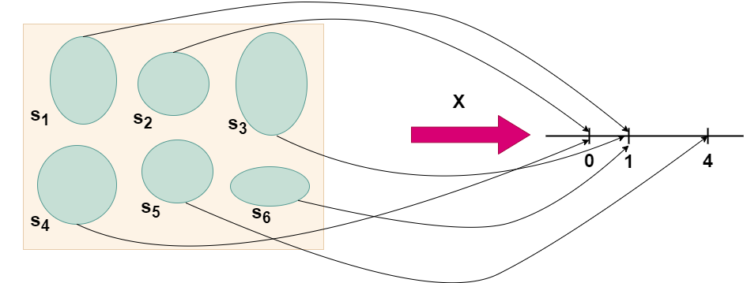                                                  
>
> ​                                                                         *图 3.1 随机变量是从样本空间映射到实数轴上*
>
> 图 3.1 该随机变量是从样本空间到实数轴的映射，样本空间中含有6个元素(鹅卵石)，通过概率函数$p$将其映射到实数轴上$\{0, 1, 4\}$，其中随机性来源于概率函数$p$在样本空间中随机选择元素

这个定义虽然抽象，但却是基础性的；在学习概率和统计时，最**重要的技能之一是能够在抽象思想和具体实例之间来回转换**。同样重要的是，**认识到问题的本质模式或结构以及它如何与您之前学习的问题相连**。我们经常讨论涉及抛硬币或从罐中抽球的情景，因为它们是简单、方便的情景，但许多其他问题是**同构**的：它们具有相同的本质结构，但以不同的方式呈现。

首先，让我们考虑一个抛硬币的例子。问题的结构是，我们有一系列试验，每次试验有两种可能的结果。在这里，我们将可能的结果视为$H$（正面）和$T$（反面），但我们也可以将它们视为“成功”和“失败”，或者1和0。例如。

> **Example  3.1.2（抛硬币）**
>
> 考虑一个实验，我们随机地抛两次公平的硬币。样本空间由四个可能的结果组成：$ S = \{HH, HT, TH, TT\} $。这里是一些在这个空间上的随机变量（为了练习，你可以想出一些自己的）。**每个随机变量都是实验某方面的数值总结**。
>
> * 让$X$表示正面的数量。这是一个可能取值为0、1和2的随机变量。作为一个函数，$X$将值2分配给结果$HH$，1分配给结果$HT$和$TH$，0分配给结果$TT$。即，
>   $$
>   X(HH) = 2, X(HT) = X(TH) = 1, X(TT) = 0
>   $$
> * 让$Y$表示反面的数量。根据$X$，我们有 $ Y = 2 - X $。换句话说，$Y$和 $ 2 - X $ 是同一个随机变量：对于所有$s$，有 $ Y(s) = 2 - X(s) $。
> * 让$I$为1，如果第一次抛硬币结果为正面结果为1，否则为0。那么$I$为结果$HH$和$HT$分配值1，为结果$TH$和$TT$分配值0。这个随机变量是所谓的**指示随机变量**的一个例子，因为它用1表示“是”和0表示“否”来指示第一次抛硬币是否为正面。
> * 我们也可以将样本空间编码为 $\{(1, 1), (1, 0), (0, 1), (0, 0)\}$，其中1代表正面，0代表反面。然后我们可以给出$X、Y、I$的明确公式：
>   $$
>    X(s_1, s_2) = s_1 + s_2, Y(s_1, s_2) = 2 - s_1 - s_2, I(s_1, s_2) = s_1 
>   $$
>   为了简化，这里 $ X(s_1, s_2) $ 来表示 $ X((s_1, s_2)) $，等等。

对于我们将会考虑的大多数随机变量来说，以这种方式书写明确的公式通常是繁琐或不切实际的。幸运的是，通常没有必要这么做，因为有其他方法可以定义一个随机变量。此外，正如本书后面部分所展示的，我们有多种方法可以研究随机变量的属性，而不必依赖于对每个结果 $s$ 的映射进行明确的计算。

正如前几章所述，对于拥有有限数量结果的样本空间，我们可以将结果视为卵石，其中每个卵石的**质量**代表其**概率**，并确保所有卵石的总质量为1。这样，随机变量就可以被理解为对每个卵石进行数字标记的过程。图3.2展示了在同一个样本空间上定义的**两个不同的随机变量**：虽然卵石或结果是相同的，但**分配给结果的实数是不同的**。

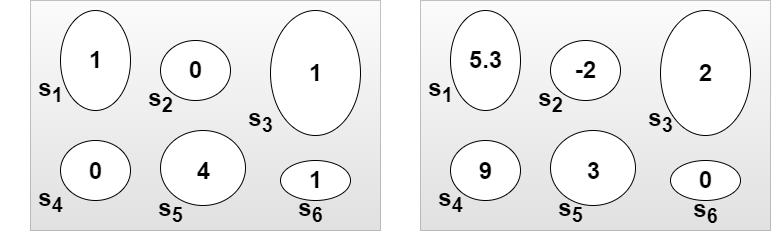

​                                                                                *图3.2    定义在样本空间中的两个随机变量*

如前所述，随机变量中的随机性来源于实验本身，在该实验中，根据概率函数 $P$ 选择样本结果 $s \in S$。在实验进行之前，结果 $s$ 还未确定，因此我们不知道 $X$ 的确切值，尽管我们可以计算 $X$ 取特定值或值范围的概率。在实验进行并且确定了结果 $s$ 之后，随机变量就变成了具体的数值 $X(s)$。

随机变量为所涉及的实验提供了**数值概括**。这是非常方便的，**因为一个实验的样本空间通常非常复杂或高维，且 $ s \in S $ 的结果可能是非数值的**。例如，实验可能是在某个城市收集一个随机样本的人，并向他们提出各种问题，这些问题可能有数字（例如年龄或身高）或非数字（例如政治党派或最喜欢的电影）的答案。事实上，相比于始终必须处理非常复杂的样本空间$S$来说，随机变量取数值是一个非常方便的简化。这样，我们可以更有效地分析和解释实验结果，而不是深陷于样本空间的**复杂性**之中。

### 3.2 分布和概率质量函数

在实践中使用的随机变量主要有两种类型：离散随机变量和连续随机变量。在本章和下一章中，我们关注的是离散随机变量。连续随机变量将在第5章中引入。

> **Definition 3.2.1（离散随机变量）**。如果存在一个有限列表的值 $a_1, a_2, \ldots, a_n$ 或一个无限列表的值 $a_1, a_2, \ldots$，使得 $P(X = a_j$ 对某些$j$成立) = 1，则称随机变量$X$是离散的。如果$X$是一个离散随机变量，那么满足 $P(X = x) > 0$ 的值的$x$构成的有限或可数无限集合称为$X$的支集

在应用中，离散随机变量的支集最常见的是一组整数。相比之下，连续随机变量可以在一个区间内（甚至是整个实数线）取任意实数值；这些随机变量在第5章中有更精确的定义。也有可能有一个离散和连续的混合随机变量，比如抛硬币然后，如果硬币正面朝上，生成一个离散随机变量，如果硬币反面朝上则生成一个连续随机变量。但理解这些随机变量的起点是理解离散和连续随机变量。

给定一个随机变量，我们希望能够用概率的语言来描述它的行为。例如，我们可能想回答关于随机变量落入给定范围的概率的问题：如果$L$是随机选择的一个美国大学毕业生的终身收入，那么$L$超过一百万美元的概率是多少？如果$M$是接下来五年内加利福尼亚州的重大地震次数，那么$M$等于0的概率是多少？

随机变量的**分布**提供了这些问题的答案。**它规定了与随机变量相关的所有事件的概率，**比如它等于3的概率，或者它至少为110的概率。我们会看到，有几种不同的方式来**表达一个随机变量的分布。对于离散随机变量来说，最直观的方式是使用概率质量函数（$PMF$）**，我们将在下面对此进行定义。

> **Definition 3.2.2（概率质量函数）**
>
> 离散随机变量$X$的概率质量函数（$PMF$）是形如 $p_X(x) = P(X = x)$，写作 $p_X$。注意，如果$x$在$X$的**支集**中，则这是正值，反之为0。

> **3.2.3**
>
>  在写 $P(X = x)$ 时，我们使用 $X = x$ 来表示一个事件，由所有$X$分配数值$x$的结果$s$组成。这个事件也被写作 $\{X = x\}$；严格地说，$\{X = x\}$ 被定义为 $\{s \in S : X(s) = x\}$，但写作 $\{X = x\}$ 更简洁直观。回到例 3.1.2，如果$X$是两次公平硬币抛掷中正面的次数，那么 $\{X = 1\}$ 包括样本结果$HT$和$TH$，这是$X$分配数值1的两个结果。由于 $\{HT, TH\}$ 是样本空间的子集，所以它是一个事件。因此，谈论 $P(X = 1)$，或更一般地，$P(X = x)$ 是有意义的。如果 $\{X = x\}$ 不是一个事件，那么计算其概率是没有意义的！**写“$P(X)$”是没有意义的；我们只能计算一个事件的概率，而不是一个随机变量的概率**。

让我们来看几个$PMF$的例子。

> **Example  3.2.4（硬币抛掷继续）**
>
> 在这个例子中，我们将找到例 3.1.2 中定义的所有随机变量的$PMF$，即两次公平硬币抛掷的例子。以下是我们定义的随机变量及其$PMF$：
>
> * $X$，硬币正面朝上的次数。由于$X$等于0，如果出现$TT$，1，如果$HT$或$TH$出现，2，如果$HH$出现，$X$的$PMF$是函数 $ p_X $ 给出的
>   $$
>   p_X(0) = P(X = 0) = 1/4,\\
>    p_X(1) = P(X = 1) = 1/2, \\
>     p_X(2) = P(X = 2) = 1/4, \\
>   $$
>
> 
>
>
>   对于所有其他$x$的值，$ p_X(x) = 0 $。
>
> * $Y = 2 - X$，硬币反面朝上的次数。根据上面的推理或使用事实 $ P(Y = y) = P(2 - X = y) = P(X = 2 - y) = p_X(2 - y) $，$Y$的$PMF$是
>   $$
>   p_Y(0) = P(Y = 0) = 1/4, \\
>    p_Y(1) = P(Y = 1) = 1/2, \\
>    p_Y(2) = P(Y = 2) = 1/4,\\
>   $$
>   对于所有其他$y$的值，$ p_Y(y) = 0 $。
>   注意$X$和$Y$有相同的$PMF$（即 $ p_X $ 和 $ p_Y $ 是相同的函数），即使$X$和$Y$不是相同的随机变量（即$X$和$Y$是两个不同的函数从 $\{HH, HT, TH, TT\}$ 到实数线）。
>
> * $I$，硬币第一次抛掷落正面朝上的指示随机变量。如果$TH$或$TT$出现，$I$等于0，如果$HH$或$HT$出现，$I$ 等于1，因此$I$的$PMF$是
>
> * $$
>   p_I(0) = P(I = 0) = 1/2,\\
>   p_I(1) = P(I = 1) = 1/2,
>   $$
>
>   对于所有其他$i$的值，$ p_I(i) = 0 $。
>
>   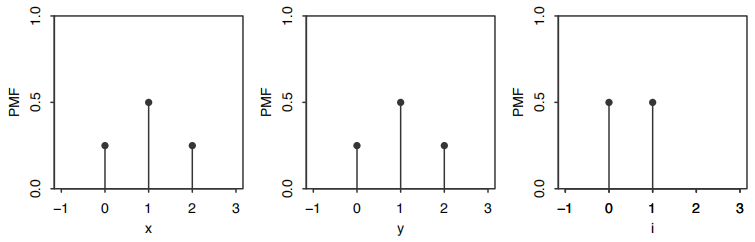
>
>   ​                                       *图3.3从左到右显示了$X$、$Y$和$I$的概率质量函数($PMF$)
>   
>   图3.3从左到右显示了$X$、$Y$和$I$的$PMF$，其中$X$是两次公平硬币抛掷中正面的次数，$Y$是反面的次数，$I$​是第一次抛掷落正面的指示器。为了便于比较不同点的高度，在$PMF$上画出了垂直条。
>

> **Example  3.2.5（骰子之和）**。我们随机掷两个公平的六面骰子。让$T = X + Y$是两次掷骰子的总和，其中$X$和$Y$​​是每个掷骰子的结果。这个实验的样本空间有36个等可能的结果：
> $$
> S = \{(1, 1), (1, 2), \ldots, (6, 5), (6, 6)\}
> $$
> 例如，下表显示了36个结果$s$中的7个，以及相应的$X$、$Y$和$T$的值。实验完成后，我们观察到$X$和$Y$的值，然后观察到的$T$​的值是这些值的总和。
>
> | s      | X    | Y    | X + Y |
> | :----- | ---- | ---- | ----- |
> | (1, 2) | 1    | 2    | 3     |
> | (1, 6) | 1    | 6    | 7     |
> | (2, 5) | 2    | 5    | 7     |
> | (3, 1) | 3    | 1    | 4     |
> | (4, 3) | 4    | 3    | 7     |
> | (5, 4) | 5    | 4    | 9     |
> | (6, 6) | 6    | 6    | 12    |
>
> 由于骰子是公平的，$X$的$PMF$​​​是
> $$
> P(X = j) = 1/6,
> $$
> 对于 $ j = 1, 2, \ldots, 6 $（对于其他$j$的值，$ P(X = j) = 0 $）；我们说$X$在1, 2, ..., 6上有一个离散均匀分布。类似地，$Y$也是在1, 2, ..., 6上的离散均匀分布。注意$Y$和$X$​**有相同的分布，但不是相同的随机变量**。事实上，我们有
> $$
> P(X = Y) = 6/36 = 1/6
> $$
> 在这个实验中，还有两个与$X$**具有相同分布的随机变量是** $7 - X$ 和 $7 - Y$。要理解这一点，我们可以使用这样一个事实：对于标准骰子，如果$X$是顶部的值，那么 $7 - X$ 就是底部的值。如果顶部的值同样可能是1, 2, ..., 6中的任意一个数字，那么底部的值也是如此。注意即使 $7 - X$ 与$X$有相同的分布，但在实验的一次运行中，它们永远不会等于$X$！
>
> 现在让我们找到$T$的$PMF$。根据概率的朴素定义，我们有
> $$
> P(T = 2) = P(T = 12) = 1/36, \\
> P(T = 3) = P(T = 11) = 2/36, \\
> P(T = 4) = P(T = 10) = 3/36,\\ 
> P(T = 5) = P(T = 9) = 4/36,\\ 
> P(T = 6) = P(T = 8) = 5/36, \\
> P(T = 7) = 6/36.\\
> $$
> 对于所有其他的$t$值，$ P(T = t) = 0 $。我们可以直接看到$T$的支集是 $\{2, 3, ..., 12\}$​，只需看两个骰子的可能总数，但作为检查，注意到
> $$
> P(T = 2) + P(T = 3) + \cdots + P(T = 12) = 1,
> $$
> 这表明已经考虑到了所有的可能性。$T$的对称性质在上面很明显，$ P(T = t) = P(T = 14 - t) $，这是有意义的，因为每个使$T = t$的结果 $\{X = x, Y = y\}$ 都有一个相同概率的对应结果 $\{X = 7 - x, Y = 7 - y\}$，使$T = 14 - t$。
>
> 图3.4显示了$T$​的$PMF$；它具有三角形状，上面提到的对称性在图中非常明显。
>
> 
>
> ​                                                            *图 3.4 两个骰子的点数之和的概率质量函数*

> **Example  3.2.6（美国家庭中的孩子数量）**
>
> 假设我们随机选择一个美国家庭。让$X$是选择家庭中的孩子数量。**由于$X$只能取整数值，它是一个离散随机变量**。$X$取值$x$的概率与美国具有$x$个孩子的家庭数量成正比。
>
> 使用2010年《社会总调查》的数据 [23]，我们可以近似估计0个孩子、1个孩子、2个孩子等家庭的比例，从而近似估计$X$​的$PMF$，其绘制在图3.5中。
>
> 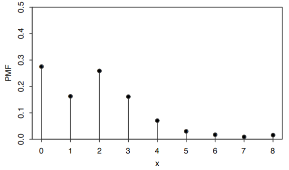
>
> ​                                                            *图 3.5 随机选择美国一个家庭其拥有孩子数量的概率质量函数*

现在我们将陈述一个有效$PMF$的性质。

> **Definition 3.2.7**（有效的$PMF$）
>
> 假设$X$是一个离散随机变量，其支集为 $x_1, x_2, \ldots$（为了符号上的简单，假设支集是可数无限的；如果支集是有限的，类似的结果也成立）。$X$的$PMF$ $p_X$ 必须满足以下两个标准:
>
> * 非负性：如果 $x = x_j$ 对某些$j$成立，则 $p_X(x) > 0$，否则 $p_X(x) = 0$；
> * 和为1：$\sum_{j=1}^{\infty} p_X(x_j) = 1$。

> **Proof：**第一个标准是真的，因为概率是非负的。第二个标准是真的，因为$X$必须取一些值，且事件 $\{X = x_j\}$ 是不相交的，所以
> $$
>  \sum_{j=1}^{\infty} P(X = x_j) = P\left(\bigcup_{j=1}^{\infty} \{X = x_j\}\right) = P(X = x_1 \text{ 或 } X = x_2 \text{ 或 } \ldots) = 1 
> $$
>  
>
> 相反，如果指定了不同的值 $x_1, x_2, \ldots$，并且我们有一个满足上述两个标准的函数，则此函数是某个随机变量的$PMF$；我们将在第5章中展示如何构造这样一个随机变量。
>
> 我们之前声称$PMF$是表示离散随机变量分布的一种方式。这是因为一旦我们知道了$X$的$PMF$，我们就可以通过对适当的$x$值进行求和来计算X落入给定实数集的概率，正如下一个例子所展示的那样。

> **Example  3.2.8**
>
> 回到例 3.2.5，让$T$是两个公平骰子掷出的总和。我们已经计算出了$T$的$PMF$。现在假设我们对$T$落在区间$[1, 4]$内的概率感兴趣。区间$[1, 4]$内$T$可以取的值只有2、3和4。我们知道这些值的概率来自$T$的$PMF$，所以
> $$
> P(1 \leq T \leq 4) = P(T = 2) + P(T = 3) + P(T = 4) = 6/36 
> $$
>

通常，给定一个离散随机变量$X$和一组实数$B$，如果我们知道$X$的$PMF$，我们可以找到 $P(X \in B)$，即$X$落在$B$中的概率，方法是对$X$的$PMF$图中$B$中的点的垂直条的高度求和。**知道离散随机变量的$PMF$确定了其分布。**

### 3.3 伯努利和二项分布

一些分布在概率论和统计学中非常常见，因此它们有自己的名称。我们将在本书中介绍这些**命名分布**，从一个非常简单但实用的案例开始：一个随机变量只能取两个可能的值（$r.v.$），即 0 和 1。

> **Definition 3.3.1（伯努利分布）**
>
> 设一个随机变量 为$X$， 如果 $P(X = 1) = p$ 且 $P(X = 0) = 1 - p$，其中 $0 < p < 1$。那么$X$被说成具有参数 $p$ 的伯努利分布，我们记为 $X \sim \text{Bern}(p)$。符号 $\sim$ 读作“服从分布”。

**任何**可能值为 0 和 1 的随机变量都有一个 $\text{Bern}(p)$ 分布，其中$p$ 是随机变量等于 1 的概率。这个数 $p$ 在 $\text{Bern}(p)$ 中被称为**分布的参数**；**它决定了我们具有哪一个特定的伯努利分布**。因此，不仅仅有一个伯努利分布，而是有一系列的伯努利分布，由 $p$ 索引。例如，如果 $X \sim \text{Bern}(1/3)$，那么仅说“$X$ 是伯努利的”是正确但不完整的；**要完全指定 $X$ 的分布，我们应该同时说明它的名称（伯努利）和它的参数值（1/3），这是记法 $X \sim \text{Bern}(1/3)$ 的重点。**

**任何事件都有一个伯努利随机变量，因为这种随机变量自然存在于其中。如果事件发生则等于 1，否则为 0。这称为事件的指示随机变量**；我们看到这样的随机变量是极其有用的。

> **Definition  3.3.2（指示随机变量）**
>
> 事件 $A$ 的指示随机变量是一个随机变量，如果 $A$ 发生则等于 1，否则为 0。我们将用 $I_A$ 或 $I(A)$ 表示事件 $A$ 的指示随机变量。注意 $I_A \sim \text{Bern}(p)$，其中 $p = P(A)$。
>
> 我们经常使用抛硬币的例子来想象伯努利随机变量，但这只是讨论以下一般情景的简易语言。

> **Story 3.3.3（伯努利试验）**
>
> 一个实验只有成功或失败两种结果（但不是两者）的结果，称为伯努利试验。伯努利随机变量可以被认为是伯努利试验中成功的指示符：如果试验中发生成功则等于 1，如果发生失败则等于 0。
>
> 根据这个情景，参数 $p$ 常被称为伯努利分布的成功概率。一旦我们开始考虑伯努利试验，就自然而然的开始考虑当我们进行不止一个试验时会发生什么。

> **Story 3.3.4（二项分布）**
>
> 假设进行了 $n$ 个独立的伯努利试验，每个都具有相同的成功概率 $p$。设 $X$ 为**成功次数**。称$X$ 的分布为具有参数 $n$ 和 $p$ 的二项分布。我们写 $X \sim \text{Bin}(n, p)$，表示 $X$ 具有参数 $n$ 和 $p$ 的二项分布，其中 $n$ 是一个正整数且 $0 < p < 1$。
>
> 请注意，我们并不是通过其概率质量函数（$PMF$），而是通过可以产生具有二项分布的随机变量的实验类型来定义二项分布。统计学中最著名的分布都有情景，这些情景解释了它们为什么经常被用作数据模型，或者用于构建更复杂分布的
>
> 首先从它们的情景角度思考命名分布有许多好处。它有助于**模式识别**，让我们看到两个问题在**结构上本质上是相同的**；它通常会导致更清晰的解决方案，这些解决方案完全避免了 $PMF$ 计算；并且它帮助我们理解命名分布之间是如何相互关联的。在这里很清楚，$\text{Bern}(p)$ 和 $\text{Bin}(1, p)$ 是同一个分布：伯努利是二项式的一个特例。

使用二项式的情景定义，让我们找到它的 $PMF$。

> **Theorem 3.3.5（二项分布 $PMF$）**
>
> 如果 $X \sim \text{Bin}((n, p)$，则 $X$ 的 $PMF$ 为
> $$
> P(X = k) = \binom{n}{k} p^k (1 - p)^{n-k} 
> $$
>
> 对于 $k = 0, 1, \ldots, n$（对于其他 $k$，$P(X = k) = 0$）。

> **3.3.6**
>
>  为了节省书写，通常默认 $PMF$ 在未明确指定为非零的地方为零，但无论如何理解随机变量的支持是很重要的，并且检查 $PMF$ 是否有效也是一个好习惯。如果两个离散随机变量有相同的 $PMF$​，那么它们也必须具有相同的支持。因此，我们有时会提到离散分布的支持；这是任何具有该分布的随机变量的支持。

> **Proof：**
>
> 由 $n$ 个独立的伯努利试验组成的实验产生了一系列的成功和失败。任何特定序列的 $k$ 个成功和 $n - k$ 个失败的概率是 $p^k (1 - p)^{n-k}$。存在 $\binom{n}{k}$ 这样的序列，因为我们只需要选择成功的位置。因此，设 $X$ 为成功次数，
> $$
> P(X = k) = \binom{n}{k} p^k (1 - p)^{n-k} 
> $$
>
> 对 $k = 0, 1, \ldots, n$，其他情况下 $P(X = k) = 0$​。这是一个有效的 $PMF$，因为它是非负的，并且由二项定理知总和为 1。
>
> 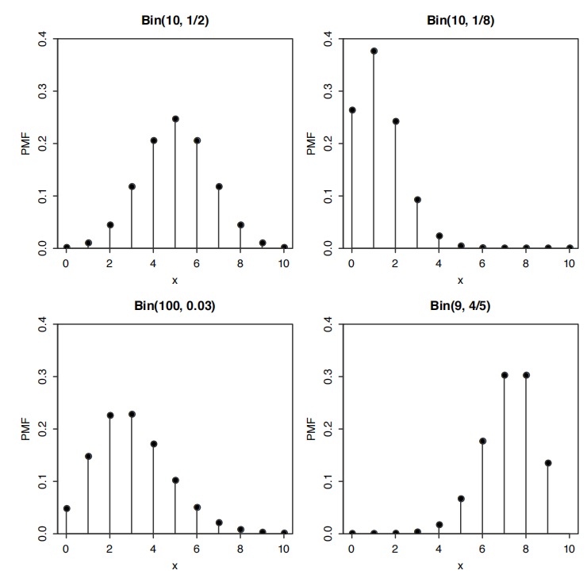
>
> ​                                                                                 *图 3.6 一些二项分布的概率质量函数图像*
>
> 图 3.6 展示了对于不同的 $n$ 和 $p$ 值的二项式 $PMF$ 图。请注意，$\text{Bin}(10, 1/2)$ 分布的 $PMF$ 关于 5 对称，但当成功概率不为 1/2 时，$PMF$ 是偏斜的。对于固定的试验次数 $n$，$X$ 倾向于较大，当成功概率较高时，$X$​ 倾向于较小，这与二项式分布的解释相符。还要记得，在任何 $PMF$ 图中，垂直条的高度之和必须为 1。

我们使用情景 3.3.4 来找到 $\text{Bin}(n, p)$ 的 $PMF$。这个情景还为我们提供了一个直接的证明：如果 $X$ 服从二项分布，那么 $n - X$ 也服从二项分布。

> **Theorem 3.3.7**
>
> 设 $X \sim \text{Bin}(n, p)$，且 $q = 1 - p$（我们经常用 $q$ 表示伯努利试验的失败概率）。那么 $n - X \sim \text{Bin}(n, q)$。

> **Proof.**：在二项式的情景中，将 $X$ 解释为 $n$ 个独立伯努利试验中的成功次数。那么 $n - X$ 就是这些试验中的失败次数。交换成功和失败的角色，我们有 $n - X \sim \text{Bin}(n, q)$。或者，我们可以检查 $n-X$ 是否具有 $\text{Bin}(n, q)$ $PMF$。设 $Y = n-X$。$Y$ 的 $PMF$ 是
> $$
>  P(Y = k) = P(X = n - k) = \binom{n}{n - k} p^{n-k} q^k = \binom{n}{k} q^k p^{n-k}, 
> $$
>
> 对 $k = 0, 1, \ldots, n$。

> **Corollary 3.3.8**
>
> 设 $X \sim \text{Bin}(n, p)$，且 $p = 1/2$ 且 $n$ 为偶数。那么 $X$ 的分布关于 $n/2$ 对称，即 $P(X = n/2 + j) = P(X = n/2 - j)$ 对所有非负整数 $j$ 都成立。

> **Proof**.：根据定理 3.3.7，$n - X$ 也服从 $\text{Bin}(n, 1/2)$ 分布，所以
> $$
> P(X = k) = P(n - X = k) = P(X = n - k)
> $$
>
> 对所有非负整数 $k$ 都成立。设 $k = n/2 + j$，就能得结果。这解释了为什么图 3.6 中的 $\text{Bin}(10, 1/2)$ $PMF$ 关于 5 对称。

> **Example  3.3.9（继续掷硬币的例子）**回到例 3.1.2，我们现在知道 $X \sim \text{Bin}(2, 1/2)$，$Y \sim \text{Bin}(2, 1/2)$，且 $I \sim \text{Bern}(1/2)$。与定理 3.3.7 一致，$X$ 和 $Y = 2 - X$ 有相同的分布，并且与推论 3.3.8 一致，$X$（以及 $Y$）的分布关于 1 对称。

### 3.4 超几何分布

如果我们有一个装满了 $w$ 个白球和 $b$ 个黑球的罐子，那么有放回的抽取 $n$ 个球，每次抽取后，将得到一个关于获得的白球数量的二项分布 $\text{Bin}(n, w/(w + b))$，因为抽取是独立的伯努利试验，所以每次成功（抽到白球）的概率为 $w/(w + b)$​。如果我们改为不放回地抽样，如图 3.7 所示，那么**白球的数量遵循超几何分布**。

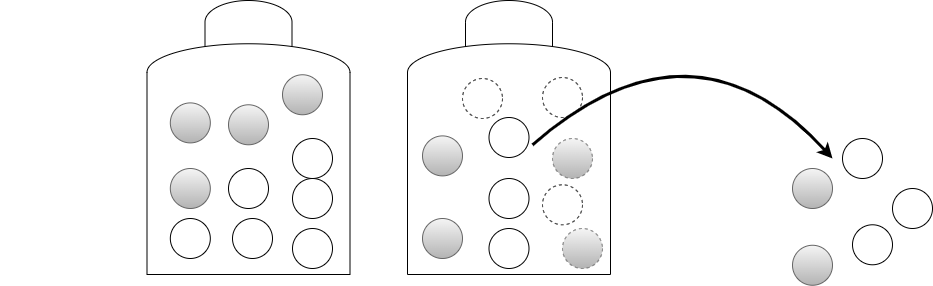

​                                                                             *图3.7 超几何分布案例*

一个包含$w$=6 个白球和$b$=4  个黑球的罐子。不放回地取出 $n$=5 个球，样本中白球的数量 $X$ 服从超几何分布。图中观察$X$=3 的情况

> **Story  3.4.1（超几何分布）**
>
> 考虑一个装有 $w$ 个白球和 $b$ 个黑球的罐子。我们随机抽取 $n$ 个球，不进行放回，所以有 $\binom{w + b}{n}$ 种方案都同样是可能的。设 $X$ 为样本中白球的数量。那么 $X$ 被认为具有参数 $w$、$b$ 和 $n$ 的**超几何分布**；我们记为 $X \sim \text{HGeom}(w, b, n)$。

> **Theorem 3.4.2（超几何 $PMF$）**
>
> 如果 $X \sim \text{HGeom}(w, b, n)$，那么 $X$ 的 $PMF$ 为
> $$
> P(X = k) = \frac{\binom{w}{k} \binom{b}{n-k}}{\binom{w+b}{n}} 
> $$
>
> 对于满足 $0 \leq k \leq w$ 和 $0 \leq n-k \leq b$ 的整数 $k$，其他情况下 $P(X = k) = 0$。

> **Proof**：
>
> 为了得到 $P(X = k)$，我们首先计算从罐子中恰好抽取 $k$ 个白球和 $n-k$ 个黑球（不区分获得相同球集合的不同顺序）的可能方式数量。如果 $k > w$ 或 $n-k > b$，那么抽取是不可能的。所以，有 $\binom{w}{k} \binom{b}{n-k}$ 种方式通过乘法规则抽取 $k$ 个白球和 $n-k$ 个黑球，总共有 $\binom{w+b}{n}$ 种方式抽取 $n$ 个球。由于所有样本都同样可能，根据概率的朴素定义，我们有
> $$
> P(X = k) = \frac{\binom{w}{k} \binom{b}{n-k}}{\binom{w+b}{n}} 
> $$
>
> 对于满足 $0 \leq k \leq w$ 和 $0 \leq n-k \leq b$ 的整数 $k$。这个 $PMF$ 是有效的，因为分子总和在所有 $k$ 上等于 $\binom{w+b}{n}$，根据范德蒙德恒等式（例 1.5.3），所以 $PMF$ 总和为 1。

超几何分布在许多表面上与罐子中的白球和黑球没有太多共同点的情景中出现。超几何情景的本质结构是，种群中的项目使用两组标签进行分类：在罐子情景中，每个球要么是白色的，要么是黑色的（这是**第一组标签**），并且每个球要么被抽取，要么没有被抽取（这是**第二组标签**）。此外，至少其中一组标签是完全随机分配的（在罐子情景中，球是随机抽取的，所有正确大小的集合都同样可能）。然后 $X \sim \text{HGeom}(w, b, n)$ 表示被双重标记的项目数量：在罐子情景中，既是白色又被抽取的球的数量。

> **Example  3.4.3（麋鹿捕捉再捕获）**
>
> 一个森林中有 $N$ 只麋鹿。今天，其中 $m$ 只麋鹿被捕捉、标记并释放回野外。在稍后的某个时候，随机再捕获了 $n$ 只麋鹿。假设被再捕获的麋鹿等可能地是任何 $n$ 只麋鹿的集合，例如，一只已被捕捉的麋鹿不会学会如何避免再次被捕捉。
>
> 根据超几何分布的故事，再捕获样本中带标记麋鹿的数量遵循 $\text{HGeom}(m, N - m, n)$ 分布。在这个故事中，$m$ 只带标记的麋鹿对应于白球，$N - m$ 只未带标记的麋鹿对应于黑球。我们从森林中再捕获 $n$ 只麋鹿，而不是从罐子中抽取 $n$ 只球。

> **Example  3.4.4（扑克手中的王牌）**
>
> 从一副洗牌良好的标准扑克牌中随机抽取五张牌，手中王牌的数量服从超几何分布 $\text{HGeom}(4, 48, 5)$，这可以通过将王牌视为白球，其余牌视为黑球来理解。使用超几何 $PMF$​，手中恰好有三张王牌的概率是
> $$
> \frac{\binom{4}{3} \binom{48}{2}}{\binom{52}{5}} \approx 0.0017.
> $$
> 下表总结了如何根据两组标签来思考上述示例。在每个示例中，我们感兴趣的随机变量是落在第二列和第四列的物品数量：即白色且被抽中、被标记且被再次捕获、是王牌且在手中的数量。

| 故事   | 第一组标签 | 第二组标签 |
| ------ | ---------- | ---------- |
| 摇奖箱 | 白色       | 黑色       |
| 麋鹿   | 被标记     | 未被标记   |
| 扑克牌 | 王牌       | 非王牌     |

下一个定理描述了具有不同参数的两个超几何分布之间的对称性；其证明来自于在超几何故事中交换两组标签。

> **Theorem 3.4.5**
>
> 超几何分布 $ \text{HGeom}(w, b, n) $ 和 $ \text{HGeom}(n, w + b - n, w) $ 是相同的。也就是说，如果 $ X \sim \text{HGeom}(w, b, n) $ 且 $ Y \sim \text{HGeom}(n, w + b - n, w) $，那么 $ X $ 和 $ Y $ 有相同的分布。

> **Proof**：
>
> 使用超几何情景，设想一个含有 $ w $ 个白球、$ b $ 个黑球的罐子，并且抽取大小为 $ n $ 的样本，不进行替换。设 $ X \sim \text{HGeom}(w, b, n) $ 为样本中白球的数量，将白/黑视为第一组标签，抽取/未抽取视为第二组标签。设 $ Y \sim \text{HGeom}(n, w + b - n, w) $ 为白球中被抽取的球的数量，将抽取/未抽取视为第一组标签，白/黑视为第二组标签。两者 $ X $ 和 $ Y $ 都计算白色被抽取的球的数量，因此它们有相同的分布。
>
> 或者，我们可以从代数上检查 $ X $ 和 $ Y $ 是否有相同的 $PMF$：
> $$
> P(X = k) = \frac{\binom{w}{k} \binom{b}{n-k}}{\binom{w+b}{n}} = \frac{w!b!n!(w + b - n)!}{k!(w + b)!(w - k)!(n - k)!(b - n + k)!},\\
> P(Y = k) = \frac{\binom{n}{k} \binom{w+b-n}{w-k}}{\binom{w+b}{w}} = \frac{w!b!n!(w + b - n)!}{k!(w + b)!(w - k)!(n - k)!(b - n + k)!}.\\
> $$
>

我们更喜欢情景证明，因为它不那么繁琐且更易记住。

> **3.4.6（二项分布与超几何分布）**
>
> 二项分布和超几何分布常常被混淆。两者都是在某些 $ n $ 之间取整数值的离散分布，并且都可以解释为 $ n $ 次伯努利试验中的成功次数（对于超几何分布，每个被标记的麋鹿在重新捕获的样本中可以被视为一次成功，每个未被标记的麋鹿被视为一次失败）。然而，**二项分布情景的一个关键部分是所涉及的伯努利试验是独立的。超几何情景中的伯努利试验是相依的，因为抽样是不替换进行的：知道我们的样本中有一个麋鹿被标记会降低第二个麋鹿也被标记的概率。**

### 3.5 离散均匀分布

假设一个非常简单的情景，与概率的朴素定义紧密相关，描述了从一些有限集合中随机挑选一个数字。

> **story 3.5.1（离散均匀分布）**
>
> 设 $ C $ 为一个有限的非空数字集合。均匀随机地选择其中的一个数字（即，$ C $ 中的所有值都同样可能）。称所选的数字为 $ X $。那么 $ X $ 服从
>
> 
>
> 参数 $ C $ 的离散均匀分布；我们记为 $ X \sim \text{DUnif}(C) $。
>
> $ X \sim \text{DUnif}(C) $ 的 $PMF$ 为
> $$
> P(X = x) = \frac{1}{|C|} 
> $$
> 因为 $PMF$ 必须总和为 1，所以对 $ x \in C $（其他情况下 $ P(X = x) = 0 $）。就像基于概率的朴素定义的问题一样，基于离散均匀分布的问题归结为计数问题。具体来说，
>
> 对于 $ X \sim \text{DUnif}(C) $ 和任何 $ A \subseteq C $，我们有
> $$
> P(X \in A) = \frac{|A|}{|C|}
> $$
>

> **Example  3.5.2（随机纸条）**
>
> 有 100 张纸条在一个帽子里，每张上面都由数字 1, 2, ..., 100，中的一个数字进行标记。并且没有数字重复出现。抽取其中的五张，每次抽取一张。
>
> 首先考虑有放回的随机抽样（概率相等）。
> (a) 抽取的纸条上写着大于等于 80 的数字的分布是什么？
> (b) 第 $j$ 次抽取（对于 $1 \leq j \leq 5$）的值的分布是什么？
> (c) 至少抽取一次数字 100 的概率是多少？现在考虑没有放回的随机抽样（所有五张纸条的集合同样可能被选中）。
> (d) 抽取的纸条上写着大于等于 80 的数字的分布是什么？
> (e) 第 $j$ 次抽取（对于 $1 \leq j \leq 5$）的值的分布是什么？
> (f) 在样本中至少抽到一次数字 100 的概率是多少？

> **Solution:**
>
> * (a) 根据二项分布情景，分布是 $\text{Bin}(5, 0.21)$。
> * (b) 设 $X_j$ 为第 $j$ 次抽取的值。由对称性，$X_j \sim \text{DUnif}(1, 2, ..., 100)$。没有特定的纸条更喜欢在第 $j$ 次被抽中，所有都同样可能。
> * (c) 用补集法，
>   $$
>   P(X_j = 100 \text{ for at least one } j) = 1 - P(X_1 = 100, ..., X_5 = 100)
>   $$
>   根据概率的朴素定义，这是
>   $$
>   1 - \left(\frac{99}{100}\right)^5 \approx 0.049 
>   $$
>   
>   这个解决方案只是对第 1 章概念的新符号表示。这种新的符号表示很有用，因为它紧凑且灵活。在上面的计算中，重要的是理解为什么
>   $$
>    P(X_1 = 100, ..., X_5 = 100) = P(X_1 = 100) \cdots P(X_5 = 100) 
>   $$
>   
>   这是根据这种情况下的朴素定义得出的，但更一般的思考方式是通过随机变量的独立性，这一概念将在第 3.8 节详细讨论。
> * (d) 根据超几何分布情景，分布是 $\text{HGeom}(21, 79, 5)$。
> * (e) 设 $Y_j$ 为第 $j$ 次抽取的值。由对称性，$Y_j \sim \text{DUnif}(1, 2, ..., 100)$。了解任何一个 $Y_i$ 会提供有关其他值的信息（所以 $Y_1, ..., Y_5$ 不是独立的，如第 3.8 节所定义），但由于**对称性**，在无条件情况下，第 $j$ 张被抽取的纸条同样可能是任何一张。这是 $Y_j$ 的无条件分布：我们是在抽取任何一张纸条之前的视角下进行工作的。
>
> 为了进一步理解为什么 $Y_1, ..., Y_5$ 每一个都是离散均匀分布，以及如何无条件地考虑 $Y_j$，因此想象一下，如果不是一个人一次抽五张纸条，而是五个人同时伸手进帽子，每个人抽一张，那么所有人抽到哪张纸条的可能性都是相等的。这种表述并没有在任何重要方面改变问题，并且有助于避免被无关的时间顺序细节所分散注意力。以某种方式给这五个人编号，例如，从年轻到年长，设 $Z_j$ 为第 $j$ 个人抽到的纸条的值。根据对称性，对于每个 $j$，$Z_j \sim \text{DUnif}(1, 2, ..., 100)$；虽然 $Z_j$ 们是相依的，但单独看每个人，他们都在抽取一个均匀随机的纸条。
>
> * (f) 事件 $Y_1 = 100, ..., Y_5 = 100$ 是互斥的，因为我们现在是无替换地抽取，所以
> $$
>    P(Y_j = 100 \text{ for some } j) = P(Y_1 = 100) + \cdots + P(Y_5 = 100) = 0.05 
> $$
>
>  理智检查：这个答案直观上是有意义的，因为我们也可以想象首先从 100 张空白纸条中随机选择五张，然后随机在纸条上写上 1 到 100 的数字，这给了数字 100 出现在所选五张纸条之一上的概率为 5/100。
>
> 因为无替换抽样使找到数字 100 更容易。所以 (c) 的答案大于或等于 (f) 的答案会很奇怪。（出于同样的原因，寻找丢失的物品时，无替换抽样比有替换抽样更有意义。）但 (c) 的答案仅略低于 (f) 的答案是有意义的，因为在 (c) 中，同一张纸条被多次抽取的可能性不大（尽管根据生日问题，这种可能性不像许多人猜测的那样不太可能）。
>
> 更一般地，如果抽取了 $k$ 张纸条，无替换，其中 $0 \leq k \leq 100$，那么同样的推理给出抽到数字 100 的概率为 $k/100$。注意，这在极端情况 $k = 100$ 时是有意义的，因为在那种情况下我们抽取了所有的纸条。

### 3.6 累积分布函数

描述随机变量（$r.v.$）分布的另一个函数是累积分布函数（$CDF$）。与仅离散随机变量拥有的概率质量函数（$PMF$）不同，$CDF$适用于所有随机变量。

> **Definition 3.6.1**
>
> 随机变量 $X$ 的累积分布函数（$CDF$）是由 $F_X(x) = P(X \leq x)$ 给出的函数。当没有歧义风险时，我们有时会省略下标，只写 $F$（或其他字母）表示$CDF$。

下面的例子展示了对于离散随机变量，我们可以自由地在$CDF$和$PMF$之间进行互换

> **Example  3.6.2**
>
> 设 $X \sim \text{Bin}(4, 1/2)$。图 3.8 显示了 $X$ 的$PMF$和$CDF$。
>
> * 从$PMF$到$CDF$：要找到 $P(X \leq 1.5)$，即在 1.5 处评估的 $CDF$，我们对所有小于或等于 1.5 的支持值上的 $PMF$ **求和**：
>   $$
>    P(X \leq 1.5) = P(X = 0) + P(X = 1) = \binom{4}{0} \left(\frac{1}{2}\right)^4 + \binom{4}{1} \left(\frac{1}{2}\right)^4 = \frac{5}{16} 
>   $$
>   
>   类似地，任意点 $x$ 处的$CDF$值是$PMF$在小于或等于 $x$ 的值上的垂直条的高度之和。
>   
> * 从$CDF$到$PMF$：离散随机变量的$CDF$由跳跃和平坦区域组成。$CDF$在 $x$ 处的跳跃高度等于$PMF$在 $x$ 的值。例如，在图 3.8 中，$CDF$在 2 处的跳跃高度与$PMF$中相应垂直条的高度相同；这在图中用花括号表示。$CDF$的平坦区域对应于 $X$​ 的支持之外的值，因此这些区域中的$PMF$等于 0。
>
>   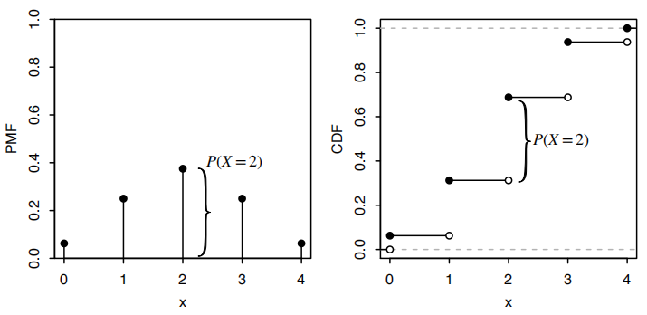
>
>   ​                                                     *图3.8 $X \sim \text{Bin}(4, 1/2)$ 分布的概率质量函数($PMF$)和累计分布函数（$CDF$）*
>
>   图3.8 $X \sim \text{Bin}(4, 1/2)$ 分布的概率质量函数($PMF$)和累计分布函数（$CDF$）。$PMF$在$x$=2处垂直点的高度等于$CDF$在$x$=2处跳跃的高度

有效的$CDF$满足以下标准。

> **Theorem 3.6.3（有效$CDF$）**
>
> **任何**$CDF$ $F$ 都具有以下属性：
>
> * 增加性：如果 $x_1 \leq x_2$，则 $F(x_1) \leq F(x_2)$。
>
> * 右连续性：如图 3.8 所示，$CDF$除可能有一些跳跃外，累积分布函数是连续的。无论从哪里跳跃，$CDF$都是从右侧连续的。也就是说，对于任何 $a$​，我们有 
>
>   
> $$
>   F(a) = \lim_{x \to a^+} F(x)
> $$
>
> * 极限趋向于 0 和 1：
>   $$
>   \lim_{x \to -\infty} F(x) = 0\\ \lim_{x \to \infty} F(x) = 1。
>   $$

> **Proof：**
>
> 上述标准对所有$CDF$都是正确的，但为简单起见，我们只对离散随机变量 $X$ 的$CDF$ $F$ 进行证明，假设 $X$ 可能的值为 0, 1, 2, ...。作为如何可视化标准的示例，考虑图 3.8：所示$CDF$是增加的（有一些平坦区域），从右侧连续（除了跳跃处是连续的，每个跳跃在底部有一个开放点，在顶部有一个封闭点），并且它在 $x \to -\infty$ 时趋向于 0，在 $x \to \infty$​ 时趋向于 1（在这个示例中，它达到了 0 和 1；在某些示例中，可能接近但永远不会达到这些值）。
>
> 第一个标准是正确的，因为事件 $\{X \leq x_1\}$ 是事件 $\{X \leq x_2\}$ 的子集，所以 $P(X \leq x_1) \leq P(X \leq x_2)$。
>
> 对于第二个标准，请注意
> $$
> P(X \leq x) = P(X \leq \lfloor x \rfloor) 
> $$
>
> 其中 $\lfloor x \rfloor$ 是小于或等于 $x$ 的最大整数。例如，因为 $X$ 是整数值,$P(X \leq 4.9) = P(X \leq 4)$。所以 $F(a + b) = F(a)$，对于任何 $b > 0$ 足够小以至于 $a + b < \lceil a \rceil + 1$，例如对于 $a =4.9$，当 $0 < b < 0.1$ 时成立。这意味着 $F(a) = \lim_{x \to a^+} F(x)$（实际上，这更强，因为它说明当 $x$ 足够接近 $a$ 并且在其右侧时，$F(x)$ 等于 $F(a)$）。
>
> 对于第三个标准，我们有 $F(x) = 0$ 对于 $x < 0$，并且
> $$
> \lim_{x \to \infty} F(x) = \lim_{x \to \infty} P(X \leq \lfloor x \rfloor) = \lim_{x \to \infty} \sum_{n=0}^{\lfloor x \rfloor} P(X = n) = \sum_{n=0}^{\infty} P(X = n) = 1 
> $$
>
>
> 反过来也是正确的：我们将在第 5 章展示，给定满足这些标准的任何函数 $F$，我们可以构造一个其$CDF$为 $F$ 的随机变量。
>
> 总结一下，我们现在已经看到了表达随机变量分布的三种等效方式。这两种是$PMF$和$CDF$：我们知道这两个函数包含相同的信息，因为我们总是可以从$PMF$推导出$CDF$，反之亦然。一般来说，对于离散随机变量，使用$PMF$更容易，因为评估$CDF$需要求和。

描述分布的第三种方式是一个情景，它精确地解释了分布是如何产生的。我们使用二项式和超几何分布的情景来推导相应的$PMF$s。尽管我们通常通过情景而不是$PMF$计算来实现更直观的证明，但情景和$PMF$也包含相同的信息。

### 3.7 随机变量的函数

在这一节中，我们将讨论随机变量应用函数意味着什么，以及为什么随机变量的函数是一个随机变量。也就是说，如果 $X$ 是一个随机变量，那么 $X^2$、$e^X$ 和 $\sin(X)$ 也是随机变量，对于任何函数 $g: \mathbb{R} \to \mathbb{R}$，$g(X)$ 也是如此。

例如，想象两个篮球队（$A$ 和 $B$）正在进行七场比赛，设 $X$ 为$A$队的获胜次数（所以如果两队实力均匀并且比赛是独立的，$X \sim \text{Bin}(7, 1/2)$）。设 $g(x) = 7 - x$，设 $h(x) = 1$ 如果 $x \geq 4$，$h(x) = 0$ 如果 $x < 4$。那么 $g(X) = 7 - X$ 是$B$队的获胜次数，$h(X)$ 是$A$队赢得大多数比赛的指示器。由于 $X$ 是一个随机变量，$g(X)$ 和 $h(X)$ 也都是随机变量。

为了正式定义随机变量的函数，让我们稍微倒带一下。在本章的开头，我们考虑了一个在含有6个元素的样本空间上定义的随机变量 $X$。图 3.1 用箭头展示了 $X$ 如何将样本空间中的每个点映射到一个实数，而图 3.2 的左半部分则展示了我们可以如何想象 $X$ 在每个点内部写上一个实数。

现在，如果我们愿意，可以对点内的所有数字应用相同的函数 $g$。这样，原来的数字 $X(s_1)$ 到 $X(s_6)$ 就变成了新的数字 $g(X(s_1))$ 到 $g(X(s_6))$，从而产生了从样本结果到实数的新映射——我们创造了一个新的随机变量，$g(X)$。

> **Definition 3.7.1（随机变量的函数）**
>
> 对于一个样本空间为 $S$ 的实验，一个随机变量 $X$，以及一个函数 $g: \mathbb{R} \to \mathbb{R}$，$g(X)$ 是将 $s \in S$ 映射到 $g(X(s))$ 的随机变量。

以 $g(x) = \sqrt{x}$ 为具体例子，图 3.9 显示了 $g(X)$ 是 $X$ 和 $g$ 的组合，表明“首先应用 $X$，然后应用 $g$”。图 3.10 通过直接在样本结果上标记来更简洁地表示 $g(X)$。这两幅图都向我们展示了 $g(X)$ 是一个随机变量；如果 $X$ 确定为 4，则 $g(X)$​ 确定为 2。

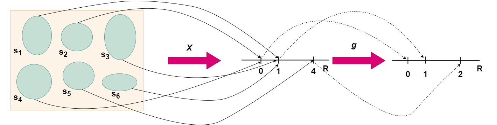

​                                                                            *图 3.9 表示随机变量的函数也是一个随机变量*

图3.9 在一个包含6个元素的样本空间中定义一随机变量$x$，且其可能的取值为0、1、4。令函数$g$是平方根函数。将函数$g$和$x$复合，给出了新的随机变量$g(x) = \sqrt{x}$ ，它的可能取值为0、1、2。

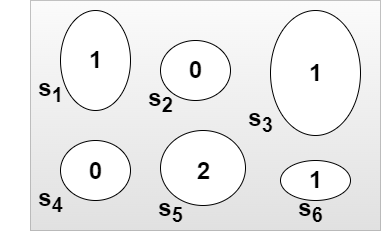

​                                             *图 3.10  由于$g(x) = \sqrt{x}$将每块鹅卵石用一个数字进行标记，因而它是一个随机变量。*

给定一个具有已知$PMF$的离散随机变量 $X$，我们如何找到 $Y = g(X)$ 的$PMF$？在 $g$ 是一对一函数的情况下，答案很直接：$Y$ 的支集是所有 $g(x)$ 的集合，其中 $x$ 在 $X$ 的支集中，且
$$
P(Y = g(x)) = P(g(X) = g(x)) = P(X = x)
$$

> **Example 3.7.2(随机游走)**
>
> 粒子在一数轴上移动$n$步。粒子从0点开始，每移动一步，只能以相等的概率移动到右边或者左边的1个单位。假设没一部移动之间都是相互独立的。设$Y$是移动$n$步后粒子所在的位置。求$Y$的概率质量函数。

> **Solution:**
>
> 将每一步移动都看作是伯努利实验，其中向右移动看作是成功，向左移动看作是失败。粒子向右移动的次数是服从参数为$n$和$\frac{1}{2}$的伯努利分布的随机变量，这里将其记为$X$。如果$X$=$j$，则粒子向右移动了$j$次，向左移动了$n$-$j$次，最后的位置为$j-(n-j)=2j-n$。因此可以用$X$构造$X$的一对一函数$Y=2X-n$。由于$X$的取值为$\{0, 1, 2, \ldots, n\}$，故$Y$的取值为$\{-n, 2-n, 4-n, \ldots, n\}$。因此，$Y$的概率质量函数可以由$X$​的概率质量函数得到
> $$
> P(Y = k) = P(2X - n = k) = P(X = \frac{n + k}{2}) = \frac{\binom{n}{\frac{n+k}{2}} \left(\frac{1}{2}\right)^n}{\binom{n+k}{\frac{n+k}{2}}}
> $$
> 其中，$k$是-n到$n$之间的整数，且$n+k$是偶数。
>
> 如果$g$不是一对一函数，则当给定一个$y$时，会存在多个$x$使得$g$（$x$）=$y$。为求得P($g$($x$)=$y$)，需要把这些$x$找出来在再求和

> **Theorem 3.7.3（$g(X)$ 的$PMF$​）**
>
> 设 $X$ 是一个离散随机变量，且$g: \mathbb{R} \to \mathbb{R}$。那么 $g(X)$ 的支集是所有使得 $g(x) = y$ 的 $y$ 的集合，对于至少一个 $x$ 在 $X$ 的支集中，且 $g(X)$ 的$PMF$是
> $$
> P(g(X) = y) = \sum_{x: g(x) = y} P(X = x) 
> $$
>
> 对于所有在 $g(X)$ 的支集中的 $y$均成立。

> **Example  3.7.4** 
>
> 继续前面的例子，设 $D$ 为粒子在 $n$ 步后离原点的距离。假设 $n$ 为偶数。找出 $D$ 的$PMF$。

> **Solution:**
> 我们可以写 $D = |Y|$；这是 $Y$ 的函数，但不是一对一的。事件 $D = 0$ 与事件 $Y = 0$ 相同。对于 $k = 2, 4, \ldots, n$，事件 $D = k$ 与事件 $\{Y = k\} \cup \{Y = -k\}$ 相同。所以 $D$ 的$PMF$是
> $$
> P(D = 0) = \binom{n}{\frac{n}{2}} \left(\frac{1}{2}\right)^n,\\
> $$
>
> $$
> P(D = k) = P(Y = k) + P(Y = -k) = 2 \binom{n}{\frac{n+k}{2}} \left(\frac{1}{2}\right)^n,
> $$
>
> 
>
> 对于 $k = 2, 4, \ldots, n$。在最后一步中，我们利用对称性（想象一个新的随机行走，每次我们的随机行走向右移动时向左移动，反之亦然）来看出 $P(Y = k) = P(Y = -k)$。

我们用来处理一个随机变量的函数的相同推理可以扩展到处理多个随机变量的函数。我们已经在加法函数的示例中看到了这一点（将两个数字 $x, y$ 映射到它们的和 $x + y$）：在例 3.2.5 中，我们看到了如何将 $T = X + Y$ 视为一个单独的随机变量，其中 $X$ 和 $Y$ 是通过掷骰子获得的。

> **Definition 3.7.5（两个随机变量的函数）**
>
> 给定一个样本空间 $S$ 的实验，如果 $X$ 和 $Y$ 是将 $s \in S$ 分别映射到 $X(s)$ 和 $Y(s)$ 的随机变量，那么 $g(X, Y)$ 是将 $s$ 映射到 $g(X(s), Y(s))$ 的随机变量。

请注意，我们假设 $X$ 和 $Y$ 定义在同一个样本空间 $S$ 上。通常我们假设 $S$ 足够丰富，以包含我们希望处理的任何随机变量。例如，如果 $X$ 基于抛硬币，$Y$ 基于掷骰子，我们最初使用的样本空间是 $S_1 = \{H, T\}$ 对于 $X$ 和 $S_2 = \{1, 2, 3, 4, 5, 6\}$ 对于 $Y$，我们可以轻松地重新定义 $X$ 和 $Y$，使得两者都定义在更丰富的空间 $S = S_1 \times S_2 = \{(s_1, s_2) : s_1 \in S_1, s_2 \in S_2\}$ 上。

理解由 $g(X, Y)$ 代表的从 $S$ 到 $\mathbb{R}$ 的映射的一种方式是用一张表格显示在各种可能的结果下 $X$、$Y$ 和 $g(X, Y)$ 的值。将 $X + Y$ 解释为一个随机变量是直观的：如果我们观察到 $X = x$ 和 $Y = y$，那么 $X + Y$ 就确定为 $x + y$。对于像 $\max(X, Y)$ 这样不太熟悉的示例，

学生们通常不确定如何将其解释为一个随机变量。但是思路是相同的：如果我们观察到 $X = x$ 和 $Y = y$，那么 $\max(X, Y)$ 就确定为 $\max(x, y)$。

> **Example  3.7.6（两个骰子掷出的最大值）**
>
> 我们掷两个公平的6面骰子。设 $X$ 为第一个骰子上的数字，$Y$ 为第二个骰子上的数字。下表给出了样本空间中7种结果下 $X$、$Y$ 和 $\max(X, Y)$​ 的值，类似于例 3.2.5 中的表格。
>
> | 结果 s | $X$  | $Y$  | $\max(X, Y)$ |
> | ------ | ---- | ---- | ------------ |
> | (1, 2) | 1    | 2    | 2            |
> | (1, 6) | 1    | 6    | 6            |
> | (2, 5) | 2    | 5    | 5            |
> | (3, 1) | 3    | 1    | 3            |
> | (4, 3) | 4    | 3    | 4            |
> | (5, 4) | 5    | 4    | 5            |
> | (6, 6) | 6    | 6    | 6            |
>
> 所以 $\max(X, Y)$​ 给每个样本结果分配一个数值。其$PMF$​为
> $$
> P(\max(X, Y) = 1) = \frac{1}{36}\\
> P(\max(X, Y) = 2) = \frac{3}{36}\\
> P(\max(X, Y) = 3) = \frac{5}{36}\\
> P(\max(X, Y) = 4) = \frac{7}{36}\\
> P(\max(X, Y) = 5) = \frac{9}{36}\\
> P(\max(X, Y) = 6) = \frac{11}{36}\\
> $$
> 这些概率可以通过在6×6的网格中汇总 $\max(x, y)$​ 的值并计算网格中每个值出现的次数来获得，或者通过类似的计算：
> $$
> P(\max(X, Y) = 5) = P(X = 5, Y \leq 4) + P(X \leq 4, Y = 5) + P(X = 5, Y = 5)\\
>  = 2P(X = 5, Y \leq 4) + \frac{1}{36}\\
>   = 2 \times \frac{4}{36}\frac{1}{36} = \frac{9}{36} \\
> $$
> 

> **3.7.7（范畴错误和共情魔法）**
>
> 概率中许多常见的错误可以追溯到将以下几个基本对象混淆：分布、随机变量、事件和数字。这些错误是范畴错误的例子。一般来说，范畴错误是一种不仅仅是错误，而且必然是错误的错误，因为它基于错误的对象类别。例如，用“-42”、“π”或“粉色大象”来回答“波士顿有多少人居住？”这个问题将是一个范畴错误——我们可能不知道一个城市的人口规模，但我们确实知道它在任何时候都是一个非负整数。为了避免犯下范畴错误，始终思考答案应该属于哪个类别。
>
> 特别常见的范畴错误是将随机变量与其分布混淆。我们称这种错误为**共情魔法**；这个术语来自人类学，用于描述人们相信通过操纵某物的代表可以影响该物体的信念。以下格言阐明了随机变量与其分布之间的区别：
>
> “词不是事物；地图不是领土。” - 阿尔弗雷德·科尔泽布斯基
>
> 我们可以将随机变量的分布想象为描述随机变量的地图或蓝图。就像不同的房屋可以共享相同的蓝图一样，不同的随机变量可以有相同的分布，即使它们总结的实验和它们映射的样本空间并不相同。
>
> 以下是两个共情魔法的例子：
>
> * 给定一个随机变量 $X$，试图通过将 $X$ 的$PMF$乘以 2 来获得 $2X$ 的$PMF$。将$PMF$乘以 2 没有意义，因为概率将不再加和为 1。正如我们上面看到的，如果 $X$ 以概率 $p_j$ 取值 $x_j$，那么 $2X$ 以概率 $p_j$ 取值 $2x_j$。因此，$2X$ 的$PMF$是 $X$ 的$PMF$的水平拉伸；它不是垂直拉伸，后者会是将$PMF$乘以2的结果。图 3.11 展示了一个离散随机变量 $X$（支集为 \{0, 1, 2, 3, 4\}）的$PMF$，以及 $2X$（支集为 \{0, 2, 4, 6, 8\}）的$PMF$。注意 $X$ 可以取奇数值，但 $2X$​ 必然是偶数。
>
> * 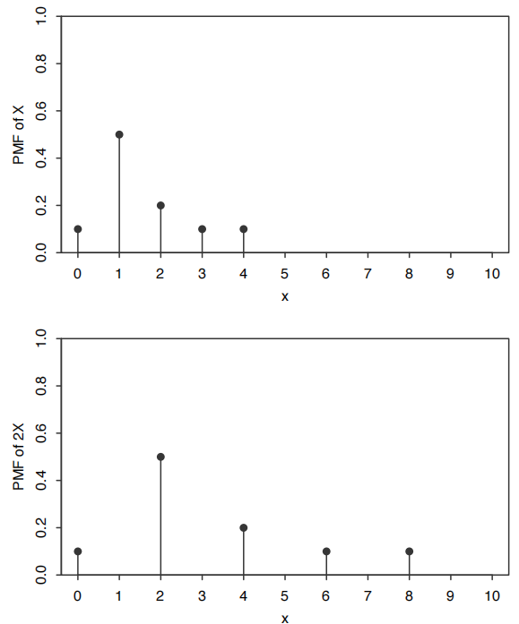
>
> * 声称因为 $X$ 和 $Y$ 有相同的分布，$X$ 必须总是等于 $Y$，即 $P(X = Y) = 1$。仅仅因为两个随机变量有相同的分布，并不意味着它们总是相等，甚至永远相等。我们在例 3.2.5 中看到了这一点。作为另一个例子，考虑抛一次公平硬币。设 $X$ 为正面的指示器，$Y = 1 - X$ 为反面的指示器。$X$ 和 $Y$ 都有 $\text{Bern}(1/2)$ 分布，但 $X = Y$ 这一事件是不可能的。$X$ 和 $Y$ 的$PMF$是相同的函数，但 $X$ 和 $Y$ 是从样本空间到实数的不同映射。
>
>   如果 $Z$ 是第二次独立抛硬币的正面指示器，那么 $Z$ 也是 $\text{Bern}(1/2)$，但 $Z$ 和 $X$​ 不是同一个随机变量。在这里，
>   $$
>   P(Z = X) = P(\text{正面和正面或反面和反面}) = 1/2
>   $$
>

我们用来处理一个随机变量的函数的相同推理可以扩展到处理多个随机变量的函数。我们已经在加法函数（将两个数字 $x, y$ 映射到它们的和 $x + y$）的示例中看到了这一点：在例 3.2.5 中，我们看到了如何将 $T = X + Y$ 视为一个单独的随机变量，其中 $X$ 和 $Y$ 是通过掷骰子获得的。

### 3.8 随机变量的独立性

就像我们有事件独立性的概念一样，我们也可以定义随机变量的独立性。直观上，如果两个随机变量 $X$ 和 $Y$ 是独立的，那么知道 $X$ 的值并不会给出 $Y$ 的值的任何信息，反之亦然。下面的定义正式化了这个想法。

> **Definition 3.8.1（两个随机变量的独立性）**如果对于任意 $x, y \in \mathbb{R}$ 如果随机变量$X$和$Y$满足
> $$
>  P(X \leq x, Y \leq y) = P(X \leq x)P(Y \leq y)
> $$
> 那么随机变量 $X$ 和 $Y$ 被认为是独立的。
>
> 在离散情况下，这等价于条件
> $$
> P(X = x, Y = y) = P(X = x)P(Y = y)
> $$
> 对所有 $x$ 在 $X$ 的支集中，$y$ 在 $Y$ 的支集中。

多于两个随机变量的定义类似。

> **Definition 3.8.2（多个随机变量的独立性）**对于任意 $x_1, \ldots, x_n \in \mathbb{R}$ 如果随机变量 $X_1, \ldots, X_n$ 满足
> $$
>  P(X_1 \leq x_1, \ldots, X_n \leq x_n) = P(X_1 \leq x_1) \cdots P(X_n \leq x_n) 
> $$
> 则称 $X_1, \ldots, X_n$ 是独立的。对于无限多个随机变量，如果其中的每一个有限子集是独立的， 我们说它们是独立的。
>
> 将此与事件的独立性标准进行比较，可能会觉得奇怪，$X_1, \ldots, X_n$ 的独立性只需要验证一个等式，而对于事件，我们需要验证所有 $\binom{n}{2}$ 对的两两独立性，所有 $\binom{n}{3}$ 个三元组的三元独立性等等。然而，仔细检查定义，我们会发现随机变量的独立性要求等式对所有可能的 $x_1, \ldots, x_n$ 成立——无限多个条件！如果我们找到哪怕一个值列表 $x_1, \ldots, x_n$ 使得上述等式不成立，那么 $X_1, \ldots, X_n$ 就不是独立的。

> **3.8.3**
>
> 如果 $X_1, \ldots, X_n$ 是独立的，那么它们也是两两独立的，即，对于 $i \neq j$，$X_i$ 与 $X_j$ 是独立的。证明 $X_i$ 和 $X_j$ 独立的思路是在独立性定义中让所有除了 $x_i, x_j$ 以外的 $x_k$ 趋向于无穷大，因为我们已经知道 $X_k < \infty$ 是真的（尽管给出完整的极限证明需要一些工作）。但是，两两独立并不一般地意味着独立，正如我们在第2章中对于事件所看到的。

> **Example  3.8.4**
>
> 在两个公平骰子的掷骰中，如果 $X$ 是第一个骰子的点数，$Y$ 是第二个骰子的点数，那么 $X + Y$ 与 $X - Y$ 并不独立，因为
> $$
>  0 = P(X + Y = 12, X - Y = 1) \neq P(X + Y = 12)P(X - Y = 1) = \frac{1}{36} \cdot \frac{5}{36} 
> $$
> 知道总和是12告诉我们差值必须是0，所以这些随机变量相互提供信息。
>
> 如果 $X$ 和 $Y$ 是独立的，那么比如说 $X^2$ 与 $Y^4$ 也是独立的，因为如果 $X^2$ 提供了关于 $Y^4$ 的信息，那么 $X$ 就会提供关于 $Y$ 的信息（使用 $X^2$ 和 $Y^4$ 作为中介：$X$ 决定 $X^2$，这将提供关于 $Y^4$ 的信息，进而提供关于 $Y$ 的信息）。更一般地，我们有以下结果（我们省略了正式证明）。

> **Theorem 3.8.5（独立随机变量的函数）**
>
> 如果 $X$ 和 $Y$ 是独立的随机变量，则 $X$ 的任何函数与 $Y$ 的任何函数是独立的。

> .**Definition 3.8.6（独立同分布，i.i.d.）**
>
> 我们经常处理随机变量，它们是独立的并且具有相同的分布。这样的随机变量称为独立同分布的，或简称为 i.i.d。

> **3.8.7（独立 vs. 同分布）**
>
> “独立”和“同分布”是两个经常被混淆但完全不同的概念。，如果它们不提供关于彼此的信息；随机变量是独立的。如果它们具有相同的$PMF$（或等价地，相同的$CDF$），它们是同分布的。所以两个随机变量是否独立与它们是否具有相同的分布无关。我们可以有：
>
> * 独立且同分布的随机变量。设 $X$ 是掷骰子的结果，$Y$ 是第二次独立掷骰子的结果。那么 $X$ 和 $Y$ 是 i.i.d。
> * 独立但不同分布的随机变量。设 $X$ 是掷骰子的结果，$Y$ 是从现在起一个月内道琼斯指数（一个股票市场指数）的收盘价。那么 $X$ 和 $Y$ 不提供彼此的信息（人们热切希望如此），并且 $X$ 和 $Y$ 没有相同的分布。
> * 相依但同分布的随机变量。设 $X$ 是 $n$ 次独立公平硬币投掷中正面朝上的次数，$Y$ 是同样 $n$ 次投掷中反面朝上的次数。那么 $X$ 和 $Y$ 都遵循 $\text{Bin}(n, 1/2)$ 分布，但它们高度相依：如果我们知道了 $X$，那么我们就完美地知道了 $Y$。
> * 相依且不同分布的随机变量。设 $X$ 是下一次选举后多数党是否保持对美国众议院的控制的指标，$Y$ 是选举前一个月内多数党在民意调查中的平均支持率。那么 $X$ 和 $Y$ 是相依的，并且 $X$ 和 $Y$ 没有相同的分布。

通过对 i.i.d. 伯努利随机变量的求和，我们可以以代数形式写下二项分布的情景。

> **Theorem 3.8.8**
>
> 如果 $X \sim \text{Bin}(n, p)$，被视为在成功概率为 $p$ 的 $n$ 次独立伯努利试验中的成功次数，那么我们可以写 $X = X_1 + \cdots + X_n$，其中 $X_i$ 是 i.i.d. $\text{Bern}(p)$。

> **Proof：**设 $X_i = 1$，如果第 $i$ 次试验是成功的，否则为 0。这就好像我们为每次试验分配了一个人，并且我们要求每个人在他们的试验成功时举手。如果我们数一数举起的手的数量（这与加上 $X_i$ 的值相同），我们就得到了总的成功次数。

二项分布的一个重要事实是，具有相同成功概率的独立二项随机变量的和也是二项分布的。

> **Theorem 3.8.9**
>
> 如果 $X \sim \text{Bin}(n, p)$，$Y \sim \text{Bin}(m, p)$，且 $X$ 独立于 $Y$，那么 $X + Y \sim \text{Bin}(n + m, p)$。

> **Proof：**我们提供三种证明，因为每种都展示了一个有用的技巧。
>
> 1. LOTP（全概率定律）：我们可以直接通过对 $X$（或 $Y$，根据我们的喜好）条件化并使用全概率定律来找到 $X + Y$ 的 $PMF$：
>    $$
>    P(X + Y = k) = \sum_{j=0}^{k} P(X + Y = k|X = j)P(X = j) \\
>     = \sum_{j=0}^{k} P(Y = k - j)P(X = j)\\
>      = \sum_{j=0}^{k} \binom{m}{k-j} p^{k-j} (1-p)^{m-k+j} \binom{n}{j} p^j (1-p)^{n-j}\\
>       = p^k (1-p)^{n+m-k} \sum_{j=0}^{k} \binom{m}{k-j} \binom{n}{j}\\
>        = \binom{n+m}{k} p^k (1-p)^{n+m-k}
>    $$
>    
>    在第二行中，我们使用了 $X$ 和 $Y$ 的独立性来证明条件化是合理的，而在最后一行中，我们使用了范德蒙德恒等式。所得到的表达式是 $\text{Bin}(n + m, p)$ 的 $PMF$，所以 $X + Y \sim \text{Bin}(n + m, p)$。
>    
> 2. 表示法：一个更简单的证明是将 $X$ 和 $Y$ 分别表示为 i.i.d. $\text{Bern}(p)$ 随机变量的和：$X = X_1 + \cdots + X_n$ 和 $Y = Y_1 + \cdots + Y_m$，其中 $X_i$ 和 $Y_j$ 都是 i.i.d. $\text{Bern}(p)$。那么 $X + Y$ 就是 $n + m$ 个 i.i.d. $\text{Bern}(p)$ 随机变量的和，所以根据前面的定理它的分布，是 $\text{Bin}(n + m, p)$。
>
> 3. 情景法：根据二项式情景，$X$ 是 $n$ 次独立试验中的成功次数，$Y$ 是另外 $m$ 次独立试验中的成功次数，所有试验都具有相同的成功概率，所以 $X + Y$ 是 $n+m$ 次试验中的总成功次数，这就是 $\text{Bin}(n + m, p)$ 分布的情景。

当然，如果我们有随机变量独立性的定义，我们也应该有条件独立性的类似定义。

> **Definition 3.8.10（随机变量的条件独立性）**
>
> 给定一个随机变量 $Z$，如果对于所有 $x, y \in \mathbb{R}$ 和 $Z$ 的支集中的所有 $z$，都有
> $$
>  P(X \leq x, Y \leq y | Z = z) = P(X \leq x | Z = z)P(Y \leq y | Z = z) 
> $$
> 那么随机变量 $X$ 和 $Y$ 在给定 $Z$ 的条件下是条件独立的。对于离散随机变量，等价的定义是要求
> $$
>  P(X = x, Y = y | Z = z) = P(X = x | Z = z)P(Y = y | Z = z) 
> $$
> 

正如我们从名称中所预期的那样，这是独立性的定义，除了我们在处处条件化 $Z = z$，并且要求等式对于 $Z$ 的支集中的所有 $z$ 成立。

> **Definition 3.8.11（条件概率质量函数）**
>
> 对于任何离散随机变量 $X$ 和 $Z$，当函数 $P(X = x|Z = z)$ 被视为在固定 $z$ 的情况下关于 $x$ 的函数时，称之为给定 $Z = z$ 条件下 $X$ 的条件概率质量函数（$PMF$）。

随机变量的独立性并不意味着条件独立性，反之亦然。首先，让我们展示为什么独立性并不意味着条件独立性。

> **Example  3.8.12（匹配硬币）**
>
> 考虑一个简单的游戏叫做匹配硬币。两个玩家，$A$ 和 $B$，各有一枚公平的硬币。他们独立地抛硬币。如果硬币相同，$A$ 赢；否则，$B$ 赢。设 $X$ 为 1 表示 $A$ 的硬币正面朝上，为 -1 表示反面朝上，对 $B$ 的硬币类似地定义 $Y$（$X$ 和 $Y$ 被称为随机符号）。
>
> 设 $Z = XY$，如果 $A$ 赢则为 1，如果 $B $赢则为 -1。那么 $X$ 和 $Y$ 是无条件独立的，但给定 $Z = 1$，我们知道 $X = Y$（硬币相匹配）。因此，给定 $Z$ 的情况下，$X$ 和 $Y$ 是条件依赖的。

> **Example  3.8.13（两个朋友）**
>
> 再次考虑“只有两个朋友会给我打电话”的情景，从示例 2.5.11 中，现在用随机变量表示。设 $X$ 为 Alice 下周五给我打电话的指示器，$Y$ 为 Bob 下周五给我打电话的指示器，$Z$ 为下周五他们中只有一个给我打电话的指示器。那么 $X$ 和 $Y$ 是独立的（根据假设）。但给定 $Z = 1$，我们有 $X$ 和 $Y$ 是完全依赖的：给定 $Z = 1$，我们有 $Y = 1 - X$。

接下来，让我们看看为什么**条件独立性并不意味着独立性**。

> **Example  3.8.14（神秘对手）**
>
> 假设你将要与两个相同的双胞胎中的一个进行两场网球比赛。对其中一个双胞胎，你们势均力敌，而对另一个双胞胎你有 $3/4$ 的胜率。假设在两场比赛之后，你才能分辨出你的对手是哪一个双胞胎。设 $Z$ 为与势均力敌的双胞胎比赛的指示器，$X$ 和 $Y$ 分别为第一场和第二场比赛的胜利指示器。条件在 $Z = 1$ 下，$X$ 和 $Y$ 是独立同分布的 $\text{Bern}(1/2)$，条件在 $Z = 0$ 下，$X$ 和 $Y$ 是独立同分布的 $\text{Bern}(3/4)$。所以 $X$ 和 $Y$ 在给定 $Z$ 的条件下是独立的。
>
> 无条件地，$X$ 和 $Y$ 是依赖的，因为观察到 $X = 1$​ 使得我们更有可能是在与较差的双胞胎比赛。即，
> $$
> P(Y = 1|X = 1) > P(Y = 1).
> $$

过去的比赛给了我们信息，帮助我们推断出我们的对手是谁，这反过来又帮助我们预测未来的比赛！注意，这个示例与示例 2.3.7 中的“随机硬币”情景是同构的。

### 3.9 二项分布与超几何分布之间的联系

二项分布和超几何分布有两种重要的联系。正如本节将展示的，我们可以通过条件化从二项分布得到超几何分布，也可以通过取极限从超几何分布得到二项分布。我们将从一个启发性例子开始。

> **Example  3.9.1（费舍尔精确检验）**
>
> 一位科学家希望研究女性或男性更有可能患有某种疾病，或者他们患病的可能性是否相等。收集了 $n$ 名女性和 $m$ 名男性的随机样本，每个人都接受了疾病检测（假设检测完全准确）。样本中患有该疾病的女性和男性的数量分别为 $X$ 和 $Y$，两者相互独立,其中 $X \sim \text{Bin}(n, p_1)$ 和 $Y \sim \text{Bin}(m, p_2)$。这里 $p_1$ 和 $p_2$ 是未知的，我们感兴趣的是检验 $p_1 = p_2$（这在统计学中被称为零假设）。
>
> 考虑一个 2×2 表，行对应于疾病状态，列对应于性别。每个条目是具有该疾病状态和性别的人数，因此 $n + m$ 是所有4个条目的总和。假设观察到 $X + Y = r$。

费舍尔精确检验基于对行和列总和进行条件化，所以 $n$、$m$、$r$ 都被视为固定的，然后看看观察到的 $X$ 值与这个条件分布相比是否“极端”。假设零假设成立，求给定 $X + Y = r$ 时 $X$ 的条件概率质量函数（$PMF$）。

> **Solution:**
> 首先我们建立一个 4×4 表，将 $n$、$m$ 和 $r$​ 视为固定值。
>
> |        | 女性  | 男性      | 总计      |
> | ------ | ----- | --------- | --------- |
> | 患病   | x     | r - x     | r         |
> | 未患病 | n - x | m - r + x | n + m - r |
> | 总计   | n     | m         | n + m     |
>
> 接下来，我们计算条件$PMF$ $P(X = x | X + Y = r)$​。根据贝叶斯定律，
> $$
> P(X = x | X + Y = r) = \frac{P(X + Y = r | X = x)P(X = x)}{P(X + Y = r)}\\
>  = \frac{P(Y = r - x)P(X = x)}{P(X + Y = r)} \\
> $$
> 由 $X$ 和 $Y$ 独立，可以证明步骤 $P(X + Y = r | X = x) = P(Y = r - x)$ 是合理的。假设零假设并设 $p = p_1 = p_2$，我们有 $X \sim \text{Bin}(n, p)$ 和 $Y \sim \text{Bin}(m, p)$，两者独立，因此 $X + Y \sim \text{Bin}(n + m, p)$​。因此，
> $$
> P(X = x | X + Y = r) = \frac{\binom{m}{r - x} p^{r - x} (1 - p)^{m - r + x} \binom{n}{x} p^x (1 - p)^{n - x}}{\binom{n + m}{r} p^r (1 - p)^{n + m - r}}\\
>  = \frac{\binom{n}{x} \binom{m}{r - x}}{\binom{n + m}{r}} \\
> $$
> 所以，条件分布 $X$ 是超几何分布，参数为 $n$、$m$、$r$。

要理解超几何分布为何“凭空出现”，让我们将这个问题与超几何分布的麋鹿情景联系起来。在麋鹿情景中，我们感兴趣的是在重新捕获的样本中标记麋鹿数量的分布。类比地，把女性想象成标记麋鹿，男性想象成未标记麋鹿。我们不是从森林中随机重新捕获 $r$ 只麋鹿，而是使 $X + Y = r$ 人感染疾病；在零假设下，感染疾病的人群等可能是任何 $r$ 人。因此，在给定 $X + Y = r$ 的条件下，$X$ 代表 $r$ 个患病个体中的女性数量。这与麋鹿样本中标记麋鹿的数量完全类似，其分布为 $\text{HGeom}(n, m, r)$。

一个有趣的事实，是 **$X$ 的条件分布不依赖于 $p$**，事实证明在统计学中很有用。无条件地，$X \sim \text{Bin}(n, p)$，但 $p$ 从条件分布的参数中消失了！这在反思后是有道理的，因为一旦我们知道 $X + Y = r$，我们就可以直接处理我们有 $r$ 个患病和 $n + m - r$ 个健康人的事实，而不需要担心最初产生这个人群的 $p$ 值。

这个启发性的例子为以下定理的证明提供了动力。

> **Theorem 3.9.2**
>
> 如果 $X \sim \text{Bin}(n, p)$，$Y \sim \text{Bin}(m, p)$，且 $X$ 独立于 $Y$，那么在给定 $X + Y = r$ 的条件下，$X$ 的条件分布是 $\text{HGeom}(n, m, r)$。
>
> 另一个方向上，**二项分布是超几何分布的极限情况。**

> **Theorem 3.9.3**
>
> 如果 $X \sim \text{HGeom}(w, b, n)$ 且 $N = w + b \to \infty$ 使得 $p = w/(w + b)$ 保持固定，那么 $X$ 的 $PMF$ 收敛到 $\text{Bin}(n, p)$ 的 $PMF$。

> **Proof ：**我们取 $\text{HGeom}(w, b, n)$ $PMF$ 的所述极限：
> $$
> P(X = k) = \frac{\binom{w}{k} \binom{b}{n - k}}{\binom{w + b}{n}} \\
> = \binom{n}{k} \frac{ w! }{ (w - k)! } \frac{b!}{(b - n + k)!} \frac{(w + b - n)!} {(w + b)!}\\
> = \binom{n}{k} \frac{ w (w-1) \ldots(w-k+1) b(b-1) \ldots (b-n+k+1)}{ (w+b) (w+b+1)\ldots(w+b-n+1) }\\
> =\binom{n}{k} \frac{ p (p- \frac1 N ) \ldots(p-\frac {k-1} N) q(q- \frac1 N) \ldots (q-\frac {n-k-1} N)}{ (1-\frac1 N) (1-\frac2 N)\ldots(1-\frac{n-1} N) }
> $$

> 当 $N \to \infty$ 时，分母趋于 1，分子趋于 $p^k (1-p)^{n-k}$​。因此，
> $$
> \\P(X = k) \to \binom{n}{k} p^k (1-p)^{n-k}
> $$
> 这正是 $\text{Bin}(n, p)$ 的 $PMF$。
>
> 二项分布和超几何分布的情景为这个结果提供了直观理解：假设有一个装有 $w$ 个白球和 $b$ 个黑球的罐子，从中有替换地抽取 $n$ 个球时会产生二项分布，而无替换地抽取则产生超几何分布。当罐子中的球数相比于抽取的球数非常大时，有替换抽取和无替换抽取本质上变得等价。实际上，这个定理告诉我们，如果 $N = w + b$ 相对于 $n$ 很大，我们可以用 $\text{Bin}(n, \frac{w}{w + b})$ 的 $PMF$ 近似 $\text{HGeom}(w, b, n)$ 的 $PMF$。

生日问题意味着在有替换抽样时，某个球被抽中多次的可能性出人意料地高；例如，如果从 1,000,000 个球中随机有替换地抽取 1,200 个球，那么某个球被抽中多次的概率大约是 51%！但随着 $N$ 的增长，这种可能性变得越来越小，即使很可能会出现一些重复，但如果在样本中绝大多数球只被抽取一次的可能性非常大，近似仍然是合理的。

### 3.10 复习

一个随机变量（$r.v.$）是一个**函数**，它为实验的每个可能结果赋予一个实数值。随机变量 $X$ 的分布是与 $X$ 相关的事件（如 $\{X = 3\}$ 和 $\{1 \leq X \leq 5\}$）的概率的完整规定。离散随机变量的分布可以使用概率质量函数（$PMF$）、累积分布函数（$CDF$）或一个情景来定义。$X$ 的$PMF$是 $P(X = x)$ 的函数，其中 $x \in \mathbb{R}$。$X$ 的$CDF$是 $P(X \leq x)$ 的函数，其中 $x \in \mathbb{R}$。$X$ 的情景描述了可能产生与 $X$ 同分布的随机变量的实验。

$PMF$ 要有效，它必须满足非负且其总和为1。$CDF$ 要有效，它必须是递增的、右连续的，并且在 $x \to -\infty$ 时趋向于 0，在 $x \to \infty$ 时趋向于 1。

区分随机变量和其分布是重要的：**分布是构建随机变量的蓝图，但不同的随机变量可以具有相同的分布，就像不同的房屋可以从同一蓝图建造一样。**

四种命名的离散分布是**伯努利**、**二项式**、**超几何**和**离散均匀分布**。其中每一种实际上都是由**参数索引的分布族**；要完全指定这些分布之一，我们需要给出分布的名称和参数值。
- $\text{Bern}(p)$ 随机变量是具有成功概率 $p$ 的伯努利试验的成功指标。
- $\text{Bin}(n, p)$ 随机变量是 $n$ 次独立伯努利试验中的成功次数，所有试验都具有相同的成功概率 $p$。
- $\text{HGeom}(w, b, n)$ 随机变量是从装有 $w$ 个白球和 $b$ 个黑球的罐子中无替换地抽取大小为 $n$ 的样本中获得的白球数。
- $\text{DUnif}(C)$ 随机变量是通过从有限集合 $C$ 中随机选择一个元素获得的，每个元素的选择概率都相等。

随机变量的函数仍然是一个随机变量。如果我们知道 $X$ 的 $PMF$，我们可以找到 $P(g(X) = k)$，即 $g(X)$ 的 $PMF$，方法是将事件 $\{g(X) = k\}$ 转换为涉及 $X$ 的等效事件，然后使用 $X$ 的 $PMF$来解决。

两个随机变量是独立的，如果知道一个随机变量的值不会提供关于另一个随机变量值的信息。这与两个随机变量是否同分布无关。在第7章中，我们将学习如何通过联合考虑而不是分别考虑依赖的随机变量来处理它们。

我们现在已经看到了概率中的四种基本类型的对象：分布、随机变量、事件和数字。图 3.12 显示了这四种基本对象之间的联系。$CDF$ 可以用作生成随机变量 $X$ 的蓝图，然后有关于 $X$ 的行为的各种事件，如所有 $x$ 的事件 $X \leq x$​。知道这些事件的概率决定了 $CDF$，从而使我们回到起点。对于离散随机变量，我们也可以使用 $PMF$ 作为蓝图，从分布到随机变量再到事件，然后再回到分布。

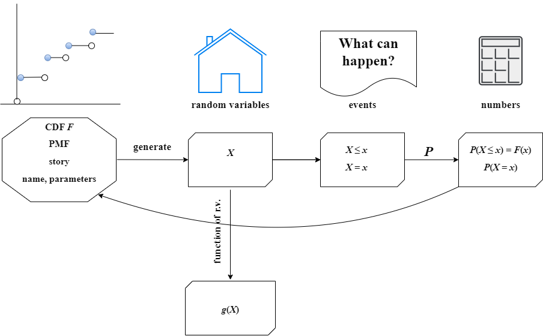

 **图 3.12**

概率中的四种基本对象：分布（蓝图）、随机变量、事件和数字。从 $CDF$ $F$ 我们可以生成一个随机变量 $X$。从 $X$出发，我们可以通过对 $X$ 进行函数操作生成许多其他随机变量。描述 $X$ 行为的各种事件，最引人注目的是对于任何常数 $x$，事件 $X \leq x$ 和 $X = x$。知道这些事件的所有 $x$ 的概率给我们提供了 $CDF$ 和（在离散情况下）$PMF$，使我们回到了起点。

这种方法提供了一种全面理解随机变量、它们的分布和相应事件之间相互关联和相互作用的方式。通过这种方法，我们可以更好地理解概率论的核心概念，为解决更复杂的概率问题打下坚实的基础。

