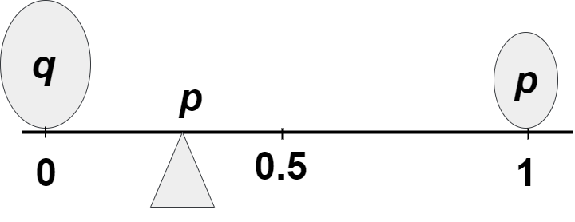
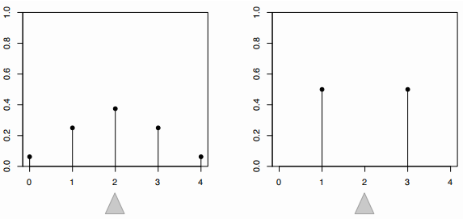
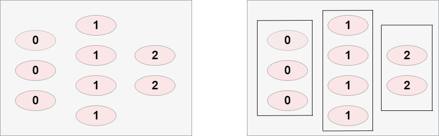
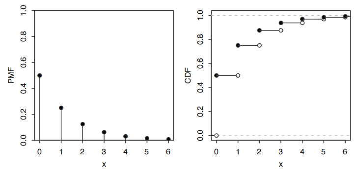
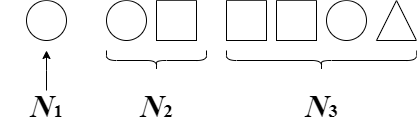
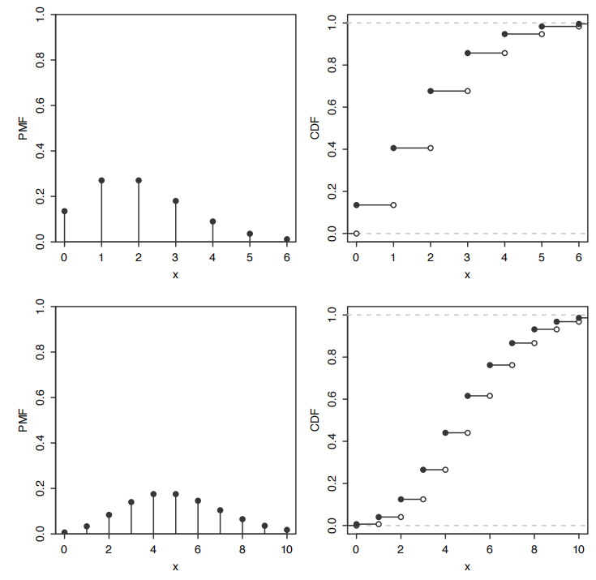
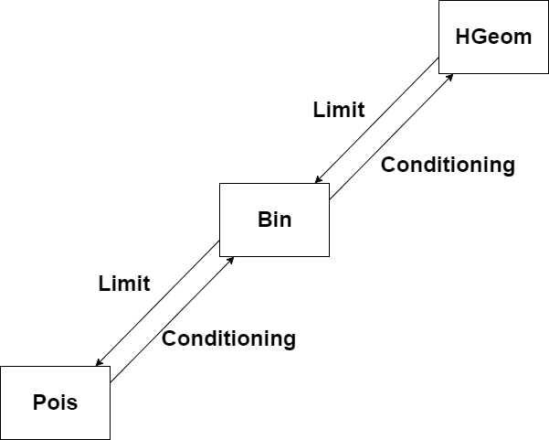
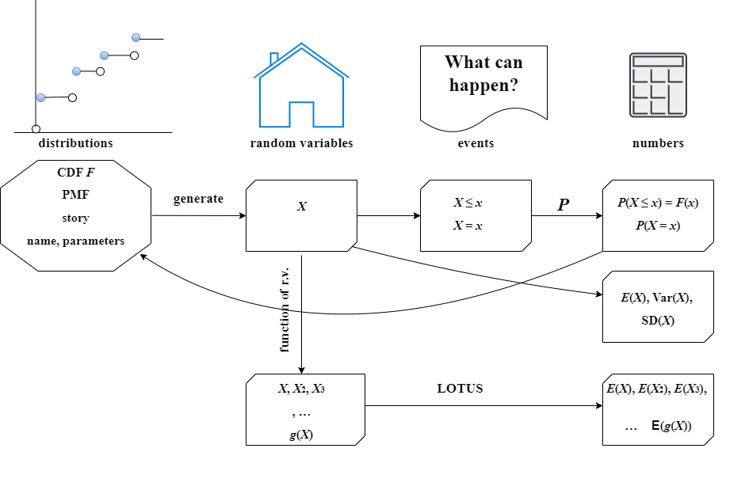

## 期望

[4.1 期望的定义](##4.1 期望的定义)

[4.2 期望的线性](##4.2 期望的线性)

[4.3 几何分布和负二项分布](##4.3 几何分布和负二项分布)

[4.4 指示随机变量和基本桥梁](##4.4 指示随机变量和基本桥梁)

[4.5 无意识统计师定律 (LOTUS)](##4.5 无意识统计师定律 (LOTUS))

[4.6 方差](##4.6 方差)

[4.7 泊松分布](##4.7 泊松分布)

[4.8 泊松分布与二项分布的联系](##4.8 泊松分布与二项分布的联系)

[4.9 使用概率和期望证明存在性](##4.9 使用概率和期望证明存在性)

[4.10 总结](##4.10 总结)

### 4.1 期望的定义

在上一章中，我们介绍了随机变量的分布，它为我们提供了关于随机变量落入任何特定集合的概率的完整信息。例如，我们可以说随机变量超过1000的可能性有多大，它等于5的可能性，或者它处于区间 $[0, 7]$ 内的可能性。然而，管理这么多的概率可能很麻烦，因此我们通常想要一个数字来总结随机变量的“平均”值。

“平均”一词有几种意义，但最常用的是随机变量的均值，也称为其期望值。此外，统计学大部分是关于理解世界上的变异性的，因此通常重要的是知道分布有多“分散”；我们将用方差和标准差的概念来正式描述这一点。我们将看到，方差和标准差是根据期望值定义的，所以期望值的用途远不止计算平均值。

给定一组数字 $ x_1, x_2, \ldots, x_n $，平均它们的熟悉方法是将它们相加并除以 $ n $。这称为算术平均数，定义为
$$
 \bar{x} = \frac{1}{n} \sum_{j=1}^{n} x_j 
$$
更一般地，我们可以定义 $ x_1, \ldots, x_n $ 的加权平均数为
$$
\text{weighted-mean}(x) = \sum_{j=1}^{n} x_j p_j
$$

其中权重 $ p_1, \ldots, p_n $ 是预先指定的非负数，总和为 1（因此当 $ p_j = \frac{1}{n} $ 对所有 $ j $ 时得到未加权的平均数 $ \bar{x} $）。

离散随机变量的期望定义受到一组数字的加权平均数的启发，其中权重由概率给出。

> **Definition 4.1.1 离散随机变量的期望**
>
> 离散随机变量 $X$ 的期望值（也称为期望或均值），其不同可能的值为 $ x_1, x_2, \ldots $，定义为
> $$
> E(X) = \sum_{j=1}^{\infty} x_j P(X = x_j)
> $$
> 如果支集是有限的，则由有限和替换。我们也可以写成
> $$
> E(X) = \sum_{x} x \cdot P(X = x) 
> $$
> 其中求和是在 $X$ 的支集上进行（无论如何，对于不在支持集中的任何 $ x $，$ xP(X = x) $ 都是 0）。如果 $ \sum_{j=1}^{\infty} |x_j| P(X = x_j) $ 发散，则期望值是未定义的，因为这种情况下 $ E(X) $ 的级数发散或其值取决于 $ x_j $ 的排列顺序。

换句话说，$X$的期望值是 $X$ 可能取值的加权平均，这些值按其概率加权。让我们通过几个简单的例子来检查这个定义是否合理：

* 设 $X$ 是掷一个公正的六面骰子的结果，所以$ X $取值为 1, 2, 3, 4, 5, 6，概率相等。直观上，我们应该能通过将这些值加起来并除以 6 来得到平均值。使用定义，期望值是
  $$
   E(X) = \frac{1}{6}(1 + 2 + \cdots + 6) = 3.5 
  $$
  正如我们所预期的。注意，在这个例子中，$X$ 从不等于其均值。这类似于某个国家每户家庭的平均孩子数可能是 1.8，但这并不意味着一个典型的家庭有 1.8 个孩子！

* 设 $ X \sim \text{Bern}(p) $ 并且 $ q = 1 - p $。那么
  $$
  E(X) = 1p + 0q = p
  $$
  这在直觉上是有意义的，因为它位于 $X$ 的两个可能值之间，根据每个值的可能性在 0 和 1 之间进行折衷。这在图 4.1 中为 $p < 1/2$ 的情况进行了说明：两个卵石正在跷跷板上平衡。为了使跷跷板平衡，支点（以三角形显示）必须位于 $p$，这在物理术语中是质心。

  

​                                                       图 4.1 用两块鹅卵石的质心描述了当$ X \sim \text{Bern}(p) $时，

频率派解释是考虑大量独立的伯努利试验，每个试验成功的概率为 $p$。用 1 表示“成功”和 0 表示“失败”，从长远来看，我们期望拥有的数据是一系列数字，其中 1 的比例非常接近 $p$。0 和 1 的列表的平均值是 1 的比例。

* 设 $X$ 有 3 个不同的可能值，$ a_1, a_2, a_3 $，概率分别为 $ p_1, p_2, p_3 $。想象进行一个模拟，其中生成了来自 $X$ 分布的 $ n $ 次独立抽取。对于 $ n $ 很大，我们预期将有大约 $ p_1n $ 个 $ a_1 $，$ p_2n $ 个 $ a_2 $，$ p_3n $ 个 $ a_3 $。（我们将在第 10 章研究大数定律时，研究这个例子的更数学化版本。）如果模拟结果接近这些预期结果，那么模拟结果的算术平均值大约为
  $$
  \frac{p_1n \cdot a_1 + p_2n \cdot a_2 + p_3n \cdot a_3}{n} = p_1a_1 + p_2a_2 + p_3a_3 = E(X)
  $$
  注意 $E(X)$ 仅取决于 $X$的分布。这直接来自定义，但值得记录，因为它是基本的。

> **Proposition 4.1.2.**
>
> 如果 $X$ 和 $Y$ 是具有相同分布的离散随机变量，那么 $ E(X) = E(Y) $（如果至少任一方存在）。

> **Proof：**
>
> 在 $E(X)$ 的定义中，我们只需要知道 $X$ 的概率质量函数 ($PMF$)。
>
> 以上命题的逆命题是错误的，因为期望值只是一个数字概要，远远不足以指定整个分布；它是衡量“中心”在哪里的一种方式，但并不能决定，例如，分布有多分散，或者随机变量取正值的可能性。图 4.2 显示了两个具有相同期望值（平衡点）的不同 $PMF$ 示例。
>
> 

> **4.1.3用期望值替换随机变量**
>
> 对于任何离散随机变量 $X$，其期望值 $E(X)$ 是一个数字（如果它存在）。一个常见的错误是无理由地用其期望值替换随机变量，这在数学上（$X$ 是一个函数，$E(X) $是一个常数）和统计上（它忽略了 $X $的变异性）都是错误的，除非在 $X$ 是一个常数的退化情况下。

> **记号 4.1.4.** 
>
> 我们经常将 $E(X)$ 简写为$EX$。类似地，我们经常将 $ E(X^2) $ 简写为 $ EX^2 $，$ E(X^n) $ 简写为 $ EX^n $。

> **4.1.5.** 
>
> 在处理期望时注意操作顺序是至关重要的。如上所述，$ EX^2 $ 是随机变量 $ X^2 $ 的期望值，而不是数字 $EX$ 的平方。除非括号明确指示了其他意思，对于一个随机变量的幂的期望值，我们首先取幂，然后取期望。例如，$ E(X - 1)^4 $ 是$$ E \left[ (X - 1)^4 \right] $$，
> 而不是 $ (EX - 1)^4 $。 图 4.2 显示了具有相同期望值的不同 $PMF$ 可以有相同的平衡点。

### 4.2 期望的线性

期望最重要的性质是线性：即一组随机变量之和的期望值等于各个随机变量期望值的和。

> **Theorem 4.2.1 期望的线性**
>
> 对于任何随机变量 $X$，$Y$ 以及任何常数 $c$，有
> $$
> E(X + Y) = E(X) + E(Y) 
> $$
>
> $$
> E(cX) = cE(X) 
> $$
>
> 第二个等式表示我们可以从期望中提取常数因子；这在直觉上是合理的，并且可以从定义中轻易验证。第一个等式，$ E(X + Y) = E(X) + E(Y) $，在 $X$ 和 $Y$ 独立时似乎也是合理的。令人惊讶的是，即使 $X$ 和 $Y$ 相关，它也是成立的！为了建立这个直觉，考虑极端情况，其中 $X$ 总是等于 $Y$。那么 $ X + Y = 2X $，并且 $ E(X + Y) = E(X) + E(Y) $ 的两边都等于 $ 2E(X) $，所以即使在依赖性最极端的情况下，线性仍然成立。
>
> 线性对于所有随机变量都是成立的，不仅仅是离散随机变量，但在本章中我们只证明了它对离散随机变量的适用性。在证明线性之前，回顾一下关于平均数的一些基本事实是值得的。如果我们有一组数字，比如（1, 1, 1, 1, 1, 3, 3, 5），我们可以通过将所有值相加并除以列表的长度来计算它们的平均值，这样列表中的每个元素都获得了 $\frac{1}{8}$​ 的权重：
> $$
> \frac{1}{8}(1 + 1 + 1 + 1 + 1 + 3 + 3 + 5) = 2
> $$
> 但是计算平均数的另一种方法是将所有 1、所有 3 和所有 5 分组，然后取一个加权平均数，给 1、3 和 5 分配适当的权重：
> $$
> \frac{5}{8} \cdot 1 + \frac{2}{8} \cdot 3 + \frac{1}{8} \cdot 5 = 2
> $$
> 这种洞察——即平均数可以通过两种方式计算，未分组或分组——就是证明线性所需的全部！

回想一下，$X$ 是一个将样本空间中的每个结果 $s$ 分配给一个实数的函数。随机变量 $X$ 可以将同一个值分配给多个样本结果。当这种情况发生时，我们对期望的定义将所有这些结果分组到一个超级石子中，其权重 $ P(X = x) $​ 是组成石子的总权重。这个分组过程在图 4.3 中为一个假设的取值在 ${0, 1, 2}$ 的随机变量进行了说明。因此，我们对期望的定义对应于分组方式的平均数计算。

这种定义的优势在于它允许我们直接处理 $X$ 的分布，而不需要回到样本空间。但当我们必须证明像这样的定理时，缺点就出现了，因为如果我们有另一个在同一样本空间上的随机变量 $Y$，由 $Y$ 创建的超级石子与由 $X$ 创建的不同，具有不同的权重 $ P(Y = y) $；这使得结合 $ \sum_x xP(X = x) $ 和 $ \sum_y yP(Y = y) $ 变得困难。

幸运的是，我们知道还有另一种同样有效的计算平均数的方法：我们可以对个别石子的值取加权平均数。换句话说，如果 $ X(s) $ 是 $X$ 分配给石子 $s$ 的值，我们可以取加权平均数
$$
 E(X) = \sum_s X(s)P(\{s\}) 
$$
其中 $ P(\{s\}) $ 是石子$s$ 的权重。这对应于未分组方式的平均数计算。这种定义的优势在于它将样本空间分解为最小可能的单元，因此我们现在对该样本空间上定义的每个随机变量使用相同的权重 $ P(\{s\}) $。如果 $Y$ 是另一个随机变量，则
$$ E(Y) = \sum_s Y(s)P(\{s\}) $$。
我们可以结合 $ \sum_s X(s)P(\{s\}) $ 和 $ \sum_s Y(s)P(\{s\}) $，得到
$$
E(X) + E(Y) = \sum_s X(s)P(\{s\}) + \sum_s Y(s)P(\{s\})\\ = \sum_s (X + Y)(s)P(\{s\}) = E(X + Y)
$$

期望的线性还可以通过模拟的概念来直观理解。如果我们从 $X$ 的分布中进行许多次模拟，模拟值的直方图将非常类似于 $X$ 的真实$PMF$。特别是，模拟值的算术平均数将非常接近 $E(X)$ 的真实值（这种收敛的精确性质由大数定律描述，我们将在第 10 章详细讨论这个重要的定理）。

设 $X $和 $Y $是总结某个实验的随机变量。假设我们进行了 $n$ 次实验，其中 $n$ 是一个非常大的数字，我们记录每次实验中 $X$ 和 $Y$ 实现的值。对于每次实验的重复，我们获得一个 $X $值、一个 $Y $值以及（通过加和）一个 $X + Y$ 的值。在图 4.4 中，每行代表一次实验的重复。左列包含 $X$ 的抽取，中间列包含 $Y$ 的抽取，右列包含 $X + Y$ 的抽取。

计算最后一列中所有数字的和有两种方法。直接的方法是简单地将该列中的所有数字相加。但同样有效的方法是将第一列中的所有数字相加，将第二列中的所有数字相加，然后将两个列的总和相加。

到处除以 $n$，我们所争论的是以下程序是等价的：

- 对最后一列中所有数字的算术平均值进行计算。根据大数定律，这非常接近于 $ E(X + Y) $。
- 对第一列的算术平均值和第二列的算术平均值进行计算，然后将两列的平均值相加。根据大数定律，这非常接近于 $ E(X) + E(Y)$。

因此，期望的线性作为算术的一个简单事实而显现出来（我们只是以两种不同的顺序相加数字而已）！请注意，在我们的论证中，我们并未依赖于 $X$ 和 $Y$ 是否独立。事实上，在图 4.4 中，$X$ 和 $Y$ 似乎是相关的：当 $X$ 很大时，$Y $也倾向于很大；当 $X $很小时，$Y$ 也倾向于很小（在第 7 章的语言中，我们说 $X$ 和 $Y$ 正相关）。但这种依赖性并不重要：洗牌 $Y$ 的抽取可以完全改变 $X$ 和 $Y$ 之间的依赖模式，但对列的总和没有影响。

### 4.3 几何分布和负二项分布

我们现在介绍另外两个著名的离散分布，几何分布和负二项分布，并计算它们的期望值。

> **Story 4.3.1几何分布**
>
> 考虑一系列独立的伯努利试验，每次试验的成功概率为 $ p \in (0, 1) $，进行试验直到第一次成功。设 $X$ 为第一次成功试验之前的失败次数。那么 $X$ 服从参数为 $p$ 的几何分布；我们表示为 $ X \sim \text{Geom}(p) $。

> **Example：**
>
> 如果我们抛掷一枚公平的硬币直到第一次正面朝上，那么第一次出现正面之前的反面次数服从 $\text{Geom}(1/2)$。
>
> 要从故事中得到几何 $PMF$，想象伯努利试验为以一个 1（成功）结束的一串 0（失败）。每个 0 的概率为 $ q = 1 - p $，最后的 1 的概率为 $p$，所以$ k $次失败后的一次成功的概率为 $ q^k p $。

> **Theorem 4.3.2 几何分布 $PMF$**
>
> 如果 $ X \sim \text{Geom}(p) $，那么 $X$ 的 $PMF$ 为
> $$
> P(X = k) = q^k p 
> $$
> 对于 $ k = 0, 1, 2, \ldots $，其中 $ q = 1 - p $。
>
> 这是一个有效的 $PMF$，因为求和一个几何级数（参见数学附录中的几何级数复习），我们有
> $$
> \sum_{k=0}^{\infty} q^k p = p \sum_{k=0}^{\infty} q^k = p \cdot \frac{1}{1 - q} = 1
> $$

就像二项定理显示二项 $PMF$ 有效一样，一个几何级数显示几何 $PMF$ 有效！几何级数也可以用来获得几何 $CDF$。

> **Theorem 4.3.3几何分布 $CDF$**
>
> 如果 $ X \sim \text{Geom}(p) $，那么 $X$ 的 $CDF$ 为
> $$
> F(x) = \begin{cases} 
> 1 - q^{\lfloor x \rfloor + 1}, & \text{if } x \geq 0; \\
> 0, & \text{if } x < 0,
> \end{cases} 
> $$
> 其中 $ q = 1 - p $ 且 $ \lfloor x \rfloor $ 是小于或等于 $x$ 的最大整数。

> **Proof： **
>
> 设 $F$ 为 $X$ 的 $CDF$。我们首先找到 $x < 0$ 的情况下的 $F(x)$，然后是 $x$ 为非负整数的情况，最后是 $x$ 为非负实数的情况。对于 $x < 0$，$ F(x) = 0 $，因为 $X$不能为负。对于非负整数 $n$，有
> $$
> F(n) = \sum_{k=0}^{n} P(X = k) = p \sum_{k=0}^{n} q^k = p \cdot \frac{1 - q^{n+1}}{1 - q} = 1 - q^{n+1} 
> $$
> 我们还可以从事件 $ X \geq n + 1 $ 意味着前$ n + 1$ 次试验都是失败的事实得到相同的结果：
> $$
> F(n) = 1 - P(X > n) = 1 - P(X \geq n + 1) = 1 - q^{n+1} 
> $$
> 对于非负实数 $x$，有
> $$
> F(x) = P(X \leq x) = P(X \leq \lfloor x \rfloor) 
> $$
> 因为 $X$ 始终取整数值。例如，
> $$
> P(X \leq 3.7) = P(X \leq 3) + P(3 < X \leq 3.7) = P(X \leq 3) 
> $$
> 因此，$F$ 如声明。
>
> 
>
> ​                                                                           *图 4.5 显示了从 0 到 6 的 $\text{Geom}(0.5)$ $PMF$ 和 $CDF$。*
>
> 所有几何 $PMF$ 的形状相似；成功概率 $p$ 越大，$PMF$ 衰减到 0 的速度越快。

> **4.3.4 几何分布的约定**
>
> 对几何分布的定义有不同的约定；一些来源将几何分布定义为包括成功的总试验次数。在本书中，几何分布不包括成功，第一次成功分布包括成功。

> **Definition 4.3.5 第一次成功分布**
>
> 在一系列独立的伯努利试验中，设 $Y$ 为直到第一次成功试验的次数，包括成功。那么$Y$ 服从参数为 $p$ 的第一次成功分布；我们表示为 $ Y \sim \text{FS}(p) $。
>
> 在这两者之间来回转换很容易，但重要的是要注意使用的是哪种约定。如果 $ Y \sim \text{FS}(p) $，那么 $ Y - 1 \sim \text{Geom}(p) $​，我们可以通过写
> $$
> P(Y = k) = P(Y - 1 = k - 1)
> $$
> 来转换 $Y$ 和 $Y - 1$ 的 $PMF$。相反，如果 $ X \sim \text{Geom}(p) $，那么 $ X + 1 \sim \text{FS}(p) $。

> **Example 4.3.6 几何期望**
>
> 设 $ X \sim \text{Geom}(p) $。根据定义，
> $$
> E(X) = \sum_{k=0}^{\infty} kq^k p 
> $$
> 其中 $ q = 1 - p $。这个求和看起来不愉快；它不是一个几何级数，因为每个项都乘以了额外的 $k$。但我们注意到每个项看起来类似于 $ kq^{k-1} $，即 $ q^k $ 的导数（关于 $q$），所以让我们从这里开始：
> $$
> \sum_{k=0}^{\infty} q^k = \frac{1}{1 - q} 
> $$
> 这个几何级数收敛，因为 $ 0 < q < 1 $。对两边关于 $q$ 求导，我们得到
> $$
> \sum_{k=0}^{\infty} kq^{k-1} = \frac{1}{(1 - q)^2} 
> $$
> 最后，如果我们将两边乘以 $ pq $，我们就得到了我们想要找到的原始求和：
> $$
> E(X) = \sum_{k=0}^{\infty} kq^k p = pq \sum_{k=0}^{\infty} kq^{k-1} = pq \cdot \frac{1}{(1 - q)^2} = \frac{q}{p} 
> $$
> 在示例 9.1.8 中，我们将基于第一步分析给出同一结果的故事证明：以 $X$ 的故事解释中第一次试验的结果为条件。如果第一次试验成功，我们知道 $ X = 0 $，如果它失败，我们浪费了一次试验，然后回到了开始的地方。

> **Example 4.3.7 第一次成功期望 **
>
> 由于我们可以将 $ Y \sim \text{FS}(p) $ 写为 $ Y = X + 1 $ 其中 $ X \sim \text{Geom}(p) $，我们有
> $$
> E(Y) = E(X + 1) = \frac{q}{p} + 1 = \frac{1}{p} 
> $$
> 负二项分布推广了几何分布：我们不是等待一个成功，而是可以等待任何预先确定的 $r$ 次成功。

> **Story 4.3.8 负二项分布 **
>
> 在一系列独立的伯努利试验中，如果 $X$ 是第 $r$ 次成功之前的失败次数，那么 $X$ 被称为具有参数 $r$ 和 $p$ 的负二项分布，表示为 $ X \sim \text{NBin}(r, p) $。
>
> 二项分布和负二项分布都是基于独立的伯努利试验；它们在停止规则和它们所计数的内容上有所不同。二项分布计算固定数量试验中的成功次数；负二项分布计算达到固定数量成功之前的失败次数。

考虑到这些相似之处，负二项 $PMF$ 的推导与二项 $PMF$ 的相应推导类似并不奇怪。

> **Theorem 4.3.9 负二项 $PMF$** 
>
> 如果 $ X \sim \text{NBin}(r, p) $，那么 $X$ 的 $PMF$ 为
> $$
> P(X = n) = \binom{n + r - 1}{r - 1} p^r q^n
> $$
> 对于 $ n = 0, 1, 2, \ldots $，其中 $ q = 1 - p $。

> **Proof：**
>
> 想象一串 0 和 1，其中 1 表示成功。任何特定的 $n$ 个 0 和 $r$ 个 1 的字符串的概率为 $ p^r q^n $。有多少这样的字符串？因为我们在达到第 $r$ 次成功时停止，所以字符串必须以 1 结束。在其他 $n+r-1$ 个位置中，我们选择 $r-1$ 个位置放置剩余的 1。所以在第 $r$ 次成功之前恰好 $n$ 次失败的总概率是
> $$
> P(X = n) = \binom{n + r - 1}{r - 1} p^r q^n 
> $$
> 其中 $ n = 0, 1, 2, \ldots $。

正如二项随机变量可以表示为独立同分布的伯努利之和，负二项随机变量可以表示为独立同分布的几何分布之和。

> **Theorem 4.3.10**
>
> 设 $ X \sim \text{NBin}(r, p) $，视为在独立的伯努利试验序列中达到第 $r$ 次成功之前的失败次数。那么我们可以写 $ X = X_1 + \cdots + X_r $，其中 $ X_i $ 是独立同分布的 $\text{Geom}(p)$。

> **Proof：**
>
> 设 $ X_1 $ 为直到第一次成功之前的失败次数，$ X_2 $ 为第一次成功和第二次成功之间的失败次数，一般来说，$ X_i $ 为第 $ i - 1 $ 次成功和第 $ i $​ 次成功之间的失败次数。
>
> 那么 $ X_1 \sim \text{Geom}(p) $，因为根据几何分布的故事，第一次成功之前的失败次数是几何分布。在第一次成功之后，直到下一次成功之前的额外失败次数仍然是几何分布！所以 $ X_2 \sim \text{Geom}(p) $，对所有的 $ X_i $ 都是如此。此外，$ X_i $ 们是独立的，因为所有的试验都是彼此独立的。将 $ X_i $ 们相加，我们得到了在第 $r$ 次成功之前的总失败次数，即 $X$。

使用线性期望，负二项分布的期望现在可以毫无额外计算地得出。

> **Example 4.3.11 负二项期望**
>
> 设 $ X \sim \text{NBin}(r, p) $。根据前面的定理，我们可以写 $ X = X_1 + \cdots + X_r $，其中 $ X_i $ 是独立同分布的 $\text{Geom}(p)$。根据线性期望，
> $$
> E(X) = E(X_1) + \cdots + E(X_r) = r \cdot \frac{q}{p}
> $$
>

接下来的示例是概率中的一个著名问题，也是对几何分布和第一次成功分布的有益应用。它通常被描述为收集优惠券的问题，因此得名，但我们将使用玩具而不是优惠券来解释。

> **example 4.3.12 收集优惠券问题**
>
> 假设有 $n$ 种类型的玩具，你一次收集一种，目标是获得一套完整的玩具。在收集玩具时，玩具类型是随机的（有时是这样，例如，随麦片盒附带的玩具或快餐店儿童套餐中附带的玩具）。假设每次你收集玩具时，它等可能是 $n$ 种类型中的任何一种。需要多少玩具才能拥有一套完整的玩具？

> **Solution:**
> 设 $N$ 为所需的玩具数量；我们想找到 $ E(N) $。我们的策略是将 $N $分解为简单随机变量之和，以便我们可以应用线性。所以写
> $$
> N = N_1 + N_2 + \cdots + N_n
> $$
> 其中 $ N_1 $ 是直到你第一次看到的新玩具类型的玩具数量（总是 1，因为第一个玩具总是新类型），$ N_2 $​​ 是直到第二个新玩具类型的额外玩具数量，依此类推。
>
> 
>
> ​                                                                  *图 4.6 用 $n = 3$​ 个玩具类型来阐明这些定义。*
>
> 这里$ N_1 $表示直到出现第一个新类型玩具时所收集到的玩具数量，$ N_2 $表示挑选玩第一个玩具之后直到出现第二个新类型时所需要的玩具数量，$ N_3 $表示挑选完第二个玩具之后直到出现第三个新类型时所需要的玩具数量。总共所需的玩具数量为 $N_1 + N_2 +  N_3$
>
> 根据 $FS$ 分布的故事，$ N_2 \sim \text{FS}((n-1)/n) $：在收集第一种玩具类型之后，得到你已经拥有的同样玩具的概率是  $\frac{1}{n}$（失败），得到新的东西的概率是 $ (n - 1)/n $（成功）。同样地，$ N_3 $，即直到第三个新玩具类型的额外玩具数量，服从 $\text{FS}((n-2)/n)$ 分布。一般来说，$ N_j \sim \text{FS}((n - j + 1)/n) $。
>
> 根据线性期望,
> $$
> E(N) = E(N_1) + E(N_2) + E(N_3) + \cdots + E(N_n)\\
> = 1 + \frac{n}{n - 1} + \frac{n}{n - 2} + \cdots + \frac{n}{1}\\
> = n \sum_{j=1}^{n} \frac{1}{j}
> $$
> 对于大的 $n$，这非常接近于 $ n(\log n + 0.577) $。

在离开这个示例之前，让我们花一点时间将其与我们对定理 4.3.10 的证明联系起来，即负二项分布作为独立同分布的几何分布之和的表示。在这两个问题中，我们都在等待指定数量的成功，并通过考虑成功之间的间隔来处理问题。有两个主要区别：

- 在定理 4.3.10 中，我们排除了成功本身，所以两次成功之间的失败次数是几何分布。在收集优惠券问题中，我们包含了成功，因为我们想计算总共的玩具数量，所以我们有第一次成功的随机变量。
- 在定理 4.3.10 中，每次试验中成功的概率从未改变，所以总的失败次数是独立同分布的几何分布之和。在收集优惠券问题中，每次成功之后成功的概率都会降低，因为找到你之前没见过的新玩具类型变得越来越难；所以 $ N_j $ 们不是同分布的，尽管它们是独立的。

> **4.3.13 随机变量的非线性函数的期望**
>
> 期望是线性的，但一般情况下我们并不能得到 $ E(g(X)) = g(E(X)) $ 对于任意函数 $g$。当 $g$ 不是线性时，我们必须小心不要随意移动 $E$。下一个示例显示了一种情况，其中 $ E(g(X)) $ 与 $ g(E(X)) $ 非常不同。

> **Example 4.3.14 圣彼得堡悖论**
>
> 假设一个富有的陌生人提出和你玩以下游戏。你将抛掷一枚公平的硬币，直到第一次正面朝上，如果游戏持续了 1 轮，你将获得 2 美元，如果持续了 2 轮，你将获得 4 美元，如果持续了 3 轮，你将获得 8 美元，一般来说，如果游戏持续了 $n$ 轮，你将获得 $ 2^n $ 美元。这个游戏的公平价值（预期收益）是多少？你愿意支付多少钱来玩一次这个游戏？

> **Solution:**
> 设$X $是你从玩游戏中获得的奖金。根据定义，$ X = 2^N $，其中 $N$ 是游戏持续的轮数。那么 $X$ 是 2 的概率为 $\frac{1}{2}$，4 的概率为$\frac{1}{4}$，8 的概率为 $\frac{1}{8}$，以此类推，所以
> $$
> E(X) = \frac{1}{2} \cdot 2 + \frac{1}{4} \cdot 4 + \frac{1}{8} \cdot 8 + \cdots = \infty
> $$
> 预期中奖金额是无限的！另一方面，游戏持续的轮数 $N$ 是直到第一次出现正面的抛掷次数，所以 $ N \sim \text{FS}(1/2) $ 并且 $ E(N) = 2 $。因此，$ E(2^N) = \infty $ 而 $ 2E(N) = 4 $。显然无限不等于 4，这说明了当 $g$ 不是线性时，将 $ E(g(X)) $ 与 $ g(E(X)) $ 混淆的危险。

这个问题通常被认为是一个悖论，因为尽管游戏的预期收益是无限的，但大多数人不愿意支付太多钱来玩这个游戏（即使他们能承受这个损失）。一种解释是注意到现实世界中的金钱是有限的。假设如果游戏持续超过 40 轮，那么富有的陌生人会逃离该国，你将一无所获。由于 $ 2^{40} \approx 1.1 \times 10^{12}$，这仍然给你赢得超过一万亿美元的潜力，而且游戏持续超过 40 轮的可能性极低。但在这种情况下，你的预期值是
$$
 E(X) = \sum_{n=1}^{40} \frac{1}{2^n} \cdot 2^n + \sum_{n=41}^{\infty} \frac{1}{2^n} \cdot 0 = 40 
$$
这种极大的减少是因为富有的陌生人可能逃离该国吗？我们假设改为富有的陌生人将你的中奖金额限制在 $ 2^{40} $ 美元，所以如果游戏持续超过 40 轮，你将获得这个金额而不是一无所获。现在你的预期值是
$$
 E(X) = \sum_{n=1}^{40} \frac{1}{2^n} \cdot 2^n + \sum_{n=41}^{\infty} \frac{1}{2^n} \cdot 2^{40} = 40 + 1 = 41 
$$
与之前的情景相比只增加了 1 美元。圣彼得堡悖论中的无穷大是由极其罕见的事件中获得极其大的奖金的“尾部”推动的。在现实世界中，合理地在某个点切断这个尾部，会大大降低游戏的预期值。

### 4.4 指示随机变量和基本桥梁

本节专门讨论指示随机变量，我们在上一章已经遇到过，但在这里将更加详细地处理。特别是，我们将展示指示随机变量是计算期望值的极其有用的工具。

回顾上一章，事件 A 的指示随机变量 $I_A$（或 $I(A)$）被定义为如果 $A$ 发生则为 1，否则为 0。所以 $I_A$ 是一个伯努利随机变量，其中成功被定义为“发生 $A$”，失败被定义为“不发生$A$”。指示随机变量的一些有用属性如下所述。

> **Theorem 4.4.1（指示随机变量的性质）**
>
> 设 $A$ 和 $B$ 是事件。那么以下性质成立。
>
> 1. $ (I_A)^k = I_A $ 对任何正整数 k。
> 2. $ I_{A^c} = 1 - I_A $。
> 3. $ I_{A \cap B} = I_A I_B $。
> 4. $ I_{A \cup B} = I_A + I_B - I_A I_B $。

> **Proo：f**
>
> 性质 1 成立，因为 $ 0^k = 0 $ 且 $ 1^k = 1 $ 对任何正整数 k。性质 2 成立，因为 $ 1 - I_A $ 在 $A$ 不发生时为 1，在 $A$ 发生时为 0。性质 3 成立，因为如果 $ I_A $ 和 $ I_B $ 都是 1，则 $ I_A I_B $​ 为 1，否则为 0。性质 4 成立，因为 
> $$
> I_{A \cup B} = 1 - I_{A^c \cap B^c} = 1 - I_{A^c} I_{B^c}\\
> = 1 - (1 - I_A)(1 - I_B) = I_A + I_B - I_A I_B
> $$
> 

指示随机变量在概率和期望之间提供了一个联系；我们称这个事实为基本桥梁。

> **Theorem 4.4.2 概率和期望之间的基本桥梁**
>
> 事件和指示随机变量之间存在一一对应关系，事件 $A$ 的概率是其指示随机变量 $I_A$ 的期望值：$$ P(A) = E(I_A) $$。

> **Proof：**对于任何事件 $A$，我们都有一个指示随机变量 $I_A$。这是一一对应的，因为 $A$ 唯一确定了 $I_A$，反之亦然（要从 $I_A$ 返回到 $A$，我们可以使用 $A$ = $\{s \in S : I_A(s) = 1\}$）。由于 $I_A \sim \text{Bern}(p)$ 且 $p = P(A)$，我们有 $E(I_A) = P(A)$。

基本桥梁将事件与其指示随机变量联系起来，允许我们将任何概率表达为期望值。作为一个示例，我们使用指示随机变量给出容斥原理和称为布尔不等式或邦费罗尼不等式的相关不等式的简短证明。

> **Example 4.4.3布尔、邦费罗尼和容斥原理**
>
> 设 $A_1, A_2, \ldots, A_n$ 是事件。注意
> $$
> I(A_1 \cup \ldots \cup A_n) \leq I(A_1) + \ldots + I(A_n) 
> $$
> 因为如果左边是 0，这是显然的，如果左边是 1，则右边至少有一项是 1。对两边取期望值，并使用线性和基本桥梁，我们有
> $$
> P(A_1 \cup \ldots \cup A_n) \leq P(A_1) + \ldots + P(A_n) 
> $$
> 这就是所谓的布尔不等式或邦费罗尼不等式。为了证明 $n = 2$ 时的容斥原理，我们可以对定理 4.4.1 中的性质 4 的两边取期望值。对于一般的 $n$，我们可以如下使用指示随机变量的性质：
> $$
> 1 - I(A_1 \cup \ldots \cup A_n) = I(A^c_1 \cap \ldots \cap A^c_n) \\
> = (1 - I(A_1)) \cdots (1 - I(A_n))\\
> = 1 - \sum_i I(A_i) + \sum_{i < j} I(A_i)I(A_j) - \ldots + (-1)^n I(A_1) \cdots I(A_n) 
> $$
>
>
> 对两边取期望值，通过基本桥梁，我们已证明了容斥原理定理。

反过来，基本桥梁在许多期望值问题中也极为有用。我们通常可以将其分布我们不知道的复杂离散随机变量表达为指示随机变量之和，这些指示随机变量极为简单。基本桥梁让我们找到指示器的期望值；然后，使用线性，我们得到原始随机变量的期望值。这种策略非常有用和多才多艺——事实上，我们在本章早些时候推导二项分布和超几何分布的期望值时已经使用了它！

识别适合这种策略的问题并定义指示随机变量需要实践，因此重要的是研究大量示例并解决大量问题。在应用该策略到计算[noun]数量的随机变量时，我们应该为每个潜在的[noun]有一个指示器。这个 [noun] 可以是一个人、一个地方或一个物体；我们将看到所有这三种类型的示例。

我们将从第 1 章中的两个问题开始复习：德蒙特的匹配问题和生日问题。

> **Example 4.4.4 纸牌匹配续**
>
> 我们有一个洗牌好的由 $n$张牌组成的牌组，标记为 1 到 $n$。如果牌的位置与牌的标签匹配，则该牌是一个匹配。设 $X$ 为匹配的数量；求 $E(X)$。

> **Solution:**
> 首先让我们检查$ X $是否可能有我们已经学习过的命名分布。二项分布和超几何分布是唯一的候选者，因为 $X$ 的值必须是 0 到 $n$ 之间的整数。但这两个分布都没有正确的支持，因为 $X$ 不能取 $n - 1$ 的值：如果 $n - 1$ 张牌是匹配的，那么第 $n $张牌也必须是匹配的。所以 $X$ 不遵循我们已经学习过的任何命名分布，但我们可以使用指示随机变量轻松找到它的均值：我们写 $X = I_1 + I_2 + \ldots + I_n$，其中
> $$
>  I_j = \begin{cases} 
> 1 & \text{如果牌组中第 j 张牌是匹配的，} \\
> 0 & \text{否则。}
> \end{cases} 
> $$
> 换句话说，$I_j$ 是 $A_j$ 事件的指示器，即牌组中第 j 张牌是匹配的。我们可以想象每个 $I_j$ 如果它的牌是匹配的就“举手”计数；加起来，我们得到总共的匹配数 $X$。
>
> 通过基本桥梁，
> $$
>  E(I_j) = P(A_j) = \frac{1}{n} 
> $$
> 所以通过线性，对所有$ j$。
> $$
>  E(X) = E(I_1) + \ldots + E(I_n) = n \cdot \frac{1}{n} = 1 
> $$
> 匹配的预期数量是 1，无论 $n$ 为多少。即使 $I_j$ 们以复杂的方式相互依赖，使得 $X$ 的分布既不是二项分布也不是超几何分布，线性仍然成立。

> **Example 4.4.5 不同生日的生日匹配问题**
>
> 在一个有 $n$ 个人的群体中，根据通常关于生日的假设，$n $个人中不同生日的预期数量是多少，即至少有一个人出生的日子的数量是多少？生日匹配的预期数量是多少，即有相同生日的人对的数量是多少？

> **Solution:**
> 设 $X$ 为不同生日的数量，并写 $X = I_1 + \ldots + I_{365}$​，其中
> $$
> I_j = \begin{cases} 1 & \text{if the } j\text{th day is represented,} \\ 0 & \text{otherwise.} \end{cases}
> $$
> 
>
> 我们为一年中的每一天创建一个指示器，因为 $X$ 计算的是一年中有代表的天数。通过基本桥梁，
> $$
> E(I_j) = P(第 j 天有代表) = 1 - P(没有人出生在第 j 天) = 1 - \left( \frac{364}{365} \right)^n
> $$
> 
>
> 然后通过线性，对所有$j$​。
> $$
> E(X) = 365 \left( 1 - \left( \frac{364}{365} \right)^n \right)
> $$
> 
>
> 现在设$Y$ 是生日匹配的数量。标记人们为 $1, 2, \ldots, n$，并以某种确定的方式对人们的 $ \binom{n}{2} $ 对进行排序。然后我们可以写$$ Y = J_1 + \ldots + J_{\binom{n}{2}} $$，
> 其中 $ J_i $ 是第 $i$ 对人拥有相同生日的指示器。我们为每一对人创建一个指示器，因为 $Y$计算的是拥有相同生日的人对的数量。任何两个人拥有相同生日的概率为 $\frac{1}{365}$​，所以再次通过基本桥梁和线性，
> $$
> E(Y) = \binom{n}{2} \frac{1}{365}
> $$

除了基本桥梁和线性之外，上述两个示例还使用了一种基本形式的对称性来极大地简化计算：在每个指示随机变量之和中，每个指示器都具有相同的期望值。例如，在匹配问题中，第 $j$ 张牌是匹配的概率不依赖于 $j$，所以我们可以只取第一个指示随机变量的期望值的 $n$ 倍。当可用时，其他形式的对称性也可以非常有帮助。接下来的两个示例展示了一种源于等可能排列的对称性。注意如何在联合使用对称性、线性和基本桥梁时，使看似非常困难的问题变得可管理。

> **Example 4.4.6 普特南问题**
>
> 一个排列 $ a_1, a_2, \ldots, a_n $ 的 1, 2, \ldots, n 在$j$处有一个局部最大值，如果 $ a_j > a_{j-1} $ 且 $ a_j > a_{j+1} $（对于 $ 2 \leq j \leq n - 1 $；对于 $ j = 1 $，局部最大值
>
> 
>
> 
>
> 意味着 $ a_1 > a_2 $，而对于 $ j = n $，它意味着 $ a_n > a_{n-1} $）。例如，排列 4, 2, 5, 3, 6, 1 在位置 1、3 和 5 处有 3 个局部最大值。2006 年普特南考试（一个著名且难度很高的数学竞赛，其中平均分数经常是 0）提出了以下问题：对于 $ n \geq 2 $，随机排列 1, 2, \ldots, n 的平均局部最大值数量是多少，所有 $ n! $ 种排列都同样可能？

> **Solution:**
> 这个问题可以使用指示随机变量、对称性和基本桥梁快速解决。让 $ I_1, \ldots, I_n $ 是指示随机变量，其中 $ I_j $ 为 1 如果在位置 $j$ 有一个局部最大值，否则为 0。我们感兴趣的是 $ \sum_{j=1}^{n} I_j $ 的期望值。对于 $ 1 < j < n $，$ E(I_j) = 1/3 $，因为在$j$ 有一个局部最大值相当于 $ a_j $ 是 $ a_{j-1}, a_j, a_{j+1} $ 中最大的，这个概率为 $\frac{1}{3}$，因为所有顺序都同样可能。对于 $ j = 1 $ 或 $ j = n $，我们有 $$ E(I_j) = \frac{1}{2} $$，因为那时只有一个邻居。因此，通过线性，
> $$
> E\left( \sum_{j=1}^{n} I_j \right) = 2 \cdot \frac{1}{2} + (n - 2) \cdot \frac{1}{3} = \frac{n + 1}{3}
> $$
> 

接下来的示例介绍了负超几何分布，它补充了以下表格。该表显示了四种抽样方案的分布：抽样可以有或没有替换，停止规则可以要求固定数量的抽取或固定数量的成功。

- 有替换：二项分布
- 无替换：超几何分布
- 固定数量的试验：负二项分布
- 固定数量的成功：负超几何分布

> **Example 4.4.7 负超几何**
>
> 一个罐子中包含 $w$ 个白球和 $b$ 个黑球，这些球被一个接一个地随机抽出，直到获得 $r$ 个白球为止。在抽出第 $r$ 个白球之前抽出的黑球数量具有参数为 $w, b, r$ 的负超几何分布。我们表示这个分布为 $ \text{NHGeom}(w, b, r) $。当然，我们
>
> 假设 $ r \leq w $。例如，如果我们洗牌一副牌并一张一张地发牌，直到发现第一个 $A$ 之前发出的牌数量就是 $ \text{NHGeom}(4, 48, 1) $。

作为另一个例子，假设一所学院提供 $g$ 门好课程和 $b$ 门差课程（对于“好”和“差”的某种定义），一名学生想找到 4 门好课程来选修。由于不知道哪些课程是好的，学生随机地一门一门地尝试课程，直到他们找到了 4 门好课程。那么学生尝试的差课程数量就是 $ \text{NHGeom}(g, b, 4) $。

我们可以通过注意到，在罐子的背景下，$ X = k $ 意味着第 $ r + k $ 个选择的球是白球，并且前 $ r + k - 1 $ 个选择的球中恰好有 $ r - 1 $ 个是白球。这给出了
$$
 P(X = k) = \binom{w}{r - 1} \binom{b}{k} \div \binom{w + b}{r + k - 1} \times \frac{w - r + 1}{w + b - r - k + 1} 
$$
对于 $ k = 0, 1, \ldots, b $（否则为 0）。

或者，我们可以想象我们继续抽球直到罐子被清空；这是有效的，因为我们在获得第 $r$ 个白球之后是否继续抽球对 $X$ 没有影响。将 $w + b $个球想象成排成随机顺序的一排，即它们将被抽出的顺序。

那么 $ X = k $ 意味着在前 $ r + k - 1 $ 个球中恰好有 $ r - 1 $ 个是白球，然后是一个白球，然后在最后 $ w + b - r - k $ 个球中恰好有 $ w - r $ 个是白球。所有 $ \binom{w + b}{w} $ 种可能的白球位置都同样可能。因此，根据概率的朴素定义，我们有以下稍微简单一些的 $PMF$ 表达式：
$$
 P(X = k) = \binom{r + k - 1}{r - 1} \binom{w + b - r - k}{w - r} \div \binom{w + b}{w} 
$$
对于 $ k = 0, 1, \ldots, b $（否则为 0）。

直接从期望的定义计算负超几何随机变量的期望值会导致复杂的求和。但答案非常简单：对于 $ X \sim \text{NHGeom}(w, b, r) $，我们有 $ E(X) = rb/(w + 1) $。

让我们使用指示随机变量来证明这一点。如前所述，我们可以假设我们继续抽球直到罐子空了。首先考虑 $ r = 1 $ 的情况。将黑球标记为 $1, 2, \ldots, b$，并设 $ I_j $ 为在抽出任何白球之前抽出黑球 $j$ 的指示器。那么 $ P(I_j = 1) = 1/(w + 1) $，因为列出黑球 $j$ 和白球被抽出的顺序（忽略其他球），所有顺序都同样可能，根据对称性，$ I_j = 1 $ 相当于黑球 $j$ 在此列表中排在首位。所以通过线性，
$$
 E\left( \sum_{j=1}^{b} I_j \right) = \sum_{j=1}^{b} E(I_j) = \frac{b}{w + 1} 
$$
这个答案是合理的，因为它随着 $b$ 的增加而增加，随着 $w$ 的减少而减少，并且在极端情况 $b = 0$（不会抽出任何黑球）和 $w = 0$（在抽出不存在的白球之前，所有黑球都会被抽出）时是正确的。此外，注意 $ b/(w + 1) $ 看起来类似于，但严格小于 $\frac{b}{w}$，这是 $\text{Geom}(w/(w + b))$ 随机变量的期望值。有替换抽样的预期等待时间比没有替换抽样的预期等待时间小是有意义的。类似地，如果你在寻找你丢失的东西，最好选择没有替换的地点进行检查，而不是浪费时间在你已经排除的地点反复查找。

对于一般的 $r$，写 $ X = X_1 + X_2 + \ldots + X_r $，其中 $ X_1 $ 是在第一个白球之前的黑球数量，$ X_2 $ 是在第一个白球之后但在第二个白球之前的黑球数量，依此类推。通过基本上与我们用来处理 $ r = 1 $ 情况相同的论证，我们有 $ E(X_j) = b/(w + 1) $ 对于每个 $j$。所以通过线性，
$$
 E(X) = \frac{rb}{w + 1} 
$$

与指示随机变量紧密相关的是对非负整数值随机变量 $X$ 的期望的另一种表达方式。我们可以不仅仅总结 $X$ 的值和 $X$ 的 $PMF$ 的值，而是总结形式为 $ P(X > n) $（称为尾部概率）的概率，对非负整数 $n$。

> **Theorem 4.4.8（通过生存函数求期望）**
>
> 设 $X$ 是非负整数值随机变量。设 $F$ 为 $X$ 的累积分布函数（$CDF$），$ G(x) = 1 - F(x) = P(X > x) $。函数 $G$ 被称为$ X$ 的生存函数。那么
> $$
> E(X) = \sum_{n=0}^{\infty} G(n) 
> $$
> 也就是说，我们可以通过总结生存函数（或者换句话说，总结分布的尾部概率）来获得 $X$ 的期望值。

> **Proof：**
>
> 为简便起见，我们只证明 $X$ 是有界的情况，即存在一个非负整数 $b$，使得 X 总是最多为 $b$。我们可以将 $X$ 表示为一系列指示随机变量的和：$ X = I_1 + I_2 + \ldots + I_b $，其中 $ I_n = I(X \geq n) $。例如，如果发生 $ X = 7 $，那么 $ I_1 $ 到 $ I_7 $ 等于 1，而其他指示器等于 0。
>
> 通过线性和基本桥梁，以及事件 $\{X \geq k\}$ 与 $\{X > k - 1\}$ 相同的事实，
> $$
>  E(X) = \sum_{k=1}^{b} E(I_k) = \sum_{k=1}^{b} P(X \geq k) = \sum_{n=0}^{b-1} P(X > n) = \sum_{n=0}^{\infty} G(n) 
> $$
> 

作为一个快速的示例，我们使用上述结果给出几何随机变量均值的另一种推导。

> **Example 4.4.9 几何期望 redux**
>
> 设 $ X \sim \text{Geom}(p) $，且 $ q = 1 - p $。使用几何故事，$\{X > n\}$ 是前 $n + 1$ 次试验都失败的事件。所以根据定理 4.4.8，
> $$
> E(X) = \sum_{n=0}^{\infty} P(X > n) = \sum_{n=0}^{\infty} q^{n+1} = \frac{q}{1 - q} = \frac{q}{p} 
> $$
> 再次确认了我们已经知道的几何随机变量的均值。

### 4.5 无意识统计师定律 (LOTUS)

在圣彼得堡悖论中我们已经看到，如果函数 $g$ 不是线性的，那么一般情况下 $E(g(X))$ 并不等同于 $g(E(X))$。那么，我们该如何正确计算 $E(g(X))$ 呢？由于 $g(X)$ 本身是一个随机变量，一种方法是先确定 $g(X)$ 的分布，再利用期望的定义进行计算。但令人意外的是，我们可以直接利用 $X$ 的分布来直接求得 $E(g(X))$，而无需预先知道 $g(X)$ 的分布。这正是利用了无意识统计师定律（LOTUS）来实现的。

> **Theorem 4.5.1 LOTUS**
>
> 假设 $X$ 是一个离散随机变量，而 $g$ 是一个从 $R$ 映射到 $R$ 的函数。那么，
> $$
>  E(g(X)) = \sum_x g(x)P(X = x) 
> $$
> 其中求和遍及 $X$ 的所有可能取值。这意味着，只要我们知道 $P(X = x)$，即 $X$ 的概率质量函数（$PMF$），我们就能得到 $g(X)$ 的期望值，而无需知道 $g(X)$ 的 $PMF$。这个定理的名字来源于从 $E(X)$ 到 $E(g(X))$ 的转换过程中，我们只需将定义中的 $x$ 替换为 $g(x)$，这个过程非常简单且机械化，甚至可能在无意识状态下完成。虽然听起来有些不可思议，但确实可以在不知道 $g(X)$ 的分布的情况下完成这个计算，LOTUS 定理就是这么一个强大的工具。

### 4.6 方差

LOTUS 的一个重要应用是计算随机变量的方差。与期望值一样，方差也是对分布进行单一数字概括的一种方式。期望值描述了分布的中心位置，而方差则描述了分布的扩散程度。

> **Definition 4.6.1 方差和标准差**
>
> 一个随机变量 $X$ 的方差定义为
> $$
> \text{Var}(X) = E((X - EX)^2) 
> $$
> 方差的平方根被称为标准差 (SD)：
> $$
> \text{SD}(X) = \sqrt{\text{Var}(X)} 
> $$
> 需要注意的是，当我们提到 $E((X - EX)^2)$ 时，我们指的是随机变量 $(X - EX)^2$ 的期望，而不是 $(E(X - EX))^2$（后者由于期望的线性性质实际上为 0）。

$X$ 的方差实际上测量了 $X$ 与其均值 $EX$ 的平均偏离程度。这里我们并不是简单地计算 $X$ 和 $EX$ 之间的平均差异，而是计算平均平方差异。为什么采取这种方式呢？注意到均值偏差 $E(X - EX)$ 总是等于 0，因为正负偏差会相互抵消。通过计算平方偏差，我们确保了正负偏差都对总体的变异性做出了贡献。然而，由于方差是平均平方距离，因此其单位不同于原始数据：若 $X$ 的单位是美元，则 $\text{Var}(X)$ 的单位是平方美元。为了将单位恢复为原来的单位，我们取平方根，这就得到了标准差。

或许有人会问，为什么不直接定义方差为 $E|X-EX|$，这样同样能在保持与 $X$ 相同单位的同时计算正负偏差呢？这种变异性度量虽然可行，但并不像 $E(X - EX)^2$ 那样受欢迎，原因在于绝对值函数在 0 点不可微分，而平方函数则在所有点上都可微分，并且在多种基本数学结果中，比如勾股定理，都扮演着核心角色。

方差还有一个等价的表达形式：$\text{Var}(X) = E(X^2) - (EX)^2$。在实际计算中，这个公式通常更为简便。由于这是我们经常使用的方差公式，我们将其单独作为一个定理陈述。

> **Theorem 4.6.2：**
>
> 对于任何随机变量 $X$，其方差可表示为
> $$
> \text{Var}(X) = E(X^2) - (EX)^2
> $$

>**Proof：**
>
>设 $\mu = EX$。展开 $(X - \mu)^2$ 并利用期望的线性性质，$X$ 的方差可以表达为
>$$
>E(X - \mu)^2 = E(X^2 - 2\mu X + \mu^2) = E(X^2) - 2\mu EX + \mu^2 = E(X^2) - \mu^2
>$$

方差具有以下性质，其中前两个性质可以直接从定义中得到验证，第三个将在后续章节中讨论，最后一个在陈述之后立即证明：

1. 对于任何常数 $c$，有 $\text{Var}(X + c) = \text{Var}(X)$。直观上来看，如果我们将分布向左或向右移动，那么应该会影响分布的中心位置，但不会影响其扩散程度。

2. 对于任何常数 $c$，有 $\text{Var}(cX) = c^2 \text{Var}(X)$。

3. 如果 $X$ 和 $Y$ 是独立的，那么 $\text{Var}(X + Y) = \text{Var}(X) + \text{Var}(Y)$。这一点我们将在第 7 章中证明并进行更详细的讨论。如果 $X$ 和 $Y$ 是相关的，则一般情况下这一性质不成立。例如，在极端情况下，如果 $X$ 总是等于 $Y$，那么我们有
   $$
   \text{Var}(X + Y) = \text{Var}(2X) = 4\text{Var}(X) > 2\text{Var}(X) = \text{Var}(X) + \text{Var}(Y)
   $$
   
4. ，如果 $\text{Var}(X) > 0$ 的话（这在 $X$ 不是常数的情况下才成立，正如下一个性质所示）。

5. $\text{Var}(X) \geq 0$，当且仅当 $P(X = a) = 1$ 对于某个常数 $a$ 时。换句话说，唯一具有零方差的随机变量是常数（可以被认为是退化的随机变量）；所有其他随机变量都有正方差。要证明这最后一个性质，注意到 $\text{Var}(X)$ 是非负随机变量 $(X - EX)^2$ 的期望，所以 $\text{Var}(X) \geq 0$。如果 $P(X = a) = 1$ 对于某个常数 $a$，那么 $E(X) = a$ 和 $E(X^2) = a^2$，所以 $\text{Var}(X) = 0$。反过来，如果假设 $\text{Var}(X) = 0$，那么 $E(X - EX)^2 = 0$，这表明 $(X - EX)^2 = 0$ 的概率是 1，从而表明 $X$ 等于其均值的概率是 1。

> **4.6.3 方差的非线性**
>
> 与期望值不同，方差不具有线性特性。在 $\text{Var}(cX) = c^2\text{Var}(X)$ 中，常数以平方形式出现，此外，如果随机变量是相关的，它们的和的方差可能不等于它们各自方差的和。

> **Example 4.6.4  几何和负二项分布的方差**
>
> 在这个例子中，我们将使用 LOTUS 来计算几何分布的方差。
>
> 假设 $X \sim \text{Geom}(p)$。我们已知 $E(X) = q/p$。通过 LOTUS，我们得到
> $$
>  E(X^2) = \sum_{k=0}^{\infty} k^2 P(X = k) = \sum_{k=0}^{\infty} k^2 pq^k = \sum_{k=1}^{\infty} k^2 pq^k 
> $$
> 我们将采用与找到期望值相似的方法来找到这个值，从几何级数开始：
> $$
>  \sum_{k=0}^{\infty} q^k = \frac{1}{1 - q} 
> $$
> 然后对 $q$ 求导。首先对两边求一次导数，我们得到：
> $$
>  \sum_{k=1}^{\infty} kq^{k-1} = \frac{1}{(1 - q)^2} 
> $$
> 我们从 $k = 1$ 开始求和，因为 $k = 0$ 的项本来就是 0。再次求导将得到 $k(k - 1)$ 而不是我们需要的 $k^2$，因此我们先在两边乘以 $q$，以此补足我们需要的 $q$。这样我们得到：
> $$
>  \sum_{k=1}^{\infty} kq^k = \frac{q}{(1 - q)^2} 
> $$
> 现在我们准备进行第二次求导：
> $$
>  \sum_{k=1}^{\infty} k^2 q^{k-1} = \frac{1 + q}{(1 - q)^3} 
> $$
> 因此：
> $$
> E(X^2) = \sum_{k=1}^{\infty} k^2 pq^k = pq \frac{1 + q}{(1 - q)^3} = \frac{q(1 + q)}{p^2}
> $$
> 最终，我们得到：
> $$
>  \text{Var}(X) = E(X^2) - (E(X))^2 = \frac{q(1 + q)}{p^2} - \left( \frac{q}{p} \right)^2 = \frac{q}{p^2} 
> $$
> 这也适用于首次成功的分布，因为通过常数平移不会影响方差。

由于负二项分布 $\text{NBin}(r, p)$ 可以表示为 $r$ 个独立的 $\text{Geom}(p)$ 随机变量的和，因此根据独立随机变量的方差可加性，负二项分布的方差为 $r \cdot \frac{q}{p^2}$。

> **Example 4.6.5 二项分布的方差**
>
> 我们来计算 $X \sim \text{Bin}(n, p)$ 的方差，使用指示随机变量以避免繁琐的求和。我们可以将 $X$ 表示为 $I_1 + I_2 + \cdots + I_n$，其中$ I_j $ 是第 $ j $ 次试验成功的指示随机变量。每个 $ I_j $ 的方差为：
> $$
>  \text{Var}(I_j) = E(I_j^2) - (E(I_j))^2 = p - p^2 = p(1 - p) 
> $$
> （回想一下 $I_j^2 = I_j$，所以 $E(I_j^2) = E(I_j) = p$）。
> 由于 $I_j$ 是独立的，我们可以将它们的方差相加，得到它们和的方差：
> $$
> \text{Var}(X) = \text{Var}(I_1) + \cdots + \text{Var}(I_n) = np(1 - p)
> $$
> 另一种方法是，我们可以先计算 $E(X^2)$，然后再求方差。

### 4.7 泊松分布

本章最后要介绍的一个重要的离散分布是泊松分布，它在离散数据建模中非常常用。我们接下来将讨论其概率质量函数（$PMF$）、均值和方差，并详细讲述其背后的故事。

> **Definition 4.7.1 泊松分布**
>
> 如果一个随机变量 $X$ 的 $PMF$ 为：
> $$
>  P(X = k) = \frac{e^{-\lambda} \lambda^k}{k!}, \quad k = 0, 1, 2, \ldots 
> $$
> 其中 $ \lambda > 0 $，则我们说 $X$ 服从参数为 $ \lambda $ 的泊松分布。我们记作 $ X \sim \text{Pois}(\lambda) $。

这个 $PMF$ 是有效的，因为其泰勒级数 $\sum_{k=0}^{\infty} \frac{\lambda^k}{k!} = e^{\lambda}$。

> **Example 4.7.2 泊松分布的期望和方差**
>
> 设 $ X \sim \text{Pois}(\lambda) $。我们将证明其均值和方差都等于 $ \lambda $。对于均值，我们有：
> $$
>  E(X) = e^{-\lambda} \sum_{k=0}^{\infty} k \frac{\lambda^k}{k!} = \lambda e^{-\lambda} \sum_{k=1}^{\infty} \frac{\lambda^{k-1}}{(k-1)!} = \lambda e^{-\lambda} e^{\lambda} = \lambda 
> $$
> 因为它为 0，首先我们排除 $ k = 0 $ 的项。然后从求和中提取一个 $ \lambda $，剩下的部分正好是 $ e^{\lambda} $ 的泰勒级数。
>
> 为了得到方差，我们首先计算 $ E(X^2) $。通过 LOTUS，我们得到：
> $$
>  E(X^2) = \sum_{k=0}^{\infty} k^2 P(X = k) = e^{-\lambda} \sum_{k=0}^{\infty} k^2 \frac{\lambda^k}{k!} 
> $$
> 从这里开始，推导过程与几何分布的方差推导类似。对泰勒级数 $\sum_{k=0}^{\infty} \frac{\lambda^k}{k!} = e^{\lambda}$ 关于 $\lambda$ 进行微分并补充：
> $$
>  \sum_{k=1}^{\infty} k \frac{\lambda^{k-1}}{k!} = e^{\lambda}, 
> $$
>
> $$
> \sum_{k=1}^{\infty} k \frac{\lambda^k}{k!} = \lambda e^{\lambda}
> $$
>
> 再次微分：
> $$
>  \sum_{k=1}^{\infty} k^2 \frac{\lambda^{k-1}}{k!} = e^{\lambda} + \lambda e^{\lambda} = e^{\lambda}(1 + \lambda), 
> $$
>
> $$
>  \sum_{k=1}^{\infty} k^2 \frac{\lambda^k}{k!} = e^{\lambda} \lambda(1 + \lambda)
> $$
>
> 最终，我们得到：
> $$
>  E(X^2) = e^{-\lambda} \sum_{k=0}^{\infty} k^2 \frac{\lambda^k}{k!} = e^{-\lambda} e^{\lambda} \lambda(1 + \lambda) = \lambda(1 + \lambda) 
> $$
> 因此，
> $$
>  \text{Var}(X) = E(X^2) - (E(X))^2 = \lambda(1 + \lambda) - \lambda^2 = \lambda 
> $$
> 所以泊松分布的均值和方差都等于 $ \lambda $。

图 4.7 展示了 $\text{Pois}(2)$ 和 $\text{Pois}(5)$ 分布从 $ k = 0 $ 到 $ k = 10 $ 的 $PMF$ 和 $CDF$。可以看出，$\text{Pois}(2)$ 的均值大约是 2，$\text{Pois}(5)$ 的均值大约是 5，与我们的计算结果一致。$\text{Pois}(2)$ 的 $PMF$ 高度偏斜，但随着 $\lambda$​ 的增加，偏斜程度减少，$PMF$ 更趋近于钟形。

​                                                                        图 4.7 上图：$\text{Pois}(2)$ 的$PMF$和$CDF$。下图：$\text{Pois}(5)$的$PMF$和$CDF$

泊松分布通常用于我们在特定区域或时间间隔内计算成功数量的情况，尤其是在有大量试验和每次试验成功概率很小的情况下。例如，以下情况下的随机变量可能遵循近似泊松分布：

1. 你在一小时内收到的电子邮件数量。可能有很多人在那个小时向你发送电子邮件，但任何特定人在那个小时内实际向你发送电子邮件的可能性不大。或者，可以想象把一小时划分为毫秒。一小时有 $3.6×10^6 $毫秒，但在任何特定毫秒中，你收到电子邮件的可能性都非常小。

2. 巧克力饼干中的巧克力碎片数量。可以想象把饼干划分成小立方体；在单个立方体中得到一个巧克力碎片的概率很小，但立方体的总数很大。
3. 某个地区一年内发生的地震数量。在任何给定的时间和地点，发生地震的概率都很小，但在一年的时间里，地震可能发生的时间和地点非常多。

参数 $ \lambda $ 被解释为这些罕见事件发生的频率；在上面的例子中，$ \lambda $ 可以是 20（每小时电子邮件）、10（每个饼干的巧克力碎片）和 2（每年地震）。

泊松范式表明，在类似于上述的应用中，我们可以通过泊松分布来近似地模拟发生事件的数量。

> **近似 4.7.3 泊松范式**
>
> 设 $ A_1, \ldots, A_n $ 是事件，$ p_j = P(A_j) $，其中 n 很大，$ p_j $ 很小，且 $ A_j $​ 独立或弱相关。设
> $$
> X = \sum_{j=1}^{n} I(A_j)
> $$
> 计算有多少 $ A_j $ 发生。那么 X 大致服从参数为 $ \lambda $ 的泊松分布，其中$$ \lambda = \sum_{j=1}^{n} p_j $$。
> 证明上述近似是有效的相当困难，需要首先给出弱相关（存在多种测量随机变量相关性的方法）和好的近似（存在多种测量近似的好坏的方法）的准确定义。一个值得注意的定理是，如果 $ A_j $ 是独立的，$ N \sim \text{Pois}(\lambda) $​，且 B 是任何非负整数集合，则
> $$
> |P(X \in B) - P(N \in B)| \leq \min\left(1, \frac{1}{\lambda}\right) \sum_{j=1}^{n} p_j^2
> $$
> 这给出了使用泊松近似产生的误差的上界。它还使得 $ p_j $ 应该有多小更加明确：我们希望 $ \sum_{j=1}^{n} p_j^2 $ 非常小，或者至少与 $ \lambda $ 相比相对非常小。这个结果可以使用一种高级技术，称为斯坦-陈方法来证明。
>
> 泊松范式也被称为稀有事件法则。这里的“稀有”指的是 $ p_j $ 很小，而不是 $ \lambda $ 很小。例如，在电子邮件的例子中，从特定人在特定小时内给你发邮件的低概率被该小时可能给你发邮件的大量人数所抵消。

在上述的例子中，发生的事件数量并不是严格的泊松分布，因为泊松随机变量没有上限，而 $ A_1, \ldots, A_n $ 发生的数量最多是 $n$，且巧克力饼干里能塞入的巧克力碎片数量是有限的。但泊松分布通常给出了很好的近似。注意，泊松范式的条件相当灵活：$n $个试验可以有不同的成功概率，且试验不必独立，尽管它们不应该非常相关。因此，有很多种情况可以用泊松范式来描述。这使得泊松成为数据建模的流行模型，或至少是一个起点，用于其值为非负整数的数据（在统计学中称为计数数据）。

> **Example 4.7.4 球放入盒子中**
>
> 有 $k$ 个可辨别的球和 $n$ 个可辨别的盒子。球被随机地放入盒子中，所有 $n^k$ 种可能性都同样可能。这种设置中的问题被称为占用问题，是计算机科学中许多广泛使用的算法的核心。
>
> （a）找出空盒子的期望数量（完全简化，而不是作为求和）。
> （b）至少有一个盒子为空的概率是多少？将答案表示为最多 $n$ 项的和。
> （c）现在设 $n = 1000，k = 5806$。空盒子的期望数量约为 3。找到至少有一个盒子为空的概率的一个好的近似小数。实用的事实 $e^3 \approx 20$ 可能有所帮助。

> **Solution:**
> （a）设 $I_j$ 为第 $j$ 个盒子为空的指示随机变量。那么
> $$
>  E(I_j) = P(I_j = 1) = \left(1 - \frac{1}{n}\right)^k 
> $$
> 通过线性，
> $$
>  E\left(\sum_{j=1}^{n} I_j\right) = \sum_{j=1}^{n} E(I_j) = n \left(1 - \frac{1}{n}\right)^k 
> $$
> 
>
> （b）当 $k < n$ 时概率为 1。一般情况下，设 $A_j$ 为盒子 $j$为空的事件。通过容斥原理，
> $$
> P(A_1 \cup A_2 \cup \cdots \cup A_n) = \sum_{j=1}^{n} (-1)^{j+1} \binom{n}{j} \left(1 - \frac{j}{n}\right)^k 
> $$
> 
>
> （c）空盒子的数量 $X$ 大致服从参数为 3 的泊松分布，因为盒子很多但每个盒子为空的概率很小；特定盒子为空的概率为 $\left(1 - \frac{1}{n}\right)^k \approx \frac{1}{n} \cdot E(X) \approx 0.003$。因此，
> $$
>  P(X \geq 1) = 1 - P(X = 0) \approx 1 - e^{-3} \approx 1 - \frac{1}{20} = 0.95 
> $$
> 泊松近似大大简化了获得生日问题的好的近似解决方案，并使得获得各种变体的好的近似解决方案成为可能，这些变体用精确方法解决是很困难的。

> **Example 4.7.5 生日问题续**
>
> 如果我们有 $m$ 个人，并做出通常的生日假设，那么每对人有 $p = \frac{1}{365}$ 的概率在同一天生日，共有 $\binom{m}{2}$ 对。根据泊松范式，生日匹配数量 $X$ 的分布大致服从泊松分布 $\text{Pois}(\lambda)$，其中 $\lambda = \binom{m}{2} \frac{1}{365}$。那么至少有一次匹配的概率是
> $$
>  P(X \geq 1) = 1 - P(X = 0) \approx 1 - e^{-\lambda} 
> $$
> 对于 $m = 23$，$\lambda = \frac{253}{365}$，且 $1 - e^{-\lambda} \approx 0.500002$，这与我们在第 1 章发现的结果一致，即我们需要 23 人才有 50-50 的机会出现生日匹配。

> **Example 4.7.6 近生日问题**
>
> 如果我们想找出需要多少人才能有 50-50 的机会，使得两人的生日在一天内（即同一天或相隔一天）？与原始生日问题不同，这很难得到精确答案，但泊松范式仍然适用。任何两个人生日在一天内的概率是 $\frac{3}{365}$（为第一个人选择一个生日，然后第二个人需要在那天、前一天或后一天出生）。同样有 $\binom{m}{2}$ 对可能的匹配，因此近一天内匹配的数量大致服从泊松分布 $\text{Pois}(\lambda)$，其中 $\lambda = \binom{m}{2} \frac{3}{365}$。然后一个类似的计算告诉我们，我们需要 m = 14 或更多。这是一个快速近似，但事实证明 m = 14 是准确的答案！

> **Example 4.7.7 生分钟和生小时**
>
> 某所大学有 1600 名大二学生。在本例中，像生日问题一样做出通常的假设。
> (a) 找出两名大二学生不仅在同一年的同一天出生，而且在同一小时和同一分钟出生（例如，两名学生都出生在 3 月 31 日晚上 8:20，不一定是同一年）的概率的泊松近似值。
> (b) 在 (a) 的假设下，有四名大二学生不仅在同一天出生，而且在同一小时出生（例如，所有人都出生在 3 月 31 日下午 2 点到 3 点之间，不一定是同一年）的概率是多少？给出两个不同的泊松近似值，一个基于为每个四人小组创建指示随机变量，另一个基于为每个可能的日-小时创建指示随机变量。你认为哪个更准确？

> **Solution:**
> (a) 这是生日问题的一个变种，有 c = 365×24×60 = 525600 类别而不是 365 类别。设 $n = 1600$。为每对大二学生创建一个指示随机变量，通过线性，同一日-小时-分钟出生的对数的期望数量为
> $$
>  \lambda_1 = \binom{n}{2} \frac{1}{c} 
> $$
> 通过泊松近似，至少有一次匹配的概率大约是 
> $$
> 1 - \exp(-\lambda_1) \approx 0.9122
> $$
> 
>
> 这个近似非常准确：在 $R$ 中输入 pbirthday(1600, classes=365×24×60) 得到的结果是 0.9125。
>
> (b) 现在有 b = 365×24 = 8760 类别。我们探索两种不同的泊松近似方法。
> 方法 1：为每组 4 名大二学生创建一个指示器。通过线性，同一日-小时出生的四人组的期望数量为
> $$
>  \lambda_2 = \binom{n}{4} \frac{1}{b^3} 
> $$
> 泊松近似给出所需概率大约是 
> $$
> 1 - \exp(-\lambda_2) \approx 0.333
> $$
> 方法 2：为每个可能的日-小时创建一个指示器。设 $I_j$ 为至少有 4 人在一年中的第 $j$ 个日-小时出生的指示器，对于 $1 \leq j \leq b$。设 $p = \frac{1}{b}$
>
> 和 $q = 1 - p$。那么
> $$
>  E(I_j) = P(I_j = 1) = 1 - P(在第 j 个日-小时最多有 3 人出生) = 1 - q^n - n p q^{n-1} - \binom{n}{2} p^2 q^{n-2} - \binom{n}{3} p^3 q^{n-3} 
> $$
> 至少有 4 人在一年中的某个日-小时出生的期望日-小时数量为
> $$
> \lambda_3 = b \cdot E(I_1)
> $$
> 其中 $E(I_1)$ 如上所述。然后我们有泊松近似
> $$
>  1 - \exp(-\lambda_3) \approx 0.295 
> $$
> 

在 $R$ 中输入命令 pbirthday(1600, classes = 8760, coincident=4) 得到的正确答案是 0.296。因此，方法 2 比方法 1 更准确。直观的解释是，方法 1 中指示器之间的依赖性更大。例如，已知学生 1、2、3、4 有相同的生日小时大大增加了学生 1、2、3、5 有相同生日小时的概率。相比之下，知道至少有 4 名学生在特定日-小时出生，对于是否至少有 4 人在不同特定日-小时出生提供的信息非常少。

### 4.8 泊松分布与二项分布的联系

泊松分布与二项分布之间存在密切的联系。这种联系与我们在前一章探讨的二项分布与超几何分布之间的关系是类似的：我们可以通过“条件化”从泊松分布导出二项分布，也可以通过“取极限”的方式从二项分布推导出泊松分布。

我们的讨论将基于一个重要事实：独立的泊松分布之和仍然是一个泊松分布，这与独立的二项分布之和仍然是二项分布的情况类似。我们将使用全概率定律来证明这一结果；在第 6 章中，我们将学习一种更快速的方法，即使用名为矩生成函数的工具。第 13 章将为这些结果提供更深入的见解。

> **Theorem 4.8.1 独立泊松分布之和**
>
> 如果 $X \sim \text{Pois}(\lambda_1)$ 和 $Y \sim \text{Pois}(\lambda_2)$，且 $X$ 和 $Y$ 独立，则 $X + Y \sim \text{Pois}(\lambda_1 + \lambda_2)$。

> **Proof：**
>
> 为了求得 $X+Y$ 的 $PMF$，我们对 $X$ 进行条件化并使用全概率定律：
> $$
> P(X + Y = k) = \sum_{j=0}^{k} P(X + Y = k | X = j)P(X = j)\\
> = \sum_{j=0}^{k} P(Y = k - j)P(X = j)\\
> = \sum_{j=0}^{k} e^{-\lambda_2} \frac{\lambda_2^{k-j}}{(k-j)!} e^{-\lambda_1} \frac{\lambda_1^j}{j!} \\
> = e^{-(\lambda_1+\lambda_2)} \frac{(\lambda_1 + \lambda_2)^k}{k!}\\
> $$

利用二项定理得到最后一步。由于我们得到了 $\text{Pois}(\lambda_1 + \lambda_2)$ 的 $PMF$，因此 $X + Y \sim \text{Pois}(\lambda_1 + \lambda_2)$。

泊松分布的故事为这个结果提供了直观的理解。如果有两种不同类型的事件，它们分别以 $\lambda_1$ 和 $\lambda_2$ 的速率独立发生，那么总体事件的发生速率就是 $\lambda_1 + \lambda_2$。

> **Theorem 4.8.2 给定泊松之和的条件泊松分布**
>
> 如果 $X \sim \text{Pois}(\lambda_1)$ 和 $Y \sim \text{Pois}(\lambda_2)$，且 $X$ 和 $Y$ 独立，则在条件 $X + Y = n$ 下，$X$ 的分布是 $\text{Bin}(n, \frac{\lambda_1}{\lambda_1 + \lambda_2})$。

> **Proof：**
>
> 与二项分布和超几何分布的相应证明类似，我们使用贝叶斯规则来计算条件 $PMF$ $P(X = k | X + Y = n)$：
> $$
> P(X = k | X + Y = n) = \frac{P(X + Y = n | X = k)P(X = k)}{P(X + Y = n)}\\
> = \frac{P(Y = n - k)P(X = k)}{P(X + Y = n)} 
> $$
>
> 现在插入 $X$、$Y$ 和 $X + Y$ 的 $PMF$；最后一个分布由前一个定理得出，是 $\text{Pois}(\lambda_1 + \lambda_2)$。这给出
> $$
> P(X = k | X + Y = n) = \frac{e^{-\lambda_2} \frac{\lambda_2^{n-k}}{(n-k)!} e^{-\lambda_1} \frac{\lambda_1^k}{k!}}{e^{-(\lambda_1+\lambda_2)} \frac{(\lambda_1 + \lambda_2)^n}{n!}}\\
> = \binom{n}{k} \frac{\lambda_1^k \lambda_2^{n-k}}{(\lambda_1 + \lambda_2)^n} 
> $$
>
>
> 这正是 $\text{Bin}(n, \frac{\lambda_1}{\lambda_1 + \lambda_2})$ 的 $PMF$。

相反地，如果我们让二项分布 $\text{Bin}(n, p)$ 中的 $n \rightarrow \infty$ 和 $p \rightarrow 0$，同时保持 $np$ 固定，则我们会得到泊松分布。这为“泊松近似二项分布”提供了基础。

> **Theorem  4.8.3 二项分布的泊松近似**
>
> 如果 $X \sim \text{Bin}(n, p)$，我们让 $n \rightarrow \infty$ 和 $p \rightarrow 0$，同时使 $np = \lambda$ 保持固定，则 $X$ 的 $PMF$ 收敛到 $\text{Pois}(\lambda)$ 的 $PMF$。更一般地，如果 $n \rightarrow \infty$ 和 $p \rightarrow 0$ 以这样的方式使得 $np$ 收敛到一个常数 $\lambda$，同样的结论成立。

这是泊松范式的一个特例，其中 $A_j$ 是独立的，具有相同的概率，因此 $\sum_{j=1}^{n} I(A_j)$ 有一个二项分布。在这个特殊情况下，我们可以通过仅仅取二项 $PMF$ 的极限来证明泊松近似是有意义的。

> **Proof：**
>
> 我们将证明 $ \lambda = np $ 固定而 $ n \rightarrow \infty $ 和 $ p \rightarrow 0 $ 的情况，通过展示 $\text{Bin}(n, p)$ 的 $PMF$ 收敛到 $\text{Pois}(\lambda)$ 的 $PMF$。对于 $ 0 \leq k \leq n $，
> $$
> P(X = k) = \binom{n}{k} p^k (1-p)^{n-k}\\
> = \frac{n(n-1)\ldots(n-k+1)}{k!} \frac{\lambda^k}{n^k} (1-\frac{\lambda}{n})^{n-k}\\
> = \frac{\lambda^k}{k!} \frac{n(n-1)\ldots(n-k+1)}{n^k} (1-\frac{\lambda}{n})^{n-k} 
> $$
>
> 当 $ n \rightarrow \infty $ 且 $ k $ 固定时，
> $$
> \frac{n(n-1)\ldots(n-k+1)}{n^k} \rightarrow 1\\
> 1-\frac{\lambda}{n} \rightarrow e^{-\lambda}\\
> 1-\frac{\lambda}{n-k} \rightarrow 1 
> $$
>
> 其中 $ e^{-\lambda} $ 来自于复利公式。因此，
> $$
> P(X = k) \rightarrow e^{-\lambda} \frac{\lambda^k}{k!} 
> $$
> 这正是 $\text{Pois}(\lambda)$ 的 $PMF$。

这个定理意味着，如果 $ n $ 很大，$ p $ 很小，且 $ np $ 中等，则我们可以用 $\text{Pois}(np)$ 的 $PMF$ 来近似 $\text{Bin}(n, p)$ 的 $PMF$。最重要的是 $ p $ 应该很小；事实上，在泊松范式提到的情况下，近似 $ P(X \in B) \approx P(N \in B) $ 对于 $ X \sim \text{Bin}(n, p) $，$ N \sim \text{Pois}(np) $ 的误差至多为 $\min(p, np^2)$。

> **Example 4.8.4 网站访客**
>
> 假设某网站的所有者正在研究网站访客数量的分布。每天有一百万人独立决定是否访问该网站，访问的概率为 $ p = 2 \times 10^{-6} $。我们要给出一个特定日子至少有三名访客的概率的近似值。

> **Solution:**
> 设 $ X \sim \text{Bin}(n, p) $ 表示访客数量，其中 $ n = 10^6 $。对这种分布进行精确计算可能会遇到计算难题或数值误差，因为 $ n $ 很大且 $ p $ 很小。但由于 $ n $ 很大，$ p $ 很小，且 $ np = 2 $ 适中，$\text{Pois}(2)$ 是一个很好的近似。这样我们得到
> $$
> P(X \geq 3) = 1 - P(X < 3) \approx 1 - e^{-2} - e^{-2} \cdot 2 - e^{-2} \cdot \frac{2^2}{2!}\\
> = 1 - 5e^{-2} \approx 0.3233
> $$
> 这个结果非常精确。

---

### 4.9 使用概率和期望证明存在性

令人惊讶且美妙的是，我们可以使用概率和期望来证明我们关心的属性的对象的存在。这种技术被称为概率方法，它基于两个简单但出奇地强大的想法。假设我想证明在一个集合中存在具有某种属性的对象。这种愿望起初似乎与概率无关；我可以逐一检查集合中的每个对象，直到找到具有期望属性的对象。 

概率方法拒绝这种费力的检查，而是选择随机选择：我们的策略是从集合中随机挑选一个对象，并证明随机对象具有期望属性的概率是正的。请注意，我们不需要计算确切的概率，而只需证明它大于0。如果我们能证明属性成立的概率为正，则我们知道一定存在具有该属性的对象——即使我们不知道如何明确构建这样的对象。

同样，假设每个对象都有一个分数，我想证明存在一个对象的分数是“好”的——即超过特定阈值的分数。同样，我们通过选择一个随机对象并考虑它的分数 X 来继续。我们知道集合中存在至少一个分数为 E(X) 的对象——不可能每个对象都低于平均水平！如果 E(X) 已经是一个好的分数，那么集合中也一定存在一个分数好的对象。因此，我们可以通过证明平均分数已经很好来证明存在一个好分数的对象。

让我们正式陈述这两个关键思想。

- 可能性原则：设$A$ 是随机选择的对象在集合中具有某种属性的事件。如果 $P(A) > 0$，则存在具有该属性的对象。
- 好分数原则：设 $X$ 是随机选择的对象的分数。如果 $E(X) ≥ c$，则存在至少得分为 $c$的对象。

为了理解可能性原则为什么是正确的，请考虑它的逆否命题：如果不存在具有期望属性的对象，则随机选择的对象具有该属性的概率为0。类似地，好分数原则的逆否命题是“如果所有对象的分数低于 $c$，则平均分数低于 $c$”，这是正确的，因为小于 $c$ 的数字的加权平均值是小于 $c$ 的数字。

概率方法并没有告诉我们如何找到具有期望属性的对象；它只是向我们保证存在这样的对象。

> **Example 4.9.1**
>
> 一个由 100 人组成的小组被分配到 15 个大小为 20 的委员会，每个人在 3 个委员会任职。证明存在至少 2 个委员会，他们有至少 3 个共同的人员。

> **Solution:**直接方法在这里不可行：需要列出所有可能的委员会分配，并计算每一种分配中每对委员会共有的人数。概率方法让我们绕过暴力计算。为了证明存在两个委员会的重叠至少有三个人，我们将计算两个随机选择的委员会在任意委员会分配中的平均重叠。因此，随机选择两个委员会，让 $X$ 为这两个委员会上的人数。我们可以将 $X$ 表示为 $I1 + I2 + ... + I100$，其中 $Ij = 1$ 表示第$ j $个人在两个委员会上，否则为 0。通过对称性，所有指标都具有相同的期望值，因此 $E(X) = 100E(I1)$，我们只需要找到 $E(I1)$。
>
> 通过基本桥定理，$E(I1) $是第一人（我们称之为 Bob）在两个委员会（我们称之为 $A$ 和 $B$）中的概率。计算这个概率的方法有很多种；其中一种方法是将 Bob 的委员会视为 15 中的 3 只有标记的球。然后 $A$ 和 $B$ 是没有替换地抽取的 2 只球的样本。使用超几何分布 HGeom(3, 12, 2) 概率质量函数（$PMF$），两只球都被标记（即两个委员会都包含 Bob）的概率为 $\frac{\binom{3}{2}\binom{12}{0}}{\binom{15}{2}} = \frac{1}{35}$。因此，
> $$
>  E(X) = \frac{100}{35} = \frac{20}{7}, 
> $$
> 这几乎达到了期望的“好分数”3。但是，希望并没有破灭！好分数原则表明存在两个委员会重叠至少 $\frac{20}{7}$，但由于两个委员会之间的重叠必须是整数，至少 $\frac{20}{7}$的重叠意味着至少有 3 的重叠。因此，存在两个委员会至少有 3 个共同成员。

> **4.9.1 通过噪音信道进行通信**
>
> 概率方法的另一个主要应用是信息论，该领域研究（在其他事情中）如何通过噪音信道实现可靠通信。考虑在存在噪音时尝试发送消息的问题。每天都有数百万人遇到这个问题，例如在打电话时（你可能会被误解）。假设您要发送的消息表示为二进制向量 $x ∈ {0, 1}^k$，您想使用编码来提高消息成功传递的机会。

> **Definition 4.9.2（编码和速率）**
>
> 给定正整数 $k$ 和 $n$，编码是一个函数$c$，它将每个输入消息$ x ∈ {0, 1}^k $分配给一个码字 $c(x) ∈ {0, 1}^n$。此编码的速率是$\frac{k}{n}$（每个输出位的输入位数）。在发送 $c(x) $之后，解码器接收到的消息可能是 $c(x) $的损坏版本，并尝试恢复正确的 $x$。

例如，一个明显的编码是多次重复自己，发送 $x $多次，比如说 $m$ 次（$m $为奇数）；这被称为重复编码。然后接收者可以通过多数决来解码，例如，如果第一位 $x $被接收为 1 的次数多于 0，则将第一位$x$ 解码为 1。但这种编码可能非常低效；为了使失败的概率非常小，你可能需要重复很多次，从而导致通信的速率非常低，即 $\frac{1}{m}$。

信息论的创始人克劳德·香农展示了一些令人惊讶的事情：即使在非常嘈杂的信道中，也存在一种编码，允许以非常接近于 1 - H(p) - ε 的速率进行非常可靠的通信。他的证明更加令人惊讶：他研究了一个完全随机编码的性能。理查德·汉明，与香农一起在贝尔实验室工作的人，这样描述香农的方法：

>  勇气是那些做大事的人的另一个特质。香农是一个很好的例子。有一段时间他大约在上午10:00来到工作，玩到下午2:00的棋，然后回家。重要的是他是如何下棋的。当被攻击时，他很少，如果有的话，防守他的位置，而是反击。这样的方法很快就会产生一个非常相互关联的棋盘。他会稍作停顿，思考一下，然后推进他的皇后说，“我不怕任何事。”我花了一段时间才意识到，当然，这就是为什么他能证明好的编码方法的存在。除了香农，谁会想到平均所有随机编码并期望找到接近理想的平均值？我从他那里学到了在困境中对自己说同样的话，有时他的方法使我能够取得重要的结果。[15]

我们将证明香农的结果的一个版本，用于每个传输位以概率 p 翻转的信道，独立地进行。首先，我们需要两个定义。在二进制向量之间，以汉明命名的自然距离度量如下。

> **Definition 4.9.3（汉明距离）**
>
> 对于两个长度相同的二进制向量 $v$ 和 $w$，汉明距离 $d(v, w)$ 是它们不同的位置数。我们可以将其写为：
> $$
>  d(v, w) = \sum_i |v_i - w_i|。 
> $$
> 

以下函数在信息论中非常频繁地出现。

> **Definition  4.9.4 二进制熵函数**
>
> 对于 $0 < p < 1$，二进制熵函数 $H$ 由以下公式给出：
> $$
>  H(p) = -p \log_2 p - (1 - p) \log_2 (1 - p)。 
> $$
> 我们还定义 $H(0) = H(1) = 0$。

信息论中 $H(p)$ 的解释是，它是从观察一个 Bern(p) 随机变量中获得的信息量的度量；$H(1/2) = 1$ 表明一个公平的硬币投掷提供了 1 位信息，而 $H(1) = 0$ 表明如果一枚硬币总是落在正面，那么被告知投掷结果不会获得任何信息，因为我们已经知道了结果。现在考虑一个每个传输位都以概率 $p$ 翻转的信道，独立地进行。直观上，可能看起来较小的 $p$ 总是更好，但请注意 $p$ = $\frac{1}{2}$ 实际上是最坏的情况。在这种情况下，技术上被称为无用信道，不可能通过信道发送信息：输出将与输入无关！类似地，在决定是否去看一部电影时，你宁愿听到一个你总是不同意观点的人的评论，还是听到一个你一半时间同意观点的人的评论？我们现在证明对于 $0 < p < 1/2$，可以使用非常接近于 $1 - H(p)$ 的速率进行非常可靠的通信。

> **Theorem  4.9.5 香农**
>
> 考虑一个每个传输位都以概率 $p$ 翻转的信道，独立地进行。设 $$0 < p < \frac{1}{2}$$ 和 $ε > 0$。存在一种速率至少为 $1 - H(p) - ε$ 的代码，可以以小于 $ε$ 的错误概率进行解码。

> **Proof：**
>
> 我们可以假设 1 - H(p) - ε > 0，因为否则对速率没有约束。设 $n$ 为一个较大的正整数（根据下面给出的条件选择），并且
> $$
> k = \left\lfloor n(1 - H(p) - \epsilon)\right\rfloor + 1。 
> $$
> 这里的向下取整函数是因为 $k$ 必须是一个整数。选择$ p0 ∈ (p, 1/2)$$ 使得 |H(p0) - H(p)| < ε/2$（可以这样做，因为 H 是连续的）。我们现在将研究一个随机代码 C 的性能。为了生成一个随机代码 C，我们需要为所有可能的输入消息 x 生成一个随机编码消息 $C(x)$。
>
> 对于每个 $x ∈ {0, 1}^k$，选择 $C(x)$ 为 ${0, 1}^n$ 中的一个均匀随机向量（独立地进行这些选择）。因此，我们可以将 $C(x) $视为 $n$ 个独立同分布的 Bern(1/2) 随机变量的向量。速率 k/n 超过 $1 - H(p) - ε $是定义所决定的，但让我们看看我们如何能够解码收到的消息！
>
> 设 $x ∈ {0, 1}^k$ 为输入消息，$C(x)$ 为编码消息，$Y ∈ {0, 1}^n$ 为接收消息。目前，将 $x$ 视为确定性的。但是 $C(x)$ 是随机的，因为编码是随机选择的，而且由于信道中的随机噪声，$Y$ 也是随机的。直观上，我们希望 $C(x)$ 会接近 $Y$（在汉明距离上），而 $C(z)$ 对于所有 $z ≠ x$ 会远离 $Y$，这样就能明确如何解码 $Y$，解码就会成功。为了使其具体化，按以下方式解码 $Y$：
>
> 如果存在唯一的 $z ∈ {0, 1}^k$，使得 $d(C(z), Y) ≤ np0$，则将 $Y$ 解码为该 $z$；
> 否则，声明解码器失败。
>
> 我们将展示，对于足够大的 $n$，解码器无法正确恢复 $x $的概率小于 $ε$。出错有两种可能性：
>
> (a) $d(C(x), Y) > np0$，或者
> (b) 存在某个冒名顶替者 $z ≠ x$ 使得 $d(C(z), Y) ≤ np0$。
>
> 注意 $d(C(x), Y)$ 是一个随机变量，所以 $d(C(x), Y) > np0$ 是一个事件。为了处理 (a)，表示
>
> $$ d(C(x), Y) = B_1 + \cdots + B_n \sim \text{Bin}(n, p)， $$
>
> 其中 Bi 是第 $i$ 位被翻转的指示器。大数定律（见第 10 章）表明，随着 $n$ 的增长，随机变量 $d(C(x), Y)/n$ 将非常接近 $p$（其期望值），因此不太可能超过 $p0$：
> $$
> P(d(C(x), Y) > np_0) = P\left(\frac{B_1 + \cdots + B_n}{n} > p_0\right) \rightarrow 0 \text{ 随着 } n \rightarrow \infty。
> $$
>
>
> 因此，通过选择足够大的 $n$，我们可以使
> $$
> P(d(C(x), Y) > np_0) < \frac{\epsilon}{4}。 
> $$
>
>
> 为了处理 (b)，请注意对于 $z ≠ x$，$d(C(z), Y) ∼ Bin(n, 1/2)$，因为 $C(z)$ 中的 $n$ 位是独立的 Bern(1/2) 随机变量，且与 Y 独立（要更详细地展示这一点，可以使用 LOTP 条件）。设 B ∼ Bin(n, 1/2)。通过使用布尔不等式，
> $$
> P(d(C(z), Y) ≤ np_0 \text{ 对于某些 } z ≠ x) ≤ (2^k - 1)P(B ≤ np_0)。 
> $$
>
>
> 为了简化表示，假设 $np0$ 是整数。对 $m$ 项求和的一个粗略方法是使用最大项的 $m$ 倍，而对二项式系数 $\binom{n}{j}$ 的一个粗略上界是使用任何 r ∈ (0, 1) 的 $r^{-j}(1 - r)^{-(n-j)}$。将这两种粗略方法结合起来，
> $$
> P(B ≤ np_0) = \frac{1}{2^n }\sum_{j=0}^{np_0} \binom{n}{j} \leq (np_0 + 1) \left(\frac{1}{2}\right)^n \binom{n}{np_0} \leq (np_0 + 1)2^{nH(p_0)-n}，
> $$
>
>
> 使用事实 $(p_0)^{-np_0}(q_0)^{-nq_0} = 2^{nH(p_0)}$，其中 $q_0 = 1 - p_0$。因此，
>
> $$
> 2^k P(B ≤ np_0) \leq (np_0 + 1)2^{n(1-H(p)-\epsilon)+2+n(H(p)+\epsilon/2)-n} = 4(np_0 + 1)2^{-n\epsilon/2} \rightarrow 0，
> $$
>
>
> 所以我们可以选择 $n$ 来使 $P(d(C(z), Y) ≤ np_0 \text{ 对于某些 } z ≠ x) < \frac{\epsilon}{4}$。
>
> 假设$ k$ 和 $n$ 已经根据上述选择，并设 $F(c, x) $是当使用代码 $c$ 和输入消息 $x $时失败的事件。将上述结果综合起来，我们已经证明了对于随机 $C$ 和任意固定 $x$，
> $$
> P(F(C, x)) < \frac{\epsilon}{2}。 
> $$
>
>
> 这意味着对于每个$x$，都存在一个代码 $c$ 使得 $P(F(c, x)) < \frac{\epsilon}{2}$，但这还不够好：我们希望找到一个对所有$x$ 都表现良好的代码！设 $X$ 为$ {0, 1}^k $中的一个均匀随机输入消息，独立于 $C$。根据 LOTP，我们有
> $$
> P(F(C, X)) = \sum_x P(F(C, x))P(X = x) < \frac{\epsilon}{2}。 
> $$
>
>
> 再次使用 LOTP，但这次条件化于 $C$，我们有
> $$
> \sum_c P(F(c, X))P(C = c) = P(F(C, X)) < \frac{\epsilon}{2}。 
> $$
>
>
> 因此，存在一个代码 $c$ 使得 $P(F(c, X)) < \frac{\epsilon}{2}$，即存在一个代码 $c$ 使得随机输入消息 $X$ 的失败概率小于 $\frac{\epsilon}{2}$。最后，我们将改进$ c$，获得一个对所有 $x$ 都表现良好的代码。我们通过剔除最差的 50% $x$ 来实现这一点。也就是说，移除那些使用代码 $c$ 时具有最高失败概率的 $2^{k-1}$个 x 值。对于所有剩余的 $x$，我们有 $P(F(c, x)) < \epsilon$，因为否则$ {0, 1}^k $中超过一半的 $x$ 将具有超过平均失败概率的两倍（参见第 10 章中的马尔可夫不等式了解更多关于这类论证的内容）。通过将剩余的 $x$ 重新标记为$ {0, 1}^{k-1} $中的向量，我们得到了一个代码 $c' : {0, 1}^{k-1} → {0, 1}^n$，其速率$ (k - 1)/n ≥ 1 - H(p) - ε$，并且对于 ${0, 1}^{k-1}$ 中的所有输入消息，错误概率小于 $ε$。

香农的上述定理还有一个相反的说法，表明如果我们要求速率至少为 $1 - H(p) + ε$，那么找到使错误概率任意小的代码是不可能的。这就是为什么 $1 - H(p)$ 被称为该信道的容量。香农还为更一般的信道获得了类似的结果。这些结果提供了理论上可以实现的界限，而没有明确指出要使用哪些代码。随后几十年的工作致力于开发实际中表现良好的特定代码，接近香农界限并允许高效的编码和解码。

---

### 4.10 总结

离散随机变量 $X$ 的期望定义为：

$$
 E(X) = \sum_{x} xP(X = x)。 
$$

期望的另一种“未分组”计算方式为：

$$
 E(X) = \sum_{s} X(s)P(\{s\})， 
$$

其中求和是在样本空间的所有“小石头”上进行的。期望是分布质心的单一数字总结。分布散度的单一数字总结是方差，定义为：

$$
\text{Var}(X) = E(X - EX)^2 = E(X^2) - (EX)^2。
$$

方差的平方根称为标准差。

期望具有线性：

$$
 E(cX) = cE(X) \text{ 和 } E(X + Y) = E(X) + E(Y)， 
$$

无论 $X$ 和 $Y$ 是否独立。方差不是线性的：

$$
\text{Var}(cX) = c^2\text{Var}(X)，
$$

和

$$
 \text{Var}(X + Y) = \text{Var}(X) + \text{Var}(Y) 
$$

通常情况下（一个重要的例外是当 $X$ 和 $Y$ 独立时）。

计算离散随机变量 $X$ 的期望的一个非常重要的策略是将其表示为指示随机变量的总和，然后应用线性和基本桥概念。即使指示随机变量不独立，该技术也非常强大；线性即使在相关随机变量中也成立。该策略可以总结为以下三个步骤：

1. 将随机变量 $X$ 表示为指示随机变量的总和。要决定如何定义指示变量，思考 $X$ 正在计算什么。例如，如果 $X$ 是局部最大值的数量，如普特南问题中所示，那么我们应该为每个可能发生的局部最大值创建一个指示变量。

2. 使用基本桥原理计算每个指示器的期望值。在适用时，此阶段可能非常有用的对称性。

3. 通过线性期望，$E(X)$ 可以通过累加指示器的期望值得出。

另一个计算期望的工具是 LOTUS（The Law Of The Unconscious Statistician），它表明我们可以只使用 $X$ 的 $PMF$ 来计算 $g(X)$ 的期望：

$$
 E(g(X)) = \sum_{x} g(x)P(X = x)。 
$$

如果 $g$ 是非线性的，尝试通过交换 $E$ 和 $g$ 来计算 $E(g(X))$ 是一个严重的错误。

我们的列表中新增了四个离散分布：几何分布、负二项分布、负超几何分布和泊松分布。几何分布 $ \text{Geom}(p) $ 是一系列独立的伯努利试验中在第一次成功之前的失败次数，而负二项分布 $ \text{NBin}(r, p) $ 是在达到 $r$ 次成功之前的失败次数。负超几何分布与负二项分布相似，但在抽取球的情况下，负超几何分布是不放回抽样，而负二项分布是放回抽样。（我们还介绍了首次成功分布，即几何分布加上了成功事件。）

泊松随机变量通常用作成功次数的近似，当存在许多独立或弱相关的试验时，其中每个试验成功的概率都很小。在二项分布的故事中，所有试验都具有相同的成功概率 $p$，但在泊松近似中，不同的试验可以有不同（但较小）的成功概率 $p_j$。

泊松、二项和超几何分布通过条件化和取极限操作相互联系，如图 4.8 所示。在本书的其余部分，我们将继续介绍新的命名分布，并将它们添加到这个家族树中，直到所有内容都联系在一起！

​                                                     *图 4.8 泊松分布(Pois)、二项分布(Bin)、和超几何分布(HGeom)之间的关系。*

